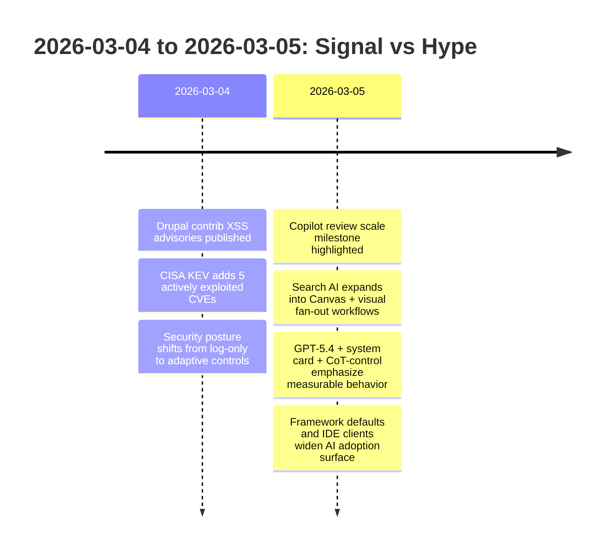

import Tabs from '@theme/Tabs';
import TabItem from '@theme/TabItem';
import TOCInline from '@theme/TOCInline';

This week had a clear throughline: AI features are shipping faster than teams can review them, and security advisories keep reminding us that "log-only" posture will bite you. The useful signal came from governance tooling, exploit intelligence, and boring upgrade discipline — not launch-day press releases.

<!-- truncate -->

<TOCInline toc={toc} minHeadingLevel={2} maxHeadingLevel={2} />

## AI Coding Tools Now Need Review Governance

GitHub crossing **60 million Copilot code reviews** is the strongest scale indicator in this batch. Volume alone means nothing, but review throughput has become a genuine bottleneck for teams that went all-in on AI-assisted code generation. The GitHub + Andela production learning loops story reinforces this: adoption sticks when AI output flows through existing delivery systems, not when it lives in sandboxed demos.

~~AI coding adoption automatically improves code quality~~. It improves speed first. Quality only follows when review policy catches up.

| Signal | What changed | Why it matters | Immediate team action |
|---|---|---|---|
| Copilot code review volume | 60M reviews reported | Review is now an AI-era control point | Track "AI-touched PR" review latency |
| GitHub + Andela | AI learning in production workflows | Skills transfer happens in real repos | Pair junior devs on AI-assisted PRs |
| Cursor automations | Triggered always-on agents | Review debt can increase silently | Require explicit policy for auto-runs |
| Cursor in JetBrains via ACP | IDE parity expanding | Existing enterprise IDE fleets can adopt faster | Standardize policy across IDEs |
| Next.js 16 default for new sites | Framework baseline moved | New project defaults will drift from old runbooks | Update scaffolding and CI presets |

<Tabs>
<TabItem value="copilot" label="Copilot Review" default>

Best when branch protection and code owners are already strict.
Weak point: teams treat AI review as a substitute for human ownership.

</TabItem>
<TabItem value="cursor" label="Cursor Automations">

Best when repetitive code hygiene is documented and test-backed.
Weak point: auto-runs can flood repos with low-context changes.

</TabItem>
<TabItem value="jetbrains" label="JetBrains ACP">

Best for orgs locked into IntelliJ/PyCharm/WebStorm workflows.
Weak point: policy drift if IDE-specific settings diverge by team.

</TabItem>
</Tabs>

## Search AI Expands Into Structured Task Completion

Google's AI Mode updates (visual query fan-out + Canvas in U.S. Search) and OpenAI's ChatGPT for Excel integrations point in the same direction: the competition has moved to in-context task completion — assembling workflows, not returning ten blue links. Gemini 3.1 Flash-Lite pricing accelerates this by making high-volume inference cheap enough for mundane internal tools.

:::info[What Actually Changed]
"AI search" shifted from retrieval to workflow assembly. Query fan-out, visual interpretation, spreadsheet integration, and document drafting are all task graph features, not just ranking features.
:::

| Surface | Practical strength | Risk |
|---|---|---|
| AI Mode visual fan-out | Better handling of ambiguous visual intent | Overconfident synthesis from weak image context |
| Canvas in Search | Fast draft/prototype loop inside search | Harder provenance tracking |
| ChatGPT for Excel + financial integrations | Analyst workflow compression | Governance and data-boundary risk |
| Gemini 3.1 Flash-Lite | Lower inference cost for routine assistants | Teams ship low-quality assistants because tokens are cheap |

## KEV Additions, ICS Exposure, and Drupal XSS — All Actionable

The security items were unusually concrete this week: CISA added five actively exploited CVEs, ICS exposure included Delta CNCSoft-G2 out-of-bounds write risk (RCE potential), Drupal contrib modules published XSS advisories, and GitGuardian/Google quantified live cert exposure (2,622 valid certificates found in leaked-key mapping as of Sep 2025, with high remediation after disclosure).

> "based on evidence of active exploitation."
>
> — CISA KEV update, [Known Exploited Vulnerabilities Catalog](https://www.cisa.gov/known-exploited-vulnerabilities-catalog)

Cloudflare's updates (always-on detections, user risk scoring, identity-aware proxy for clientless devices, ARR for IP overlap, QUIC proxy-mode rebuild, and anti-deepfake onboarding with Nametag) all target the same operational gap: binary allow/deny controls without continuous verification.

:::danger[Do Not Leave These as "Backlog"]
Patch Drupal contrib modules `google_analytics_ga4` (&lt;1.1.14) and `calculation_fields` (&lt;1.0.4) immediately if installed. Treat KEV-listed CVEs as incident work, not sprint work. For enterprise access, move from static allow/deny policies to risk-scored and identity-aware controls now.
:::

```js title="scripts/triage-kev.js" showLineNumbers
const kevList = new Set([
  "CVE-2017-7921",
  "CVE-2021-22681",
  "CVE-2021-30952",
  "CVE-2023-41974",
  "CVE-2023-43000",
]);

function priorityFor(cve, cvss, internetExposed) {
  // highlight-next-line
  const cvssFloor = 7.0;
  // highlight-start
  if (kevList.has(cve)) return "P0";
  if (internetExposed && cvss >= cvssFloor) return "P1";
  // highlight-end
  if (cvss >= cvssFloor) return "P2";
  return "P3";
}

export { priorityFor };
```

## Drupal and WordPress: Patch Discipline Still Wins

Drupal 10.6.4 and 11.3.4 are both production-ready patch releases with explicit support windows. CKEditor5 moved to 47.6.0 with a security fix reviewed as non-exploitable in Drupal's built-in implementation. That should lower your stress level, not your urgency — upgrade on schedule, not in a panic.

Dripyard's DrupalCon Chicago footprint and UI Suite's Display Builder walkthrough both show implementation velocity climbing the stack: teams want fast page composition without grinding through Twig templates and custom CSS. On the WordPress side, WP Rig stays relevant as a starter theme that teaches good defaults, particularly while the block-versus-classic coexistence remains a mess.

```diff
--- a/composer.json
+++ b/composer.json
@@
-    "drupal/core-recommended": "^10.5",
+    "drupal/core-recommended": "^10.6",
@@
-    "drupal/google_analytics_ga4": "^1.1.13",
+    "drupal/google_analytics_ga4": "^1.1.14",
@@
-    "drupal/calculation_fields": "^1.0.3"
+    "drupal/calculation_fields": "^1.0.4"
```

:::caution[Support Windows Are Not Suggestions]
Drupal 10.4.x security support has ended. Any site below 10.5.x is on borrowed time. Keep core and contrib patch cadence weekly, with emergency override for KEV-linked or XSS advisories.
:::

<details>
<summary>Ecosystem notes logged this week</summary>

- Stanford WebCamp 2026 call for proposals is open; online event on 30 April 2026, hybrid program on 1 May 2026.
- Dripyard announced DrupalCon Chicago training, sessions, and template content.
- UI Suite Initiative published Display Builder page layouts walkthrough.
- WP Builds episode #207 with Rob Ruiz covered WP Rig trajectory and theme development patterns.
</details>

## AI Claims vs Measurable Outcomes

OpenAI shipped GPT-5.4, a new Thinking System Card, CoT-Control findings, education opportunity tools, and the Learning Outcomes Measurement Suite. The encouraging part: measurement and safety instrumentation are becoming product features instead of staying buried in research PDFs.

Axios covering AI-assisted local journalism is the grounded counterpart here — constrained use cases, newsroom workflows, and impact metrics tell you more than any "AI transformation" keynote. The "89% Problem" framing around dormant open-source packages also holds up: LLMs happily revive abandoned dependencies, which means package health intelligence went from nice-to-have to mandatory overnight.

Qwen team turbulence is worth noting as a reminder that model capability and organizational stability are separate variables. Don't anchor platform risk decisions on benchmark screenshots.

> "Shock! Shock! I learned yesterday that an open problem ... had just been solved"
>
> — Donald Knuth, [Claude Cycles note](https://www-cs-faculty.stanford.edu/~knuth/papers/claude-cycles.pdf)

## Week in Context



## What to Do With All This

Speed is cheap. Governance costs real effort. The teams pulling ahead this cycle are the ones treating AI output, dependency health, and exploit intelligence as a single operational system — not three separate backlogs.

:::tip[Single Best Action for This Week]
Create one shared triage board that merges AI-generated-code review load, KEV/CVE patch priority, and dependency health alerts. If an item is AI-touched and security-relevant, it gets one owner, one SLA, and one merge gate.
:::
