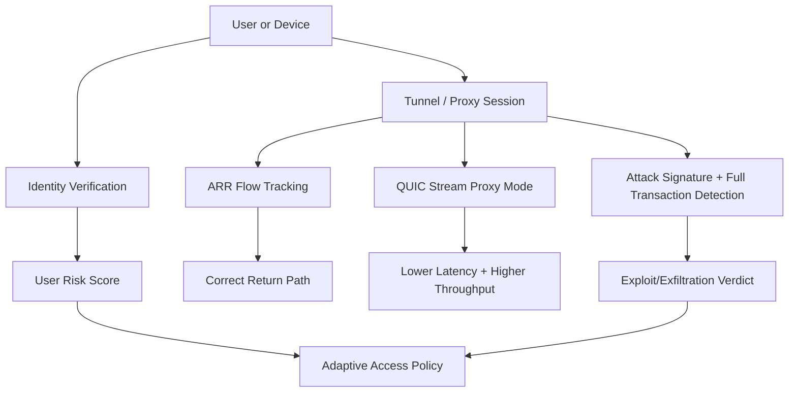
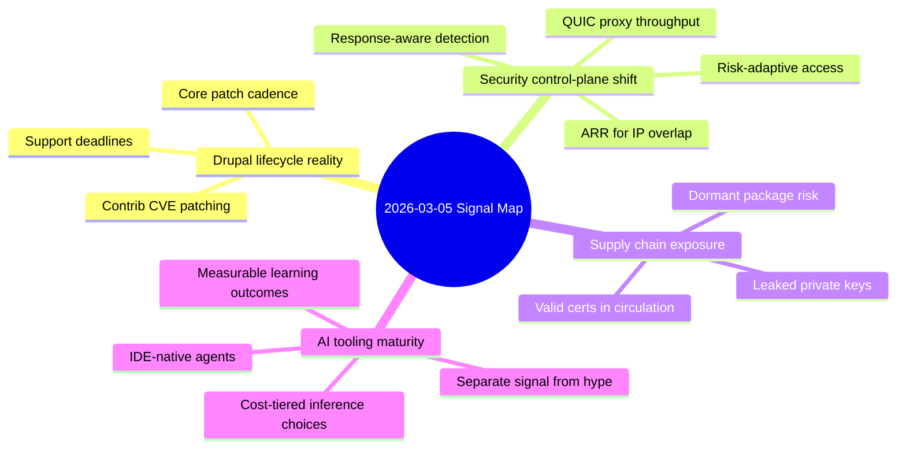

import Tabs from '@theme/Tabs';
import TabItem from '@theme/TabItem';
import TOCInline from '@theme/TOCInline';

This week had one consistent theme: operational reality beat product marketing. Core CMS releases, security advisories, network control-plane changes, and AI tooling updates all pointed to the same conclusion: the teams shipping measurable risk reduction are winning. ~~“New model”~~ is not a strategy; verified maintenance posture is.

<!-- truncate -->

<TOCInline toc={toc} minHeadingLevel={2} maxHeadingLevel={2} />

## Drupal Core Moved, and the Clock Is Real

**Drupal 10.6.4** and **Drupal 11.3.4** are production-ready patch releases, and both include CKEditor 5.47.6.0. The practical point is not “new version available”; it is support horizon and security window management.

> "Drupal 10.6.4 is a patch (bugfix) release... ready for use on production sites."
>
> — Drupal release notes, [Drupal.org](https://www.drupal.org/project/drupal/releases/10.6.4)

| Stream | Status as of 2026-03-05 | Security support window | Action |
|---|---|---|---|
| 11.3.x | Supported | Until December 2026 | Preferred target for net-new builds |
| 10.6.x | Supported | Until December 2026 | Stable target for conservative estates |
| 10.5.x | Supported | Until June 2026 | Transitional only |
| 10.4.x and older | Ended/unsupported | Ended | Upgrade immediately |

:::danger[Contrib XSS advisories are active, not theoretical housekeeping]
`Google Analytics GA4` (<1.1.14, CVE-2026-3529) and `Calculation Fields` (<1.0.4, CVE-2026-3528) both ship XSS risk paths. Treat these as same-day patch items, then validate rendered output where custom attributes or expression inputs are accepted.
:::

```bash title="scripts/drupal-security-audit.sh" showLineNumbers
#!/usr/bin/env bash
set -euo pipefail

echo "Core version:"
drush status --fields=drupal-version --format=string

echo "Contrib versions:"
drush pm:list --status=enabled --type=module --format=json | jq -r '
  to_entries[] | "\(.key): \(.value.version // "unknown")"
'

# highlight-next-line
echo "Fail build if vulnerable GA4 or Calculation Fields is detected"
composer show --direct --format=json | jq -e '
  .installed[]
  | select(.name=="drupal/google_analytics_ga4" and (.version|sub("^v";"")|split(".")|map(tonumber)) < [1,1,14])
' >/dev/null && { echo "VULN: drupal/google_analytics_ga4"; exit 1; } || true

composer show --direct --format=json | jq -e '
  .installed[]
  | select(.name=="drupal/calculation_fields" and (.version|sub("^v";"")|split(".")|map(tonumber)) < [1,0,4])
' >/dev/null && { echo "VULN: drupal/calculation_fields"; exit 1; } || true
```

```diff title="policies/dependency-baseline.diff"
--- a/policies/dependency-baseline.yaml
+++ b/policies/dependency-baseline.yaml
@@
- drupal/core-recommended: "^10.5"
+ drupal/core-recommended: "^10.6 || ^11.3"
@@
- drupal/google_analytics_ga4: "^1.1"
+ drupal/google_analytics_ga4: "^1.1.14"
@@
- drupal/calculation_fields: "^1.0"
+ drupal/calculation_fields: "^1.0.4"
```

<details>
<summary>Full changelog context used for upgrade decisions</summary>

- Drupal 10.6.4: patch release, production ready, CKEditor 5.47.6.0 included.
- Drupal 11.3.4: patch release, production ready, CKEditor 5.47.6.0 included.
- 10.6.x and 11.3.x security support: through December 2026.
- 10.5.x security support: through June 2026.
- 10.4.x support: ended.
- Contrib advisories on 2026-03-04:
- SA-CONTRIB-2026-024 (`drupal/google_analytics_ga4`) XSS, CVE-2026-3529.
- SA-CONTRIB-2026-023 (`drupal/calculation_fields`) XSS, CVE-2026-3528.

</details>

## Cloudflare Is Replacing Policy Guesswork with Runtime Signals

Automatic Return Routing (ARR), QUIC Proxy Mode rebuild, always-on detections, Gateway Authorization Proxy, User Risk Scoring, and identity proofing against deepfake/laptop-farm abuse all push in one direction: fewer brittle static controls, more stateful decisions.



<Tabs>
  <TabItem value="legacy" label="Legacy posture" default>
  Static allow/deny, manual NAT/VRF workarounds for overlap, WAF tuning loops with `log vs block` politics, device-client assumptions that fail on VDI and guest networks.
  </TabItem>
  <TabItem value="current" label="Current posture">
  Stateful flow tracking for overlap, QUIC streams for proxy performance, response-aware exploit detection, identity-aware policy even without endpoint clients, and dynamic risk-scored access.
  </TabItem>
</Tabs>

:::caution[Runtime signals are only useful if they are enforced]
If User Risk Scores and exploit detections are wired only to dashboards, teams keep reacting after impact. Bind high-risk states directly to step-up auth, short-lived session policy, and privileged route denial.
:::

## Secret Exposure Data and OSS Package Decay Became Quantifiable

GitGuardian + Google mapped roughly 1M leaked private keys to 140k certificates; 2,622 certificates were still valid as of September 2025, then 97% got remediated during disclosure. That is not abstract “supply chain concern”; that is live trust material exposed in the wild. Add the “89% dormant majority” package-health problem and this becomes a dependency governance issue, not a scanner issue.

| Signal | What it proved | Operational response |
|---|---|---|
| 2,622 valid certs from leaked keys | Leaks persist into active trust | Automate key/cert revocation and re-issuance |
| 97% remediation rate after disclosure | Direct outreach works | Keep owner metadata and escalation paths current |
| Dormant OSS majority reactivated by LLM coding | Stale packages get pulled back into production | Gate on maintenance cadence and release recency |

```yaml title=".github/workflows/secret-and-health.yml" showLineNumbers
name: secret-and-health-gate
on:
  pull_request:
  push:
    branches: [main]

jobs:
  gate:
    runs-on: ubuntu-latest
    steps:
      - uses: actions/checkout@v4
      - name: Secret scan
        run: ggshield secret scan repo .
      - name: Dependency health snapshot
        run: ./scripts/dependency-health.sh > health.json
      # highlight-start
      - name: Block stale critical packages
        run: jq -e '.critical[] | select(.days_since_release > 365)' health.json >/dev/null && exit 1 || exit 0
      # highlight-end
      - name: Persist report
        uses: actions/upload-artifact@v4
        with:
          name: dependency-health
          path: health.json
```

:::warning[Certificate leaks are breach accelerators]
If private key leaks are discovered after incident response starts, containment cost is already inflated. Rotate first, investigate second, and treat Certificate Transparency lookups as a continuous control.
:::

## AI/Product Updates: Keep the Useful, Ignore the Theater

Useful:
- Canvas in Google AI Mode for drafting docs and simple interactive tools in-search.
- Cursor support inside JetBrains IDEs via ACP.
- Gemini 3.1 Flash-Lite pricing/performance tier for high-volume pipelines.
- Next.js 16 default for new projects and Node.js 25.8.0 current runtime.
- OpenAI Learning Outcomes Measurement Suite as an evaluation direction that cares about longitudinal impact.
- Axios showing AI used as workflow multiplier for local journalism, not newsroom replacement fiction.

Noisy but relevant:
- Qwen team turbulence around a strong 3.5 model line.
- Public “AI solved my open problem” moments, including Donald Knuth’s note, which matters because serious people changed their priors in public.

> "What a joy it is to learn... celebrate this drama."
>
> — Donald Knuth, [Claude and Cycles](https://www-cs-faculty.stanford.edu/~knuth/papers/claude-cycles.pdf)

:::info[Model announcements are cheap; integration economics are not]
Choose tools based on integration surface (`IDE`, `CI`, `eval`, `policy`), latency budget, and governance fit. Capability demos without deployment discipline are just another backlog source.
:::

## The Bigger Picture



## Bottom Line

The winning pattern is consistent across CMS ops, network security, and AI tooling: stateful telemetry tied to automatic enforcement, plus explicit lifecycle deadlines.

:::tip[Single action that pays off immediately]
Add a weekly release-and-advisory gate in CI that blocks deploys on unsupported Drupal streams, known vulnerable contrib versions, leaked-secret findings, and stale critical dependencies in one policy check.
:::
