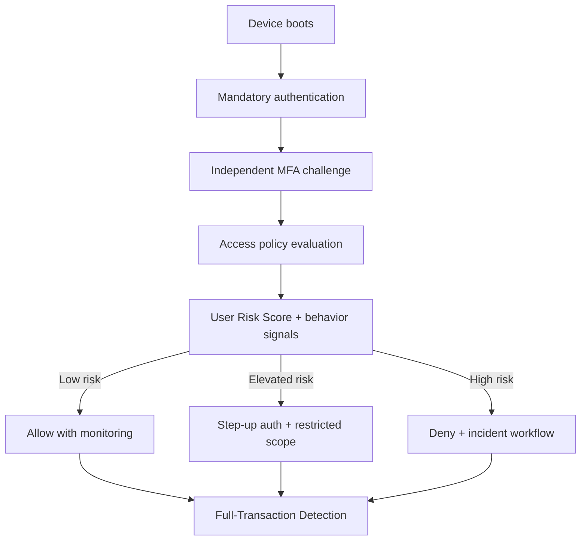
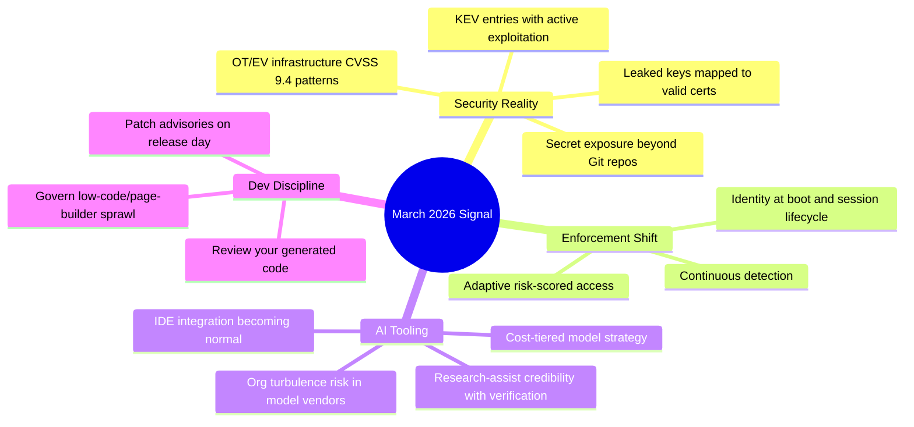

import Tabs from '@theme/Tabs';
import TabItem from '@theme/TabItem';
import TOCInline from '@theme/TOCInline';

The pattern across this week was simple: **security telemetry** got more concrete while AI announcements kept mixing real progress with polished marketing. The useful signal was in remediation rates, exploit evidence, and policy enforcement paths, not launch-page adjectives. Most teams still underinvest in review discipline and secret hygiene, then wonder why incident response is chaos.

<!-- truncate -->

<TOCInline toc={toc} minHeadingLevel={2} maxHeadingLevel={2} />

## Secrets, Exploits, and Supply Chain Reality

GitGuardian + Google published the number that matters: leaked keys were mapped to certificates at scale, and 2,622 were still valid as of September 2025. That is not a theoretical risk model; that is active attack surface. Their 97% remediation outcome proves disclosure campaigns work when owners are identified and pressured with evidence.

> "Don't file pull requests with code you haven't reviewed yourself."
>
> — Simon Willison, [Agentic Engineering Patterns](https://simonwillison.net/guides/agentic-engineering-patterns/)

The anti-pattern above connects directly to the "89% problem" thesis: LLMs revive abandoned packages, and teams import them fast, often without ownership checks, maintenance history, or secret scanning around generated glue code.

| Signal | Why it matters | Immediate move |
|---|---|---|
| 2,622 still-valid certs from leaked keys | Live credential abuse path | Revoke + rotate cert-linked keys within 24h |
| CISA added CVE-2026-21385 and CVE-2026-22719 to KEV | Active exploitation confirmed | Patch on KEV SLA, not quarterly cycle |
| ICS/OT CSAFs with CVSS 9.4 (Mobiliti, ePower, Everon, Labkotec) | Admin takeover / service disruption risk | Segment charging/OT control planes and block internet admin paths |
| "Protecting Developers Means Protecting Their Secrets" | Secrets leak beyond Git history | Scan filesystem, env vars, CI logs, agent memory snapshots |

:::danger[Credential Exposure Is an Incident, Not a Backlog Item]
When a private key leak is tied to an active certificate, treat it as production compromise even if no abuse is detected yet. Revoke certificate, rotate key material, invalidate downstream sessions, and record proof of revocation in the incident ticket.
:::

```yaml title="security/triage-rules.yaml" showLineNumbers
version: 1
rules:
  leaked_private_key:
    source: certificate_transparency
    severity: critical
    # highlight-next-line
    action: revoke_and_rotate_within_24h
    evidence_required:
      - ct_log_match
      - ownership_verified
  kev_entry:
    source: cisa_kev
    severity: high
    # highlight-next-line
    action: patch_or_mitigate_within_72h
  dormant_dependency_revival:
    source: llm_generated_imports
    severity: medium
    # highlight-next-line
    action: enforce_maintainer_and_release_recency_checks
```

## Drupal Security Advisories That Need Immediate Upgrades

Two Drupal contrib advisories dropped on 2026-03-04:

- **Google Analytics GA4** (`SA-CONTRIB-2026-024`, `CVE-2026-3529`), XSS, affected `<1.1.13`
- **Calculation Fields** (`SA-CONTRIB-2026-023`, `CVE-2026-3528`), XSS, affected `<1.0.4`

Both are "moderately critical," but that label gets misread. XSS in admin-mediated flows is still a strong foothold for privilege expansion and session abuse in real environments.

```diff title="drupal/ga4-attribute-sanitization.diff"
--- a/src/GtagBuilder.php
+++ b/src/GtagBuilder.php
@@
- $attributes[$name] = $value;
+ // highlight-next-line
+ $attributes[Html::escape($name)] = Xss::filterAdmin($value);
```

```php title="drupal/modules/custom/security_guard/src/EventSubscriber/ScriptTagPolicySubscriber.php" showLineNumbers
<?php

declare(strict_types=1);

namespace Drupal\security_guard\EventSubscriber;

use Drupal\Component\Utility\Html;
use Drupal\Component\Utility\Xss;
use Symfony\Component\EventDispatcher\EventSubscriberInterface;

final class ScriptTagPolicySubscriber implements EventSubscriberInterface {
  public static function getSubscribedEvents(): array {
    // highlight-next-line
    return ['ga4.script_attributes.build' => 'onBuild'];
  }

  public function onBuild(array &$attributes): void {
    foreach ($attributes as $key => $value) {
      // highlight-start
      $cleanKey = Html::escape((string) $key);
      $cleanValue = Xss::filterAdmin((string) $value);
      // highlight-end
      $attributes[$cleanKey] = $cleanValue;
    }
  }
}
```

:::caution[Moderately Critical Does Not Mean Optional]
If these modules are present, upgrade now and backport sanitization checks into custom integrations that extend script attributes or expression evaluators. Audit stored form values for payload persistence before declaring closure.
:::

## Cloudflare's Continuous Enforcement Push (Real Security, Not Slogans)

Cloudflare's updates are coherent when viewed as one architecture:
- Always-on detections (Attack Signature Detection + Full-Transaction Detection)
- Mandatory authentication + independent MFA from boot-to-login path
- Nametag integration for deepfake/laptop-farm resistance
- Gateway Authorization Proxy for clientless/device-constrained contexts
- User Risk Scoring driving adaptive policy



:::warning[Binary Access Rules Are Obsolete]
"Allow/deny once at login" misses post-auth abuse and stolen-session replay. Enforce continuous checks with response-aware detection and dynamic risk scoring, or the control plane is blind after initial authentication.
:::

## AI and Dev Tooling: Keep the Useful Parts, Ignore the Theater

> "Shock! Shock! ... solved by Claude Opus 4.6"
>
> — Donald Knuth, [paper note](https://www-cs-faculty.stanford.edu/~knuth/papers/claude-cycles.pdf)

Knuth's quote and the graviton-amplitude preprint both point to one thing: model-assisted research is now credible in narrow, technical lanes when verification is explicit. Separately, the Qwen team turbulence is a reminder that model capability and org stability are different risks.

<Tabs>
  <TabItem value="high-signal" label="High Signal" default>

  - Cursor in JetBrains via ACP: practical if your team lives in IntelliJ/PyCharm/WebStorm.
  - Gemini 3.1 Flash-Lite pricing/perf tier: relevant for cost-constrained high-volume workloads.
  - Next.js 16 default + Node.js 25.8.0 current: upgrade planning impacts CI/CD and runtime baselines.
  - OpenAI Learning Outcomes Measurement Suite: needed if schools are deploying AI without longitudinal evidence.
  - Axios AI newsroom workflow: concrete operational use in local journalism throughput.

  </TabItem>
  <TabItem value="watchlist" label="Watchlist / Hype">

  - "Canvas in AI Mode in Search": useful UI packaging, but value depends on export fidelity and workflow integration.
  - Copilot Dev Days: community motion, not product proof.
  - Project Genie prompt tips: creative demo energy; production utility still niche.
  - "Something is afoot in Qwen land": important governance signal, not a deployment blocker by itself.

  </TabItem>
</Tabs>

## CMS and Frontend Practice: WP Rig + UI Suite Display Builder

WP Rig's value is still architectural discipline for theme development, especially in agencies where consistency collapses under deadline pressure. Display Builder in Drupal UI Suite targets a different pain: shipping composed layouts fast without turning every page into custom Twig/CSS debt.

| Topic | Useful for | Risk if misused |
|---|---|---|
| WP Rig starter toolkit (#207 interview) | Standardized theme pipelines and onboarding | Cargo-cult setup without understanding build chain |
| UI Suite Display Builder page layouts | Faster visual composition and publish flow | Uncontrolled component sprawl and inconsistent governance |
| Next.js 16 default | Faster adoption path for new sites | Silent dependency drift if lockfiles/pipelines are stale |

## Full Item Ledger

<details>
<summary>Full changelog mapping of all verified items</summary>

- GitGuardian + Google leaked key/certificate study (2,622 valid certs; 97% remediation).
- Drupal SA-CONTRIB-2026-024 (GA4, CVE-2026-3529, XSS, `<1.1.13`).
- Drupal SA-CONTRIB-2026-023 (Calculation Fields, CVE-2026-3528, XSS, `<1.0.4`).
- Simon Willison anti-pattern on unreviewed AI-generated PRs.
- WP Builds #207 with Rob Ruiz on WP Rig.
- Google Search AI Mode Canvas availability in U.S.
- Qwen team turbulence commentary.
- Cloudflare: Always-on detections, boot-to-login enforcement, deepfake/laptop-farm defenses, Gateway Authorization Proxy, User Risk Scoring.
- UI Suite Initiative Display Builder walkthrough.
- Graviton single-minus amplitude preprint assisted by GPT-5.2 Pro.
- "89% Dormant Majority" open-source supply-chain framing.
- OpenAI Learning Outcomes Measurement Suite.
- Axios AI for local journalism operations.
- Cursor availability in JetBrains IDEs via ACP.
- Donald Knuth quote on model-assisted problem solving.
- Next.js 16 default for new sites.
- Gemini 3.1 Flash-Lite release and pricing context.
- Node.js 25.8.0 current release mention.
- DeepMind Project Genie prompt/world-building tips.
- GitHub Copilot Dev Days event push.
- ICS/OT CSAFs and advisories:
  - Mobiliti e-mobi.hu
  - ePower epower.ie
  - Everon OCPP backends
  - Labkotec LID-3300IP
  - Hitachi Energy RTU500
  - Hitachi Energy Relion REB500
- CISA KEV additions:
  - CVE-2026-21385 (Qualcomm chipsets memory corruption)
  - CVE-2026-22719 (VMware Aria Operations command injection)

</details>

## The Bigger Picture



## Bottom Line

Security is converging on continuous validation while AI tooling is converging on workflow embedding. Teams that win this year are the ones that treat leaked secrets and KEV entries as immediate operations work, and treat AI output as draft code until reviewed, tested, and owned.

:::tip[Single Best Move This Week]
Create one enforcement policy that combines secret leak detection, KEV ingestion, and adaptive access responses in the same incident lane. A unified lane removes handoff delay, which is where most preventable breaches still happen.
:::
