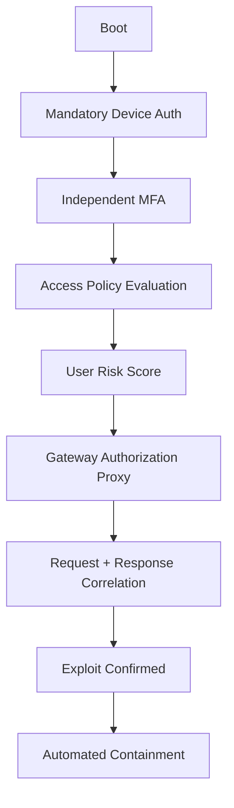
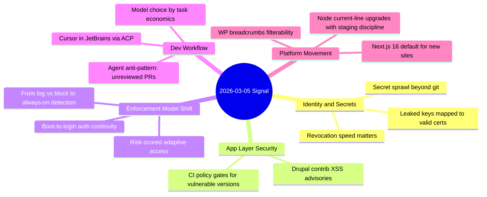

import Tabs from '@theme/Tabs';
import TabItem from '@theme/TabItem';
import TOCInline from '@theme/TOCInline';

The week's signal was simple: prevention keeps getting cheaper than cleanup, but most teams still budget for cleanup. The strongest updates were not shiny model demos; they were concrete controls around secrets, auth, exploit detection, and dependency health. ~~"It's only in logs"~~ is still how incidents are born.

<!-- truncate -->

<TOCInline toc={toc} minHeadingLevel={2} maxHeadingLevel={2} />

## Secrets, Certificates, and the Cost of "Probably Fine"

GitGuardian + Google mapped roughly 1M leaked private keys to 140k certificates; **2,622 certificates were still valid** (as of September 2025). That is not "theoretical exposure"; that is active trust material in the wild.

| Stage | Count | Why it matters |
|---|---:|---|
| Leaked private keys | ~1,000,000 | Raw secret spill volume |
| Mapped to certs | ~140,000 | Attack-path enrichment via CT |
| Still valid | 2,622 | Immediate impersonation risk |
| Remediated via disclosure | 97% | Coordinated disclosure works when owners are reachable |

:::danger[Certificate Leaks Are Not "Just Secrets Hygiene"]
Treat private key leaks as live identity compromise, not just compliance debt. Add CT-driven revocation checks to incident response and enforce max certificate lifetimes to reduce blast radius.
:::

## Drupal Contrib XSS: Two Advisories, Same Pattern

`SA-CONTRIB-2026-024` (Google Analytics GA4, `CVE-2026-3529`, affected `<1.1.13`) and `SA-CONTRIB-2026-023` (Calculation Fields, `CVE-2026-3528`, affected `<1.0.4`) are both **input handling failures** presented as module features.

```yaml title="security/policy-gates.yaml" showLineNumbers
drupal:
  advisories:
    fail_on:
      - SA-CONTRIB-2026-024
      - SA-CONTRIB-2026-023
  constraints:
    google_analytics_ga4: ">=1.1.13"
    calculation_fields: ">=1.0.4"
pipeline:
  # highlight-next-line
  block_deploy_if_advisory_open: true
  require_cve_link: true
```

```diff
- $attributes = $request->get('script_attributes');
- $output = '<script ' . $attributes . ' src="' . $src . '"></script>';
+ $attributes = array_map('Html::escape', (array) $request->get('script_attributes'));
+ $safe = [];
+ foreach ($attributes as $k => $v) {
+   $safe[] = sprintf('%s="%s"', preg_replace('/[^a-zA-Z0-9:-]/', '', $k), $v);
+ }
+ $output = '<script ' . implode(' ', $safe) . ' src="' . UrlHelper::stripDangerousProtocols($src) . '"></script>';
```

:::caution[Patch + Pin or You Didn't Fix It]
Upgrading modules without adding version constraints in CI just delays recurrence. Pin minimum safe versions and fail build on new advisories.
:::

## WordPress and Frontend Tooling: Useful Changes vs Marketing Fog

WordPress 7.0's **Breadcrumbs block filters** are a real developer win: one block in a stable location, filterable trail logic. WP Rig's continued maintenance matters because starter architecture quality still determines long-term theme maintainability more than any prompt-to-theme wizard.

```php title="theme/inc/breadcrumbs.php" showLineNumbers
<?php
if ( ! defined( 'ABSPATH' ) ) { exit; }

add_filter(
  'block_core_breadcrumbs_items',
  function( array $items ): array {
    // highlight-next-line
    if ( ! is_user_logged_in() ) {
      $items = array_values(
        array_filter(
          $items,
          static fn( $item ) => ($item['label'] ?? '') !== 'Internal'
        )
      );
    }

    // highlight-start
    $items[] = [
      'url'   => home_url('/status/'),
      'label' => 'System Status',
    ];
    // highlight-end
    return $items;
  }
);
```

<Tabs>
<TabItem value="wp-rig" label="WP Rig" default>

Best when theme teams need opinionated standards, build tooling, and onboarding that doesn't collapse under agency handoffs.

</TabItem>
<TabItem value="next16" label="Next.js 16">

Good default for new app sites, but not a theme architecture substitute; it solves different layers of the stack.

</TabItem>
<TabItem value="display-builder" label="Drupal Display Builder">

Strong for visual layout velocity; still needs governance to prevent content model drift disguised as "flexibility."

</TabItem>
</Tabs>

## AI Tooling Updates: Keep the Stuff That Saves Time

Canvas in Google Search AI Mode, Cursor via ACP in JetBrains, Gemini 3.1 Flash-Lite pricing/perf push, GPT-5.3 Instant positioning, and Node.js 25.8.0 all landed in the same cycle. Only some of that changes daily engineering outcomes.

| Update | Operational value | Recommendation |
|---|---|---|
| Cursor in JetBrains via ACP | High | Roll into existing IntelliJ/PyCharm workflows |
| Gemini 3.1 Flash-Lite | Medium-High | Use for high-volume, bounded tasks |
| GPT-5.3 Instant | Medium-High | Use where conversational smoothness matters |
| Canvas in Search AI Mode | Medium | Helpful for quick drafts/prototypes |
| Node.js 25.8.0 (Current) | Medium | Test in staging; don't autopromote to production |

> "Don't file pull requests with code you haven't reviewed yourself."
>
> — Simon Willison, [Agentic Engineering Patterns](https://simonwillison.net/guides/agentic-engineering-patterns/)

> "I learned yesterday that an open problem I'd been working on for several weeks had just been solved..."
>
> — Donald Knuth, [Claude Cycles](https://www-cs-faculty.stanford.edu/~knuth/papers/claude-cycles.pdf)

## Security Controls Are Shifting from Alerts to Enforcement

Cloudflare's recent set (Attack Signature Detection, Full-Transaction Detection, mandatory auth from boot-to-login, independent MFA, User Risk Scoring, Gateway Authorization Proxy, deepfake/laptop-farm defenses) signals a practical shift: enforce continuously, not periodically.

`CISA` adding exploited vulnerabilities to KEV (`CVE-2026-21385`, `CVE-2026-22719`) and multiple CSAF notices (OT/EV charging + industrial control products) reinforce the same point: identity and exposure windows are shrinking, attacker automation is not.



:::info[Logs Are Evidence, Not Defense]
Detection pipelines that include server response context beat request-only WAF signatures. Wire your controls so confirmed exploit behavior can trigger policy changes automatically.
:::

## Supply Chain Reality: The "Dormant Majority" Is Back

"The 89% Problem" is not academic. LLM-assisted coding revives old packages, and that revives old vulnerabilities plus abandoned maintenance assumptions. Pair this with secret sprawl outside Git (filesystems, env vars, agent memory), and package count becomes a weak proxy.

<details>
<summary>Practical gate set used in my internal checklists</summary>

```bash title="scripts/ci-secret-and-package-gates.sh" showLineNumbers
#!/usr/bin/env bash
set -euo pipefail

# highlight-next-line
trufflehog filesystem . --fail --json > reports/secrets.json
osv-scanner --lockfile=package-lock.json --format=json > reports/osv.json
npm audit --audit-level=high --json > reports/npm-audit.json

jq '.Results | length' reports/secrets.json
jq '.results.vulnerabilities | length' reports/osv.json

# highlight-start
if grep -q '"severity":"HIGH"\|"severity":"CRITICAL"' reports/npm-audit.json; then
  echo "High/Critical dependency risk found"
  exit 1
fi
# highlight-end
```

</details>

:::warning["No Recent Commits" Is Not a Safety Signal]
Dormant packages can still be heavily used and newly reactivated by generated code. Track maintainer activity, release cadence, open CVEs, and transitive exposure before adoption.
:::

## The Bigger Picture



## Bottom Line

The meaningful trend is convergence: identity, secrets, dependency health, and runtime detection are collapsing into one continuous control plane. Tooling announcements are noise unless they reduce mean-time-to-safe-change.

:::tip[Single Most Useful Move This Week]
Add one hard CI gate that fails on known vulnerable package/module versions and one runtime gate that blocks high-risk auth states. That pair prevents more incidents than another dashboard.
:::
