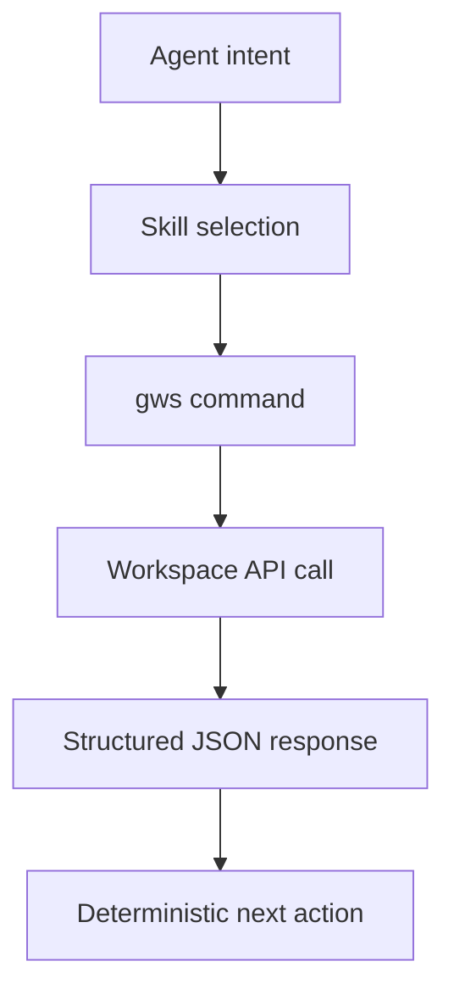
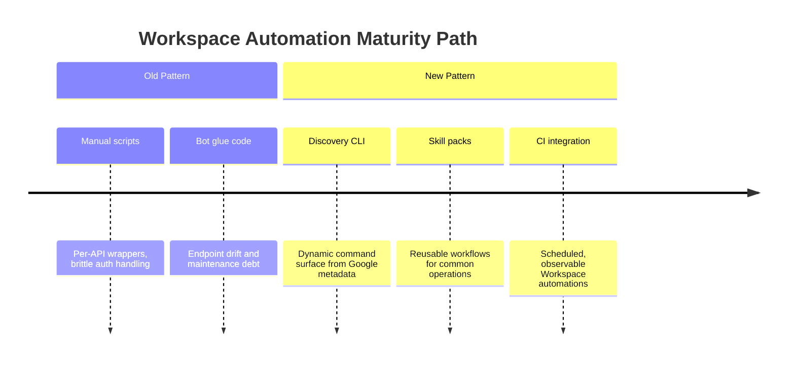

import Tabs from '@theme/Tabs';
import TabItem from '@theme/TabItem';
import TOCInline from '@theme/TOCInline';

Google quietly shipped something most "AI productivity" posts pretend to discuss but never deliver: an actual CLI that maps to Google Workspace APIs and is usable by agents. The practical value is not the marketing line; it is the dynamic API surface plus a large skills pack that removes glue-code tax. ~~This is just another Gmail script bundle~~.

<!-- truncate -->

<TOCInline toc={toc} minHeadingLevel={2} maxHeadingLevel={2} />

## What Actually Shipped

> "Drive, Gmail, Calendar, and every Workspace API. Zero boilerplate. Structured JSON output. 40+ agent skills included."
>
> — Google Workspace CLI README, [github.com/googleworkspace/cli](https://github.com/googleworkspace/cli)

| Item | Verified signal | Why it matters |
|---|---|---|
| API coverage model | Runtime command generation from Google Discovery Service | New API methods appear without waiting for wrapper releases |
| Agent orientation | Structured JSON responses and `SKILL.md`-based skills | Agents can execute deterministic workflows instead of scraping human text |
| Skill inventory | Repo currently contains 100+ skills (base APIs + recipes + personas) | "40+" undersells current automation surface |

:::info[Discovery-driven coverage is the real feature]
Most CLIs rot because command surfaces are hand-maintained. This one builds commands from Discovery metadata at runtime, so API expansion shows up as command expansion. That changes maintenance economics for long-lived automations.
:::

## Why This Matters for Agent Workflows



<Tabs>
  <TabItem value="static" label="Static Wrappers" default>

    - Hardcoded commands and flags
    - Slow update cycle when APIs change
    - Frequent breakage in CI scripts when endpoints drift

  </TabItem>
  <TabItem value="gws" label="Discovery-Driven gws">

    - Commands generated from Discovery Service
    - Faster compatibility with Workspace API updates
    - Better fit for agents that need machine-readable output

  </TabItem>
</Tabs>

:::caution[Do not confuse skill count with production readiness]
A large skill catalog is distribution, not governance. Production use still needs explicit scope control, audit logging, and failure policy per workflow. Treat every skill as privileged code, not a harmless prompt macro.
:::

## CI/CD Pattern That Does Not Rot

```yaml title=".github/workflows/workspace-ops.yml" showLineNumbers
name: workspace-ops

on:
  workflow_dispatch:
  schedule:
    - cron: "0 * * * *"

jobs:
  inbox-triage:
    runs-on: ubuntu-latest
    steps:
      - uses: actions/checkout@v4
      - uses: actions/setup-node@v4
        with:
          node-version: "22"
      - run: npm i -g @googleworkspace/cli
      # highlight-start
      - name: Auth check
        run: gws auth status --json
      - name: Unread summary
        run: gws gmail users.messages.list --userId=me --q="is:unread newer_than:1d" --json
      # highlight-end
      - name: Persist artifact
        run: mkdir -p artifacts && gws calendar events.list --calendarId=primary --maxResults=20 --json > artifacts/calendar.json
```

```diff title="ci/pipeline-change.diff"
- curl -H "Authorization: Bearer $TOKEN" "https://gmail.googleapis.com/gmail/v1/users/me/messages?q=is:unread"
+ gws gmail users.messages.list --userId=me --q="is:unread" --json
```

<details>
<summary>Verification snapshot (repo state on 2026-03-05)</summary>

```bash title="scripts/verify-gws-surface.sh"
git clone --depth 1 https://github.com/googleworkspace/cli
cd cli
find skills -type f | wc -l
rg "Drive, Gmail, Calendar, and every Workspace API" README.md
rg "40\\+ agent skills included" README.md
```

</details>

## Security and Failure Modes

:::warning[Token scope sprawl becomes silent blast radius]
If one agent credential has broad Gmail, Drive, Admin, and Chat scopes, a prompt-injection incident stops being a bad email and turns into lateral damage. Split workflows by service account or profile, and enforce least-privilege OAuth scopes per job.
:::

:::danger[Indirect prompt injection is a real operational risk]
Workspace content is untrusted input. A malicious doc or email can instruct an agent to perform unrelated actions unless tool-call policy is constrained. Put model-output guardrails in front of execution: allowlisted commands, argument validation, and approval gates for state-changing operations.
:::

## The Bigger Picture



## Bottom Line

Google Workspace CLI is useful because it reduces integration entropy, not because it has an "AI" label. The winning move is boring: treat it as infrastructure, pin policies around it, and run it under CI observability from day one.

:::tip[Single highest-value action]
Replace one brittle Workspace REST script in production with `gws ... --json`, then add command allowlisting and scoped credentials in the same PR. Ship the security boundary with the migration, not later.
:::
