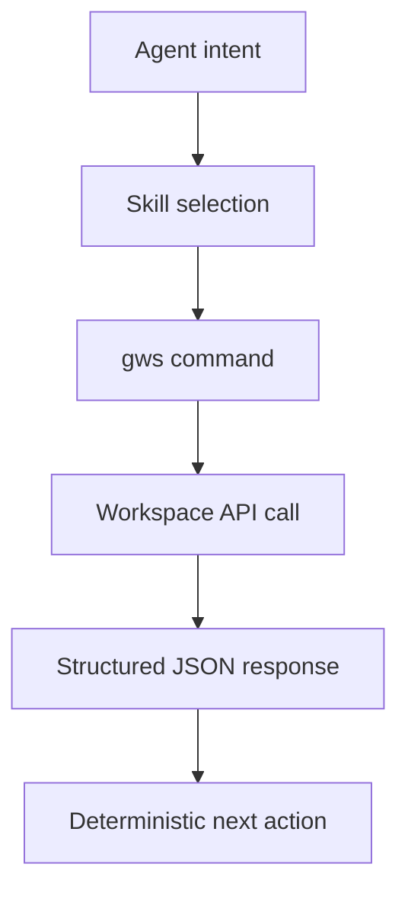

import Tabs from '@theme/Tabs';
import TabItem from '@theme/TabItem';
import TOCInline from '@theme/TOCInline';

Every few months someone announces a "revolutionary AI productivity tool" that turns out to be three API calls in a trench coat. Google's Workspace CLI is not that. It ships a dynamic command surface built from Discovery Service metadata, a skills pack north of 100 entries, and structured JSON output that agents can actually parse without hallucinating a schema. ~~This is just another Gmail script bundle~~.

<!-- truncate -->

<TOCInline toc={toc} minHeadingLevel={2} maxHeadingLevel={2} />

## What Actually Shipped

> "Drive, Gmail, Calendar, and every Workspace API. Zero boilerplate. Structured JSON output. 40+ agent skills included."
>
> — Google Workspace CLI README, [github.com/googleworkspace/cli](https://github.com/googleworkspace/cli)

| Item | Verified signal | Why it matters |
|---|---|---|
| API coverage model | Runtime command generation from Google Discovery Service | New API methods appear without waiting for wrapper releases |
| Agent orientation | Structured JSON responses and `SKILL.md`-based skills | Agents can execute deterministic workflows instead of scraping human text |
| Skill inventory | Repo currently contains 100+ skills (base APIs + recipes + personas) | "40+" undersells current automation surface |

## Why This Matters for Agent Workflows



<Tabs>
<TabItem value="static" label="Static Wrappers" default>

- Hardcoded commands and flags
- Slow update cycle when APIs change
- Frequent breakage in CI scripts when endpoints drift

</TabItem>
<TabItem value="gws" label="Discovery-Driven gws">

- Commands generated from Discovery Service
- Faster compatibility with Workspace API updates
- Better fit for agents that need machine-readable output

</TabItem>
</Tabs>

:::caution[Do not confuse skill count with production readiness]
A large skill catalog is distribution, not governance. Production use still needs explicit scope control, audit logging, and failure policy per workflow. Treat every skill as privileged code, not a harmless prompt macro.
:::

## CI/CD Integration

The core migration pattern is replacing raw REST calls with `gws ... --json`. Discovery-driven commands track API changes automatically, so CI pipelines stop breaking when Google shifts an endpoint. Pair that with scheduled `workflow_dispatch` runs and artifact persistence, and Workspace ops become observable infrastructure instead of cron-and-pray scripts.

<details>
<summary>Verification snapshot (repo state on 2026-03-05)</summary>

```bash title="scripts/verify-gws-surface.sh"
git clone --depth 1 https://github.com/googleworkspace/cli
cd cli
find skills -type f | wc -l
rg "Drive, Gmail, Calendar, and every Workspace API" README.md
rg "40\\+ agent skills included" README.md
```

</details>

## Security and Failure Modes

If one agent credential has broad Gmail, Drive, Admin, and Chat scopes, a prompt-injection incident stops being a bad email and turns into lateral damage. Split workflows by service account or profile, and enforce least-privilege OAuth scopes per job.

:::danger[Indirect prompt injection is a real operational risk]
Workspace content is untrusted input. A malicious doc or email can instruct an agent to perform unrelated actions unless tool-call policy is constrained. Put model-output guardrails in front of execution: allowlisted commands, argument validation, and approval gates for state-changing operations.
:::

## Why this matters for Drupal and WordPress

Agencies and teams that run Drupal or WordPress often rely on Gmail, Drive, and Calendar for client work, content handoffs, and ops. Replacing brittle custom scripts with a single CLI that emits structured JSON makes agent-driven workflows (content pipelines, triage, reporting) easier to automate and to secure. Use Workspace CLI for the parts that touch Google; keep Drupal/WordPress (and their APIs) as the source of truth for site content. Split credentials by scope so a compromised agent cannot cross from Workspace into deployment or repo access.

## Bottom Line

Google Workspace CLI is useful because it reduces integration entropy, not because it has an "AI" label. The winning move is boring: treat it as infrastructure, pin policies around it, and run it under CI observability from day one.

:::tip[Single highest-value action]
Replace one brittle Workspace REST script in production with `gws ... --json`, then add command allowlisting and scoped credentials in the same PR. Ship the security boundary with the migration, not later.
:::
