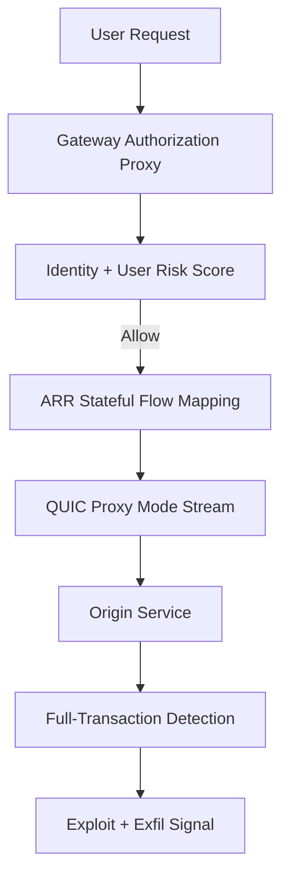
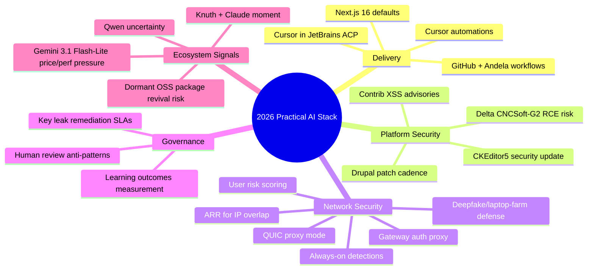

import Tabs from '@theme/Tabs';
import TabItem from '@theme/TabItem';
import TOCInline from '@theme/TOCInline';

This batch of signals points to one theme: AI is becoming default infrastructure, but reliability still depends on old-school engineering discipline. The useful updates were not hype demos, they were upgrade policies, transport-layer rewrites, detection pipelines, and measurable outcomes. The noisy part of the ecosystem is still noisy, but the practical path is clearer than people admit.

<!-- truncate -->

<TOCInline toc={toc} minHeadingLevel={2} maxHeadingLevel={2} />

## AI In Production: Better Plumbing, Less Theater

GitHub + Andela's update matters because it grounds AI adoption in real delivery workflows, not benchmark screenshots. Cursor automations and ACP support in JetBrains matter for the same reason: they move agentic behavior into existing IDE loops instead of forcing team migration theater. Google's Canvas in AI Mode being broadly available in the U.S. and Next.js 16 becoming default both signal the same shift: AI-first UX and AI-assisted coding are now baseline assumptions.

> "Developers connected to Andela share how they're learning AI tools inside real production workflows."
>
> — GitHub Blog, [Scaling AI opportunity across the globe](https://github.blog/)

<Tabs>
<TabItem value="cursor" label="Cursor Automations" default>

Trigger-based always-on agents with explicit instructions. Strong for repeatable maintenance and repo chores. High risk if prompts are not versioned.

</TabItem>
<TabItem value="jetbrains" label="JetBrains ACP Client">

Cursor available inside IntelliJ/PyCharm/WebStorm via ACP. Useful for teams locked into JetBrains workflows and inspections.

</TabItem>
<TabItem value="search-canvas" label="Search Canvas">

Fast drafting and interactive tool prototyping in AI Mode. Good ideation surface, weak governance surface.

</TabItem>
</Tabs>

:::info[What Actually Changed]
The industry moved from "chat with model" to "wire model into workflow." That includes IDE-native clients, triggered automations, and default framework baselines (Next.js 16 for new sites). ~~Prompt quality alone drives outcomes~~; operational controls drive outcomes.
:::

## CMS Reality: Drupal and WordPress Reward Discipline

Drupal 10.6.4 and 11.3.4 are patch releases, but the operational message is bigger: unsupported branches are now a liability window, not a "sometime later" task. Both updates include CKEditor5 `v47.6.0` with a security fix relevant to XSS handling in General HTML Support. Contrib advisories on March 4, 2026 add urgency: `google_analytics_ga4 < 1.1.14` and `calculation_fields < 1.0.4` both carry XSS risk.

| Item | Why it matters | Action |
|---|---|---|
| Drupal `10.6.4` | Production bugfix baseline, support through Dec 2026 (10.6.x) | Upgrade from 10.5/10.4 tracks immediately |
| Drupal `11.3.4` | Current Drupal 11 patch with CKEditor5 security update | Patch all 11.x estates |
| SA-CONTRIB-2026-024 (GA4) | XSS via insufficient attribute sanitization | Upgrade to `>=1.1.14` |
| SA-CONTRIB-2026-023 (Calculation Fields) | XSS via insufficient input validation | Upgrade to `>=1.0.4` |
| UI Suite Display Builder video | Low-code layout velocity for Drupal teams | Use for page layout, keep review gates |
| WP Rig episode #207 | Starter theme with best-practice teaching value | Good for onboarding, still needs perf budgets |
| Dripyard at DrupalCon Chicago | Training/presentations indicate ecosystem maturity | Track practical demos, ignore booth fluff |

```yaml title="ops/2026-03-05-cms-remediation.yaml" showLineNumbers
release_policy:
  drupal:
    supported_branches:
      - "10.6.x"
      - "11.3.x"
    eol_notes:
      # highlight-next-line
      - "10.4.x security support ended; block deploys on <10.5.x"
advisories:
  - id: "SA-CONTRIB-2026-024"
    project: "google_analytics_ga4"
    fixed_in: "1.1.14"
  - id: "SA-CONTRIB-2026-023"
    project: "calculation_fields"
    fixed_in: "1.0.4"
gates:
  # highlight-next-line
  - "Fail CI if vulnerable contrib version detected"
  - "Fail CI if CKEditor5 version drifts from secured baseline"
```

:::danger[Drupal Contrib XSS Is Not Theoretical Busywork]
Treat moderately critical XSS advisories as immediate patch work when modules touch script attributes or user-controlled expressions. Waiting for exploit PoCs is unnecessary risk; the attacker path is already described.
:::

<details>
<summary>Patch-window notes</summary>

- Drupal 10.6.x security support runs until **December 2026**.
- Drupal 10.5.x security support runs until **June 2026**.
- Drupal 10.4.x security support has ended.
- Drupal 11.3.x security coverage runs until **December 2026**.

</details>

## Security and Networking: Fewer Assumptions, More Telemetry

Cloudflare's set of updates forms a coherent pattern: QUIC-based proxy mode for performance, stateful return routing for overlapping IP spaces, identity-aware proxying for clientless devices, dynamic user risk scoring, and always-on exploit detection that correlates request payload + server response. That is a real architecture progression, not a feature dump.



```diff title="security/policy-shift.diff"
- action: allow_if_identity_valid
+ action: allow_if_identity_valid_and_risk_below_threshold
+ detection: full_transaction
+ response_logic: correlate_payload_with_origin_response
+ transport: quic_streams_proxy_mode
```

:::warning[Certificate and Key Leakage Has a Long Tail]
GitGuardian + Google mapped roughly 1M leaked keys to 140k certs, with 2,622 still valid as of September 2025. That means revocation/rotation SLAs are often fiction on paper.
:::

Delta CNCSoft-G2's out-of-bounds write (CVSS v3 7.8) is the other side of the same story: operational tech environments still carry RCE-class exposure where patch cadence is slow and blast radius is high.

## AI, Education, and Media: Measure Outcomes or Stop Talking

OpenAI's education announcements (tools, certifications, and the Learning Outcomes Measurement Suite) are only useful if institutions instrument before/after learning impact over time. Axios' newsroom use case is one of the better practical examples: AI as workflow acceleration around local reporting, not replacement of editorial judgment.

> "OpenAI introduces the Learning Outcomes Measurement Suite to assess AI's impact on student learning..."
>
> — OpenAI, [Learning outcomes update](https://openai.com/)

:::caution[No Measurement, No Credibility]
If school or newsroom AI rollouts lack baseline metrics, every success claim is marketing copy. Track cycle time, quality deltas, and user-level outcomes before expanding budget.
:::

## Model and OSS Signals: Useful, Messy, and Sometimes Uncomfortable

Qwen 3.5 momentum plus high-profile team departures is a reminder that model quality and org stability are separate risk vectors. Knuth publicly reacting to Claude solving a problem he was working on is a strong signal that frontier models are crossing into non-trivial expert workflows. The "89% Problem" on dormant open-source packages is the supply-chain counterpoint: AI-assisted resurrection can increase utility and risk at the same time.

> "Don't file pull requests with code you haven't reviewed yourself."
>
> — Simon Willison, [Agentic Engineering Anti-patterns](https://simonwillison.net/guides/agentic-engineering-patterns/)

## The Bigger Picture



## Bottom Line

The winning move is boring and effective: run AI where engineering controls already exist, then tighten patching, identity, and telemetry until failure modes become observable.

:::tip[Single Action That Pays Off This Week]
Create one repo-level `ai-change-gate` that requires human review, dependency health checks, and security advisory scans before merge. It cuts risk across AI-generated code, dormant-package adoption, and fast-moving CMS/security updates in one place.
:::
