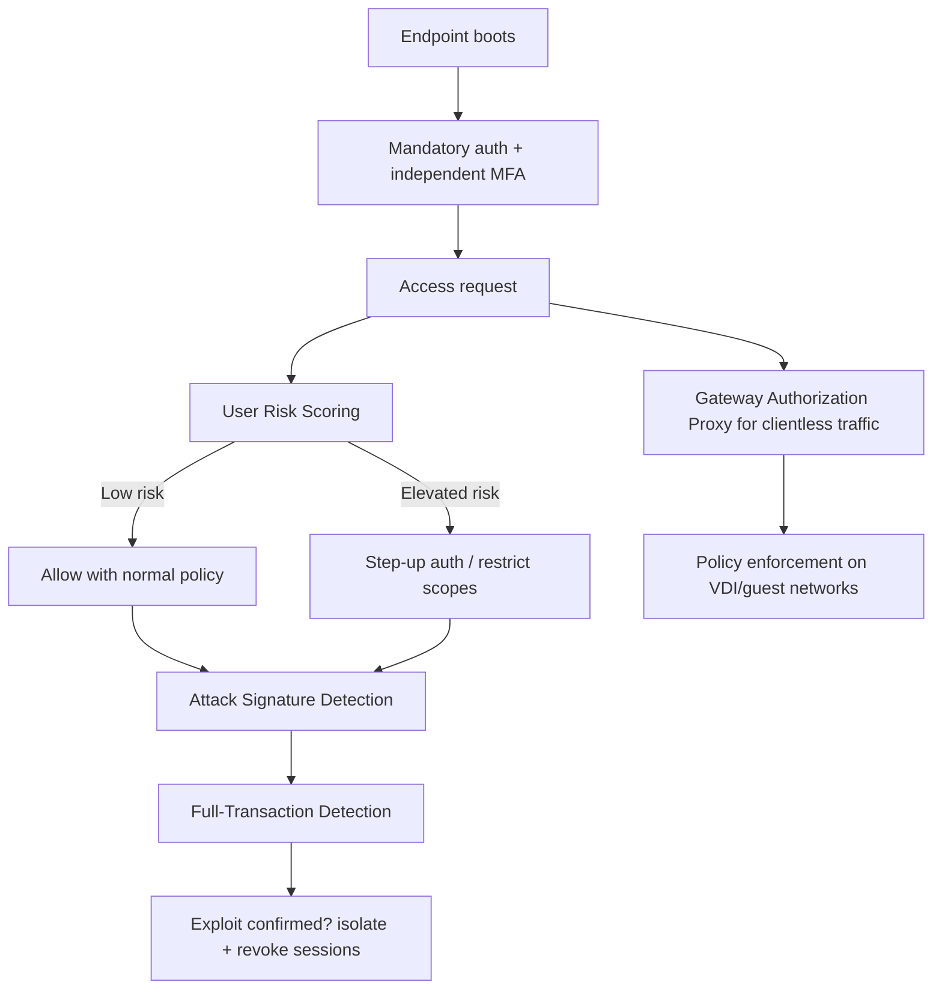
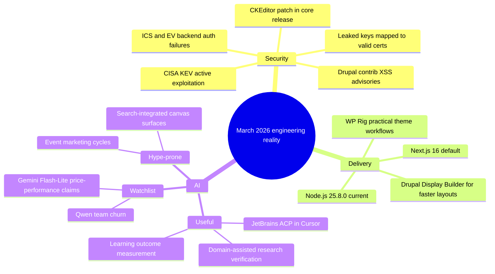

import Tabs from '@theme/Tabs';
import TabItem from '@theme/TabItem';
import TOCInline from '@theme/TOCInline';

Most of this week's "news" falls into two piles: things that can hurt production this quarter, and things that are mostly vendor theater. The useful pattern is simple: patch aggressively where risk is concrete, then ignore hype unless it changes delivery speed or incident rates.

<!-- truncate -->

<TOCInline toc={toc} minHeadingLevel={2} maxHeadingLevel={2} />

## Drupal 11.3.4 and the contrib XSS pair are the only Drupal items that demand immediate action

**Drupal 11.3.4** is a patch release declared production-ready, with 11.3.x security coverage through December 2026. It also updates CKEditor5 to `47.6.0`, including a fix for an XSS issue in General HTML Support.

> "ready for use on production sites"
>
> — Drupal core release announcement, [Drupal.org](https://www.drupal.org/project/drupal/releases/11.3.4)

At the same time, two March 4 advisories matter for real sites:

| Advisory | Risk | Affected | CVE | Action |
|---|---|---|---|---|
| SA-CONTRIB-2026-024 (Google Analytics GA4) | Moderately critical XSS | `< 1.1.13` | `CVE-2026-3529` | Upgrade to `>=1.1.13`, block unsafe custom script attributes |
| SA-CONTRIB-2026-023 (Calculation Fields) | Moderately critical XSS | `< 1.0.4` | `CVE-2026-3528` | Upgrade to `>=1.0.4`, validate user-supplied expressions |

:::danger[Drupal contrib XSS in production paths]
Run `drush pm:list --status=enabled | rg "google_analytics_ga4|calculation_fields"` and patch same day.  
If change windows are slow, add temporary WAF rules for reflected/stored script payloads on analytics and form endpoints until deployment completes.
:::

```bash title="drupal-security-check.sh"
#!/usr/bin/env bash
set -euo pipefail

drush pm:list --status=enabled --type=module --format=list \
  | rg "google_analytics_ga4|calculation_fields" || true

drush updatedb -y
drush cr
drush pm:security
```

```diff
- $attributes = $request->get('custom_attributes');
- $script_tag = '<script ' . $attributes . ' src="' . $ga_url . '"></script>';
+ $attributes = $request->get('custom_attributes');
+ $safe = array_filter($attributes, static fn($k) => in_array($k, ['async', 'defer', 'nonce'], true), ARRAY_FILTER_USE_KEY);
+ $script_tag = build_safe_ga_script_tag($ga_url, $safe);
```

## Secret leakage is still the fastest path from "small mistake" to "big incident"

The Google + GitGuardian study mapped about 1M leaked private keys to 140k certificates; **2,622 certificates were still valid** as of September 2025. That is not a theoretical problem.

The companion lesson from "Protecting Developers Means Protecting Their Secrets" is correct: leaks are not only in Git history. They persist in filesystem artifacts, env vars, CI logs, and long-lived agent memory.

:::warning[Rotate before triage]
Any leaked private key tied to active certs gets immediate revoke/rotate.  
Forensics can happen after containment. Reverse that order and incident cost jumps fast.
:::

```yaml title="security-watchlist.yaml" showLineNumbers
controls:
  # highlight-next-line
  - id: cert_transparency_monitor
    source: ct_logs
    frequency: "15m"
    action: open_incident_if_valid_cert
  - id: repo_secret_scan
    source: git_history_and_prs
    frequency: "on_push"
    action: block_merge_and_rotate
  # highlight-start
  - id: runtime_secret_scan
    source: ci_logs_env_and_artifacts
    frequency: "hourly"
    action: scrub_store_rotate
  # highlight-end
  - id: agent_memory_scrub
    source: tool_session_transcripts
    frequency: "daily"
    action: redact_and_expire
```

## Agentic engineering anti-patterns: unreviewed code is still malpractice

Simon Willison called out the anti-pattern plainly:

> "Don't file pull requests with code you haven't reviewed yourself."
>
> — Simon Willison, [Agentic Engineering Patterns](https://simonwillison.net/guides/agentic-engineering-patterns/)

That advice pairs perfectly with the "89% Problem" write-up: LLMs revive abandoned packages, which means dependency freshness is no longer a quality signal by itself.

:::caution[The new false positive: recently touched package == healthy package]
Gate dependency updates with maintenance signal checks: active maintainers, release cadence, open security issues, and CI status.  
`npm outdated` or `composer outdated` is inventory, not trust.
:::

## Cloudflare's zero-trust updates are real progress, not blog gloss

The set of Cloudflare One updates fits together: always-on detections, full-transaction correlation, mandatory auth from boot-to-login, identity checks against deepfake/laptop-farm abuse, clientless device policy via Gateway Authorization Proxy, and dynamic User Risk Scoring in Access decisions.



## AI product updates: some useful, some pure announcement churn

<Tabs>
  <TabItem value="signal" label="High Signal" default>

- **Cursor in JetBrains via ACP**: useful if a team is locked into IntelliJ/PyCharm/WebStorm and wants one agent workflow.
- **OpenAI Learning Outcomes Measurement Suite**: finally measuring impact over time instead of "vibes-based pedagogy."
- **Axios AI workflow notes**: practical newsroom automation framing instead of "AI replaces reporting."
- **GPT-assisted graviton preprint workflow**: strongest value is verification speed in derivations, not replacing domain judgment.

  </TabItem>
  <TabItem value="noise" label="Mostly Noise">

- Canvas in Google Search AI Mode: convenient, but this is packaging.
- Copilot Dev Days: community enablement, not a technical shift.
- Project Genie prompt tips: interesting demo surface, limited production relevance today.

  </TabItem>
  <TabItem value="watch" label="Watch Closely">

- **Qwen 3.5 momentum + team departures**: model quality can survive org churn, but roadmap stability risk increases immediately.
- **Gemini 3.1 Flash-Lite pricing/perf**: cost profile is compelling; benchmark on real latency and refusal behavior before migration.

  </TabItem>
</Tabs>

> "I'll have to revise my opinions about 'generative AI' one of these days."
>
> — Donald Knuth, [claude-cycles.pdf](https://www-cs-faculty.stanford.edu/~knuth/papers/claude-cycles.pdf)

## Infrastructure and ICS advisories: this is why asset inventory still wins

Multiple high-CVSS CSAF disclosures landed across EV charging and industrial control vendors (Mobiliti/e-mobi.hu, ePower, Everon OCPP backends, Labkotec LID-3300IP, Hitachi RTU500/REB500). CISA also added two actively exploited entries to KEV: `CVE-2026-21385` and `CVE-2026-22719`.

<details>
<summary>Consolidated risk ledger from this cycle</summary>

| Area | Representative issue | Common failure mode | Priority |
|---|---|---|---|
| EV/OCPP backends | Missing auth, weak auth controls | Unauthorized admin control / service disruption | P0 |
| ICS device firmware | Role/authorization weaknesses | Config tampering, outage risk | P0 |
| Federal KEV additions | Qualcomm memory corruption, VMware Aria command injection | Active exploitation path | P0 |
| Drupal contrib | XSS in GA4 and Calculation Fields | Admin/session compromise | P1 |
| PKI/Secrets | Valid certs tied to leaked private keys | Trusted-channel abuse | P0 |

</details>

## Toolchain and CMS workflow notes worth keeping

- **Next.js 16 default for new sites** and **Node.js 25.8.0 (Current)** mean more teams will hit framework/runtime skew in CI unless version pinning is explicit.
- **WP Rig** remains relevant because it teaches sane defaults and modern build patterns without pretending classic and block themes are identical.
- **UI Suite Display Builder** is valuable for teams that need layout speed in Drupal without custom Twig/CSS for every page. It reduces handoff friction, not architecture complexity.

:::info[Operational interpretation]
~~"No-code layout" means no engineering needed~~.  
It means engineers stop writing repetitive presentation glue and spend time on schema, access control, and performance budgets.
:::

## The Bigger Picture



## Bottom Line

:::tip[Single action that prevents the most pain]
Adopt a weekly "exploitability-first" review: patch confirmed exposed software (`Drupal contrib`, `KEV`, `internet-facing auth flaws`), rotate exposed secrets/certs, and defer everything else to scheduled evaluation.  
This one filter cuts incident probability faster than any new AI tool rollout.
:::
