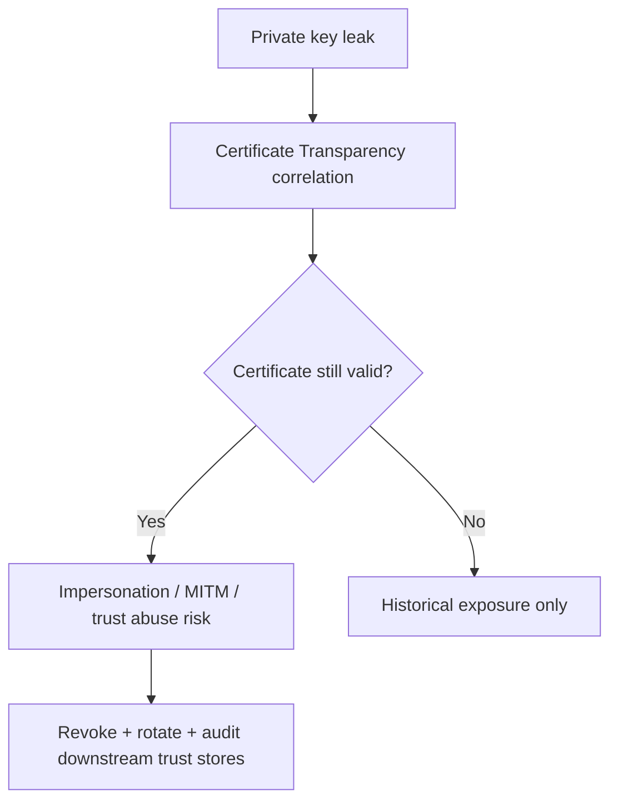
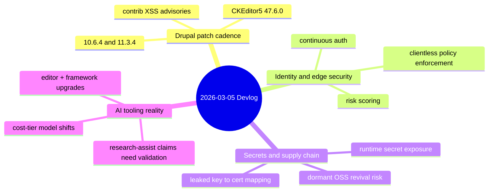

import Tabs from '@theme/Tabs';
import TabItem from '@theme/TabItem';
import TOCInline from '@theme/TOCInline';

The pattern today is simple: patch fast, validate continuously, and stop trusting one-time checks. Drupal dropped production-ready patch releases with hard support deadlines, Cloudflare moved deeper into always-on identity and detection, and multiple AI/vendor announcements separated useful tooling from marketing theater.
<!-- truncate -->

<TOCInline toc={toc} minHeadingLevel={2} maxHeadingLevel={2} />

## Drupal 10.6.4 and 11.3.4: boring patch work that prevents bad weekends

> "Drupal 10.6.4 is a patch (bugfix) release of Drupal 10 and is ready for use on production sites."
>
> — Drupal.org, [Drupal 10.6.4 release](https://www.drupal.org/project/drupal/releases/10.6.4)

> "Drupal 11.3.4 is a patch (bugfix) release of Drupal 11 and is ready for use on production sites."
>
> — Drupal.org, [Drupal 11.3.4 release](https://www.drupal.org/project/drupal/releases/11.3.4)

**Why it matters:** support windows are now operational deadlines, not trivia. `10.4.x` is done, `10.5.x` is on a short fuse, and both `10.6.4`/`11.3.4` include CKEditor5 `47.6.0` with a security update.

| Track | Current patch | Security coverage | Status |
|---|---:|---|---|
| Drupal 11.3.x | 11.3.4 | Until December 2026 | Supported |
| Drupal 10.6.x | 10.6.4 | Until December 2026 | Supported |
| Drupal 10.5.x | latest 10.5.x | Until June 2026 | Supported, near end |
| Drupal 10.4.x | n/a | Ended | Unsupported |

```diff
- "drupal/core-recommended": "^10.4",
+ "drupal/core-recommended": "^10.6",
- "drupal/core-composer-scaffold": "^10.4",
+ "drupal/core-composer-scaffold": "^10.6",
- "drupal/core-project-message": "^10.4"
+ "drupal/core-project-message": "^10.6"
```

:::danger[Contrib XSS advisories are active, not theoretical]
`SA-CONTRIB-2026-024` (`Google Analytics GA4`, CVE-2026-3529, affected `<1.1.13`) and `SA-CONTRIB-2026-023` (`Calculation Fields`, CVE-2026-3528, affected `<1.0.4`) are both XSS-class issues. Update immediately, then grep custom code for passthrough attribute injection and unsafe expression handling patterns.
:::

:::caution[Do not confuse "patch release" with "optional"]
Patch releases here include dependency-level security movement (CKEditor5 47.6.0). Skipping "small" updates is how teams accidentally run unsupported stacks while believing they are current.
:::

<details>
<summary>Security bulletin quick list</summary>

- Drupal core: [10.6.4](https://www.drupal.org/project/drupal/releases/10.6.4), [11.3.4](https://www.drupal.org/project/drupal/releases/11.3.4)
- GA4 module advisory: [SA-CONTRIB-2026-024](https://www.drupal.org/sa-contrib-2026-024)
- Calculation Fields advisory: [SA-CONTRIB-2026-023](https://www.drupal.org/sa-contrib-2026-023)

</details>

## Secret leakage moved from "possible" to measured blast radius

GitGuardian + Google mapped leaked private keys to certs: about 1M leaked keys, 140k mapped certificates, and 2,622 still valid (as of September 2025). That is not a scare slide; that is live attack surface.

| Finding | Value | Operational meaning |
|---|---:|---|
| Leaked keys analyzed | ~1,000,000 | Leak volume is industrial, not edge-case |
| Certificates mapped | ~140,000 | Correlation at internet scale is practical |
| Valid exposed certs | 2,622 | Immediate impersonation risk |
| Remediation rate | 97% | Coordinated disclosure can work |



```yaml title="security/secret-governance.yaml" showLineNumbers
version: 1
controls:
  detection:
    providers:
      - git_history
      - filesystem
      - ci_artifacts
      # highlight-next-line
      - agent_runtime_memory
  response:
    # highlight-start
    revoke_certificate_on_match: true
    rotate_private_key_on_match: true
    # highlight-end
    max_minutes_to_revoke: 30
  exceptions:
    require_security_signoff: true
```

:::warning[Secret scanning only in Git is a partial control]
Secrets also pool in env files, build artifacts, and agent memory traces. Detection scope must include runtime and workspace residue, or teams only catch the easiest leaks.
:::

Sources: [GitGuardian study summary](https://blog.gitguardian.com/2622-valid-certificates-exposed-a-google-gitguardian-study/), [Protecting Developers Means Protecting Their Secrets](https://blog.gitguardian.com/protecting-developers-means-protecting-their-secrets/), [89% dormant majority analysis](https://blog.gitguardian.com/the-89-problem-how-llms-are-resurrecting-the-dormant-majority-of-open-source/)

## Cloudflare's identity/security updates: from perimeter checks to continuous enforcement

Five updates point in one direction: evaluate trust continuously, not just at login.

<Tabs>
  <TabItem value="legacy" label="Legacy model" default>

  Static allow/deny, optional MFA, WAF tuning in "log vs block" mode, and device-client assumptions for policy enforcement.

  </TabItem>
  <TabItem value="current" label="Current model">

  Attack + full-transaction detection, mandatory auth from boot, independent MFA, user risk scoring in Access policies, and Gateway Authorization Proxy for clientless endpoints.

  </TabItem>
</Tabs>

| Capability | Old pain | New control |
|---|---|---|
| WAF confidence | false positives or blind spots | always-on exploit + exfiltration detection |
| Endpoint trust | post-login drift | boot-to-login mandatory enforcement |
| Non-managed devices | policy bypass | clientless identity-aware proxy |
| Insider/deepfake risk | weak onboarding identity checks | continuous identity verification |
| Access policy | binary | dynamic user risk scoring |

Sources: [Always-on detections](https://blog.cloudflare.com/always-on-detections-eliminating-the-waf-log-versus-block-trade-off/), [Mind the gap](https://blog.cloudflare.com/mind-the-gap-new-tools-for-continuous-enforcement-from-boot-to-login/), [Defeating the deepfake](https://blog.cloudflare.com/defeating-the-deepfake-stopping-laptop-farms-and-insider-threats/), [Gateway Authorization Proxy](https://blog.cloudflare.com/moving-from-license-plates-to-badges-the-gateway-authorization-proxy/), [User Risk Scoring](https://blog.cloudflare.com/stop-reacting-to-breaches-and-start-preventing-them-with-user-risk-scoring/)

## AI/dev tooling this week: useful upgrades, plus noise you can ignore

> "Shock! Shock! I learned yesterday that an open problem ... had just been solved by Claude Opus 4.6"
>
> — Donald Knuth, [Claude cycles note](https://www-cs-faculty.stanford.edu/~knuth/papers/claude-cycles.pdf)

**Useful now:**
- `Cursor` in JetBrains via ACP.
- `Next.js 16` default for new sites.
- `Node.js 25.8.0` current.
- `Gemini 3.1 Flash-Lite` positioned for low-cost inference tiers.
- OpenAI Learning Outcomes Measurement Suite adds actual measurement framing.

**Worth tracking, not blindly adopting:**
- Search "Canvas in AI Mode" docs/tools generation in-browser.
- Qwen team turbulence despite strong 3.5 model momentum.
- "GPT-5.2 Pro helped derive graviton amplitudes" preprint claims need replication.

```bash
# practical baseline check in active repos
node -v
npm view next version
npm outdated
```

:::info[Use capability announcements as integration triggers, not strategy]
Adopt when the feature closes a specific bottleneck: editor latency, test feedback loop, deployment friction, or measurable learning outcomes. Ignore everything that cannot produce a before/after metric.
:::

## CMS and builder ecosystem: no-code promises are fine when outputs stay auditable

UI Suite Display Builder is pushing visual Drupal layout construction; WP Rig remains relevant as a starter that teaches structure instead of dumping abstractions. Different surface area, same question: can teams audit what ships.

| Item | Stack | Practical value |
|---|---|---|
| Display Builder video series | Drupal | Faster visual composition for page layouts |
| WP Rig episode #207 | WordPress | Maintained starter path for modern theme dev |
| Axios AI newsroom workflow | Media ops | AI as workflow acceleration, not author replacement |

Sources: [UI Suite Initiative](https://www.ui-suite.com/), [WP Builds #207](https://wpbuilds.com/2026/), [Axios AI + local journalism](https://openai.com/)

## The Bigger Picture



## Bottom Line

:::tip[Single action with highest ROI]
Create one weekly "production safety pass" that combines: Drupal/core+contrib patch check, exposed secret/certificate revocation check, and access-policy drift review. One checklist, one owner, one SLA. That beats ten dashboards nobody reads.
:::
