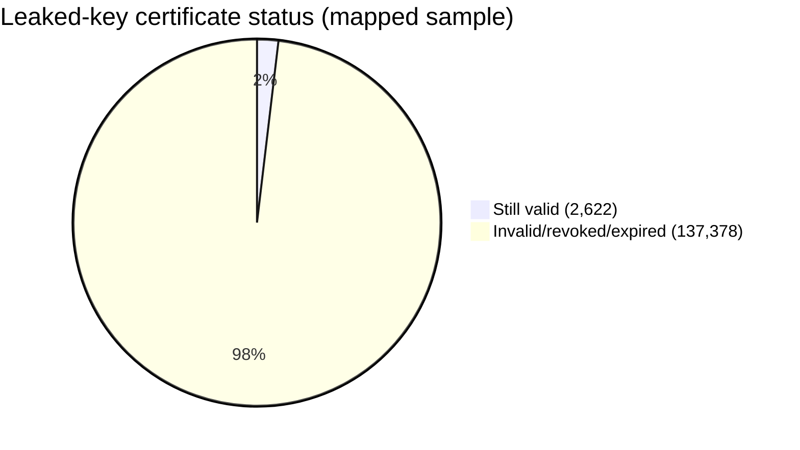
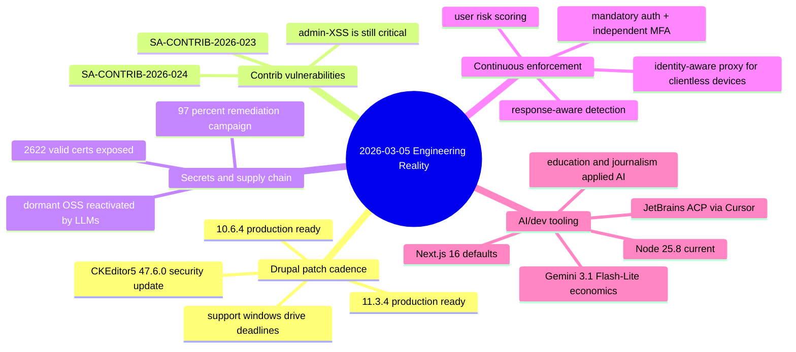

import Tabs from '@theme/Tabs';
import TabItem from '@theme/TabItem';
import TOCInline from '@theme/TOCInline';

Today's signal was mostly security operations, not product hype. Core Drupal patch lines moved, contrib advisories landed, and multiple vendors pushed "continuous" security controls that finally close obvious blind spots. On the AI side, a few releases are practical, many are just distribution updates with marketing paint.
<!-- truncate -->

<TOCInline toc={toc} minHeadingLevel={2} maxHeadingLevel={2} />

## Drupal Core: Support Windows Became Deadline Math

**Drupal core** 10.6.4 and 11.3.4 are patch releases and production-ready, with CKEditor5 updated to `v47.6.0` including a security fix in General HTML Support.

| Track | Latest patch | Security support window | Operational impact |
|---|---:|---|---|
| Drupal 10 | `10.6.4` | 10.6.x until Dec 2026; 10.5.x until Jun 2026 | 10.4.x is out of support; upgrade path is no longer optional |
| Drupal 11 | `11.3.4` | 11.3.x until Dec 2026 | Patch now to inherit CKEditor5 security update |

:::caution[Do not treat patch releases as "low priority"]
Patch releases now carry direct security dependency movement (CKEditor5 in this case). Any site below supported minor lines is already in a risk state, not a backlog state.
:::

```yaml title="ops/drupal-upgrade-runbook.yaml" showLineNumbers
site: example-drupal-prod
owner: platform
window: "2026-03-06 02:00-03:00 UTC"
checks:
  - php -v
  - composer validate --strict
  - drush status
  # highlight-next-line
  - drush pm:security --format=json
upgrade:
  # highlight-start
  from: "10.4.x|10.5.x|10.6.x"
  to: "10.6.4"
  require:
    - "drupal/core-recommended:^10.6.4"
    - "ckeditor5:^47.6.0"
  # highlight-end
post:
  - drush updb -y
  - drush cr
  - drush test:run --group=smoke
rollback:
  - restore-db-snapshot
  - restore-files-snapshot
```

## Contrib Advisories: Two Moderately Critical XSS Issues, Same Root Cause

**Contrib modules** took hits in `SA-CONTRIB-2026-023` and `SA-CONTRIB-2026-024`. Both are XSS class flaws with admin-context exploit assumptions, which teams regularly underestimate.

| Advisory | Project | Severity | Affected | CVE | Immediate action |
|---|---|---|---|---|---|
| SA-CONTRIB-2026-024 | Google Analytics GA4 | Moderately critical (12/25) | `<1.1.14` | `CVE-2026-3529` | Upgrade and audit custom attributes injected into analytics script tags |
| SA-CONTRIB-2026-023 | Calculation Fields | Moderately critical (14/25) | `<1.0.4` | `CVE-2026-3528` | Upgrade and validate/sanitize formula inputs across forms/webforms |

:::danger[Admin-context XSS is still a production incident]
"Admin only" does not mean safe. Admin sessions carry broad mutation rights, making stored/admin-XSS a practical pivot to full site compromise.
:::

```diff title="docs/security-playbook.diff"
- Treat admin-only XSS as low urgency
+ Treat admin-only XSS as incident-level until patched
+ Require module-version policy checks in CI
+ Block deploy when advisory-affected version is detected
```

## Secret Exposure: Certificates Proved the Risk Is Not Theoretical

**Secret hygiene** got hard evidence: GitGuardian + Google mapped leaked keys to certificate transparency and found `2,622` valid certificates as of Sep 2025, then reported `97%` remediation success after coordinated disclosure. Good response rate, bad baseline.



The "89% problem" framing is also valid: LLM coding throughput reactivates stale packages and stale risk. ~~Old code is harmless because it is dormant~~ is now false once assistants start importing forgotten dependencies into active builds.

:::warning[Build pipelines need secret scanning beyond Git history]
Secrets leak in temp files, `.env`, logs, shell history, CI artifacts, and agent memory buffers. Run scanning on filesystem + runtime outputs, not just commit diffs.
:::

## Continuous Enforcement Is Replacing Point-in-Time Security

Cloudflare's recent set of updates is coherent: always-on exploit detection (`Attack Signature Detection`, `Full-Transaction Detection`), mandatory auth + independent MFA, identity-aware access for clientless environments (Gateway Authorization Proxy), deepfake-resistant onboarding (Nametag integration), and dynamic User Risk Scoring.

<Tabs>
  <TabItem value="legacy" label="Legacy WAF/Auth" default>

  Point controls, manual tuning, and a permanent `log vs block` trade-off. Good for dashboards, weak for prevention consistency.

  </TabItem>
  <TabItem value="continuous" label="Continuous Enforcement">

  Correlated request+response detection, adaptive user risk policy, and enforced identity from boot through access. Lower blind spots, fewer brittle static rules.

  </TabItem>
</Tabs>

## AI + Dev Tooling: Practical Updates vs Marketing Noise

**AI tooling** shipped real workflow movement, but not all announcements are equally useful.

| Item | What changed | Signal |
|---|---|---|
| Cursor in JetBrains IDEs | ACP client support for IntelliJ/PyCharm/WebStorm family | High for teams standardized on JetBrains |
| Next.js 16 default for new sites | Default track changed | Medium; impacts scaffolding conventions |
| Node.js 25.8.0 (Current) | Current channel update | Medium; verify ecosystem compatibility before broad adoption |
| Gemini 3.1 Flash-Lite | Faster/cheaper tier (`$0.25/M in`, `$1.5/M out`) | High for cost-sensitive inference workloads |
| Canvas in AI Mode (US) | Draft docs + interactive tools in Search | Medium; useful if already inside Google's workflow |
| OpenAI Learning Outcomes Suite | Longitudinal measurement framework | High for education teams needing evidence, not anecdotes |
| Axios newsroom usage | AI for workflow acceleration in local journalism | Medium-high; operational proof beats generic "AI for media" claims |
| Qwen team turbulence | Model quality story now coupled to org stability risk | High for roadmap-dependent adopters |
| GPT-5.2 Pro in graviton amplitude preprint | Assisted symbolic derivation/verification claims | High research signal, low immediate product impact |
| GitHub Copilot Dev Days | In-person adoption events | Low technical signal, high ecosystem reach |

> "Don't file pull requests with code you haven't reviewed yourself."
>
> — Simon Willison, [Agentic Engineering Patterns](https://simonwillison.net/guides/agentic-engineering-patterns/)

That anti-pattern is still everywhere. Shipping unreviewed agent output is not speed; it is delayed incident creation.

> "What a joy it is to learn ... my conjecture has a nice solution"
>
> — Donald Knuth, [Claude cycles note](https://www-cs-faculty.stanford.edu/~knuth/papers/claude-cycles.pdf)

Short version: model capability is climbing fast, but review discipline is still the bottleneck.

<details>
<summary>Full operational checklist used for these updates</summary>

```bash title="scripts/weekly-security-and-tooling-check.sh" showLineNumbers
#!/usr/bin/env bash
set -euo pipefail

date
drush pm:security --format=json
composer outdated "drupal/*"

npm outdated || true
node -v

# Secret scanning beyond git history
gitleaks detect --no-git --source . || true

# Dependency and package health spot-check
npm audit --omit=dev || true
```
</details>

## The Bigger Picture



## Bottom Line

The thread across all items is simple: move from static assumptions to continuous verification. Patch windows, contrib hygiene, secret exposure, identity controls, and AI-assisted coding all fail the same way when review and enforcement are occasional instead of systemic.

:::tip[Single action with highest ROI]
Add one release gate that blocks deployment on any of: unsupported Drupal minor, advisory-affected contrib version, or newly detected secret in workspace/runtime artifacts.
:::
