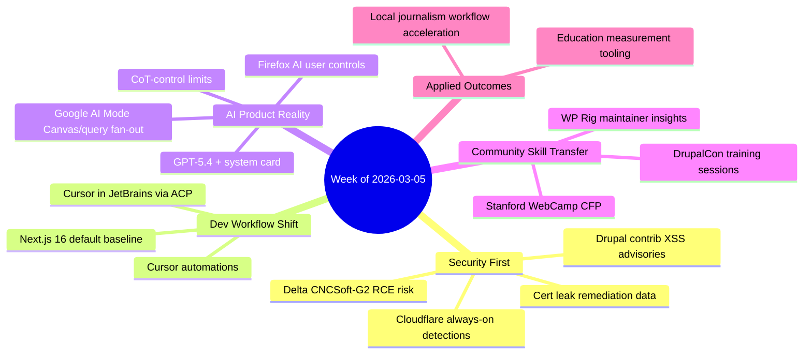

import Tabs from '@theme/Tabs';
import TabItem from '@theme/TabItem';
import TOCInline from '@theme/TOCInline';

The signal this week was not "new shiny AI." It was operational discipline: patch windows, identity controls, cert hygiene, and better defaults in dev tooling. The AI news mattered too, but mostly where it touched production workflows instead of demo theater.

<!-- truncate -->

<TOCInline toc={toc} minHeadingLevel={2} maxHeadingLevel={2} />

## Conferences, Community, and Practical Training

Three items stood out because they create real skill transfer, not just content velocity:

- **Stanford WebCamp 2026** opened CFPs for an online event on 30 April 2026 and hybrid program on 1 May 2026. Source: [Stanford WebCamp](https://webcamp.stanford.edu/).
- **Dripyard at DrupalCon Chicago** is doing training + talks + template session, which is the right ratio: hands-on plus architecture context. Source: [Dripyard](https://www.dripyard.com/).
- **WP Rig maintainer interview (#207)** highlighted a truth people still avoid: starter frameworks are education tools first, productivity tools second. Source: [WP Builds episode 207](https://wpbuilds.com/).

:::info[What this means in practice]
Conference announcements are only useful when they include formats that force implementation: training labs, architecture walkthroughs, and migration stories. Keynotes are branding; workshops are competence.
:::

## AI in Search and IDEs: Useful, but Only with Guardrails

Google shipped two meaningful updates: visual query fan-out in AI Mode and Canvas in AI Mode for drafting/building in Search. Cursor shipped automations and ACP-based JetBrains support. Firefox shipped user-facing AI controls with an explicit user-choice stance.

> "We believe in user choice"
>
> — Ajit Varma, Mozilla, [The Mozilla Blog](https://blog.mozilla.org/)

<Tabs>
<TabItem value="search" label="Search AI Mode" default>

Best for fast exploration where source fidelity still gets manually verified.  
Useful for visual + multimodal intent expansion, not for final factual claims.

</TabItem>
<TabItem value="cursor" label="Cursor Automations">

Best for always-on repo workflows with trigger-based execution.  
High leverage only when automation includes QA gates and rollback policy.

</TabItem>
<TabItem value="jetbrains" label="Cursor via ACP in JetBrains">

Best for teams staying in IntelliJ/PyCharm/WebStorm while adopting agent workflows incrementally.

</TabItem>
</Tabs>

:::caution[Automation without review is still bad engineering]
~~Agent-generated code can go straight to PR if tests pass~~ is how teams ship regressions at scale. Simon Willison's anti-pattern note is correct: no unreviewed code should hit collaborators.
:::

## Model Announcements: Separate Capability from Claims

OpenAI posted GPT-5.4 + GPT-5.4 Thinking System Card, plus CoT-Control findings saying reasoning models still struggle to tightly control their chains of thought. Translation: monitorability remains a real safety lever, not a solved checkbox.

Also in the same week: Qwen turbulence and public discussion around team departures, Gemini 3.1 Flash-Lite price/perf positioning, and Donald Knuth publicly revising his AI skepticism after a concrete math result.

> "Shock! Shock! I learned yesterday that an open problem I'd been working on for several weeks had just been solved..."
>
> — Donald Knuth, [claude-cycles.pdf](https://www-cs-faculty.stanford.edu/~knuth/papers/claude-cycles.pdf)

## Security Reality: The Week's Highest-Value Work

The most actionable updates were security bulletins and architecture fixes.

| Item | Why it matters | Action now |
|---|---|---|
| Delta CNCSoft-G2 OOB write (RCE risk) | OT/critical manufacturing exposure with remote code execution potential | Isolate affected hosts, inventory versions, apply vendor mitigation |
| Drupal SA-CONTRIB-2026-024 (GA4) | XSS via insufficient attribute sanitization | Upgrade to `>=1.1.14`, review custom attribute inputs |
| Drupal SA-CONTRIB-2026-023 (Calculation Fields) | XSS via insufficient validation | Upgrade to `>=1.0.4`, validate expression inputs |
| GitGuardian + Google cert leak study | 2,622 valid certs mapped from leaked private keys | Rotate exposed key material, enforce secret scanning in CI |
| Cloudflare always-on detections | Better exploit confirmation via request+response correlation | Enable detection telemetry before strict block mode |

:::danger[Do not treat "theoretical" XSS as low priority]
Admin-context XSS becomes tenant-wide compromise in real CMS operations. Patch, then hunt for persistence artifacts (`<script>`, rogue attributes, unexpected admin users).
:::

```yaml title="security-triage-playbook.yaml" showLineNumbers
week_of: 2026-03-05
priorities:
  - id: drupal-contrib-xss
    systems: [drupal]
    // highlight-next-line
    required_versions: {google_analytics_ga4: ">=1.1.14", calculation_fields: ">=1.0.4"}
    validation:
      - run: "drush pm:list --status=enabled --type=module"
      - run: "grep -R \"data-.*=\" web/modules/contrib -n"
  - id: cert-leak-response
    systems: [pkI, ci]
    actions:
      // highlight-start
      - "Rotate keys tied to leaked cert chains"
      - "Invalidate old certs and deploy replacements"
      - "Enable pre-commit and CI secret scanning"
      // highlight-end
  - id: cloudflare-policy-hardening
    systems: [edge, identity]
    actions:
      - "Enable Attack Signature Detection"
      - "Enable Full-Transaction Detection"
      - "Add User Risk Score to Access policy decisions"
```

## Drupal and Framework Release Hygiene

Drupal 10.6.4 and 11.3.4 are patch releases ready for production, both carrying CKEditor5 47.6.0 with a security update in General HTML Support. Support windows are explicit and short enough to force planning discipline.

```diff title="web/composer.lock.diff"
- "drupal/core-recommended": "10.6.3"
+ "drupal/core-recommended": "10.6.4"
- "ckeditor5": "47.5.0"
+ "ckeditor5": "47.6.0"
```

<details>
<summary>Release window snapshot to pin in ops docs</summary>

- Drupal `10.6.x` security support: until **December 2026**
- Drupal `10.5.x` security support: until **June 2026**
- Drupal `10.4.x`: security support **ended**
- Drupal `11.3.x` security coverage: until **December 2026**
- Next.js 16: now default for new sites (new baseline assumptions for tooling/docs)

</details>

:::warning[Patch lag now compounds faster]
When editor components get security fixes, delayed patching is not neutral. It increases incident response cost, especially in content-heavy orgs with many admin users.
:::

## Education and Media: AI Value Is in Measurement, Not Hype

OpenAI's education updates were useful because they included tooling plus measurement frameworks (Learning Outcomes Measurement Suite), not just "AI for schools" slogans. GitHub + Andela case studies were useful for the same reason: production workflow examples beat abstract capability talk. Axios on local journalism followed the same pattern: AI as force multiplier for workflow bottlenecks, not for replacing reporting judgment.

## The Bigger Picture



## Bottom Line

The hard truth: the highest ROI this week was still boring engineering hygiene, with AI features adding value only when wrapped in review, policy, and measurement.

:::tip[Single action that pays off this week]
Run a 90-minute release-and-security sweep: patch Drupal core/contrib, rotate any exposed cert material, and gate all agent automation with mandatory human review before merge.
:::
