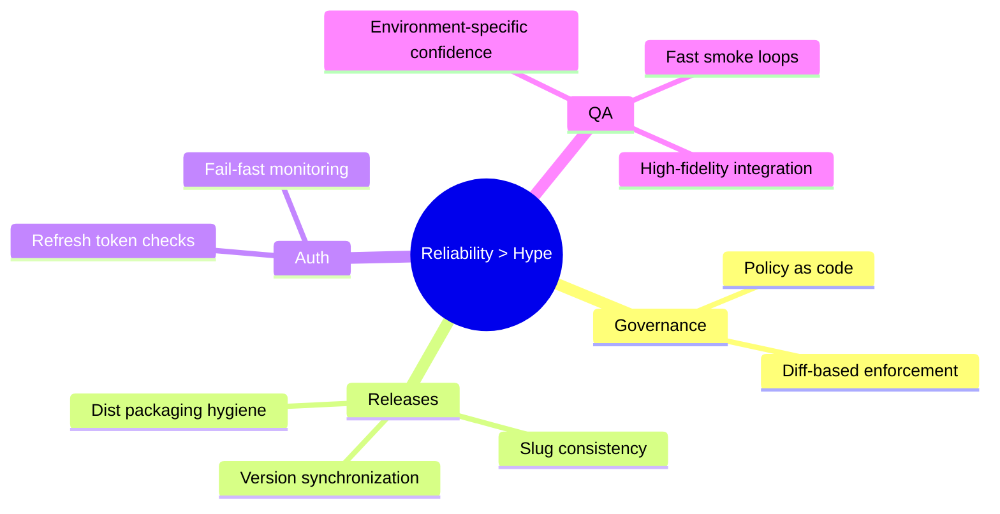

import Tabs from '@theme/Tabs';
import TabItem from '@theme/TabItem';
import TOCInline from '@theme/TOCInline';

The week’s pattern was simple: reliability came from boring constraints, not smarter prompts. **Policy-as-code** beat tribal memory, release hygiene prevented silent breakage, and QA only mattered when environments matched production assumptions. ~~“Just automate everything”~~ is still bad advice when guardrails are undefined.

<!-- truncate -->

<TOCInline toc={toc} minHeadingLevel={2} maxHeadingLevel={2} />

## Policy-Driven Agent Workflows Beat Prompt Folklore

Prompt craftsmanship is not a control plane. Execution standards in files are auditable, diffable, and enforceable; vibes in chat history are none of those.

```diff
--- a/policies.yaml
+++ b/policies.yaml
@@ -8,6 +8,10 @@ quality:
   require_tests: true
   block_on_failed_lint: true
 
+release:
+  require_version_sync: true
+  forbid_wp_prefix_slug: true
+
 automation:
   answer_owner_email: true
   check_token_health_before_reauth: true
```

:::caution[Policy Drift Is Silent Until It Isn't]
When enforcement lives only in memory, regressions pass code review because nobody notices the missing rule. Keep release and QA rules in repo-tracked config, and fail CI on drift.
:::

## WordPress Release Hygiene Is a Systems Problem, Not a Naming Problem

Most plugin rejection pain is self-inflicted inconsistency: slug mismatch, text-domain mismatch, version mismatch, and missing hardening boilerplate.

> "Given a version number MAJOR.MINOR.PATCH, increment the:"
>
> — Semantic Versioning 2.0.0, [semver.org](https://semver.org/)

| Surface | Must Match Slug/Version | Failure Mode |
|---|---|---|
| Main plugin file name | Slug | Packaging and discoverability confusion |
| `Text Domain` + i18n calls | Slug | Translation loading failures |
| Header `Version` + constant + `readme` stable tag | Version | Broken release tracking |
| `.distignore` | Release contents | Shipping dev junk to users |

```php title="site-contextsnap.php" showLineNumbers
<?php
if ( ! defined( 'ABSPATH' ) ) { exit; }

/**
 * Plugin Name: Site ContextSnap
 * Version: 1.4.0
 * Text Domain: site-contextsnap
 */

define( 'SITECONTEXTSNAP_VERSION', '1.4.0' );

// highlight-next-line
load_plugin_textdomain( 'site-contextsnap', false, dirname( plugin_basename( __FILE__ ) ) . '/languages' );

add_action( 'init', 'site_contextsnap_boot' );
function site_contextsnap_boot() : void {
    // highlight-next-line
    register_setting( 'reading', 'site_contextsnap_mode' );
}
```

:::info[Why This Keeps Paying Off]
Release metadata consistency is not cosmetics. It is the contract between deploy tooling, translators, and support workflows. One mismatch creates a chain of false signals.
:::

## OAuth Tokens: Stop Reauthorizing, Start Monitoring

Manual reauth is operational debt disguised as maintenance. Refresh tokens exist to prevent routine outages; missing health checks are the real bug.

```python title="jobs/verify_gmail_token.py" showLineNumbers
from pathlib import Path
import json

TOKEN_PATH = Path("token.json")

def verify_token() -> tuple[bool, str]:
    if not TOKEN_PATH.exists():
        return False, "token.json missing"

    data = json.loads(TOKEN_PATH.read_text())
    # highlight-start
    if "refresh_token" not in data or not data["refresh_token"]:
        return False, "refresh_token missing"
    if "client_id" not in data:
        return False, "client_id missing"
    # highlight-end
    return True, "token healthy"

ok, reason = verify_token()
print(reason)
raise SystemExit(0 if ok else 1)
```

:::warning[The Real Production Risk]
If refresh-token health is not checked before send jobs, email automation fails at runtime under load windows, not during calm periods. Gate outbound mail jobs with token health first, then fail fast.
:::

## Local QA Split: Fast WASM for Smoke, Lando for Truth

Speed and fidelity solve different problems. Pretending one tool does both is how flaky confidence gets mistaken for quality.

<Tabs>
  <TabItem value="wp-playground" label="WP Playground" default>
Fast smoke checks for activation, hooks, and admin rendering. Great for feedback loops under one minute.
  </TabItem>
  <TabItem value="lando" label="Lando">
Higher-fidelity checks for integration behavior, DB nuances, CLI workflows, and stack parity. Slower, but the failures are real.
  </TabItem>
</Tabs>

```bash title="scripts/run-local-qa.sh"
#!/usr/bin/env bash
set -euo pipefail

echo "Smoke: Playground"
npx @wp-playground/cli server --auto-mount >/tmp/playground.log 2>&1 &
PLAYGROUND_PID=$!

echo "Fidelity: Lando"
lando start
lando php -v
lando wp plugin list

kill "$PLAYGROUND_PID"
```

<details>
<summary>Full QA gate example</summary>

```yaml title=".github/workflows/qa.yml" showLineNumbers
name: QA

on:
  push:
  pull_request:

jobs:
  fast-smoke:
    runs-on: ubuntu-latest
    steps:
      - uses: actions/checkout@v4
      # highlight-next-line
      - run: npm ci && npm run smoke

  fidelity:
    runs-on: ubuntu-latest
    steps:
      - uses: actions/checkout@v4
      # highlight-start
      - run: composer install --no-interaction
      - run: vendor/bin/phpcs
      - run: vendor/bin/phpunit
      # highlight-end
```

</details>

## The Bigger Picture



## Bottom Line

:::tip[One Rule That Prevents Most Pain]
Block merges unless three checks pass together: policy lint, version/slug consistency scan, and stack-appropriate tests (fast smoke plus high-fidelity integration). Anything less is optimism dressed as process.
:::
