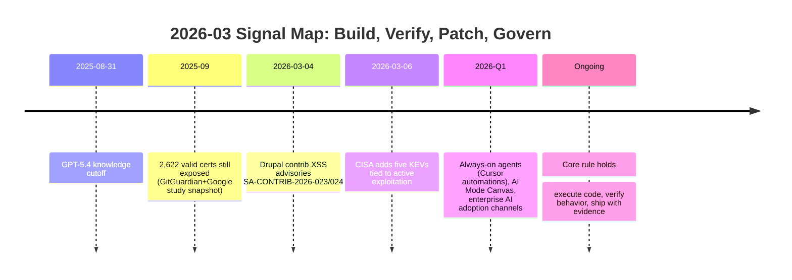

import Tabs from '@theme/Tabs';
import TabItem from '@theme/TabItem';
import TOCInline from '@theme/TOCInline';

This week had two distinct categories of input: engineering signal worth acting on, and marketing noise dressed up as progress. The signal boiled down to running code, verifying outputs, patching fast, and treating security advisories as operational tasks. The noise was model announcements presented as if they change delivery outcomes by themselves.

<!-- truncate -->

<TOCInline toc={toc} minHeadingLevel={2} maxHeadingLevel={2} />

## Agentic Engineering Requires Verification Loops

> "Never assume that code generated by an LLM works until that code has been executed."
>
> — Simon Willison, [Agentic Engineering Patterns](https://simonwillison.net/guides/agentic-engineering-patterns/)

Code generation gets all the attention, but the part that matters in agentic tooling is **verification loops**: execute, inspect, fail fast, retry with evidence. ~~"Pretty code output" means progress~~; runnable and validated output means progress.

:::caution[Unreviewed Agent PRs Waste Team Time]
Do not open pull requests from agent output without manual review and execution evidence attached. Require logs for tests, lint, and one realistic manual path before review. If a PR has no evidence artifact, close it and send it back.
:::

```bash title="scripts/verify-agent-output.sh" showLineNumbers
#!/usr/bin/env bash
set -euo pipefail

task="${1:-unnamed-task}"
# highlight-next-line
run_id="$(date +%Y%m%d-%H%M%S)"
out_dir="artifacts/${task}-${run_id}"

mkdir -p "$out_dir"
echo "Task: $task" | tee "$out_dir/summary.txt"
echo "Run: $run_id" | tee -a "$out_dir/summary.txt"

# highlight-start
npm run lint | tee "$out_dir/lint.log"
npm test | tee "$out_dir/test.log"
phpunit --colors=never | tee "$out_dir/phpunit.log"
# highlight-end

echo "Manual checks" | tee -a "$out_dir/summary.txt"
echo "- login flow" | tee -a "$out_dir/summary.txt"
echo "- role permissions" | tee -a "$out_dir/summary.txt"
echo "- rollback path" | tee -a "$out_dir/summary.txt"
```

## GPT-5.4: Better Model, Same Verification Requirements

OpenAI shipped `gpt-5.4` and `gpt-5.4-pro` across API, ChatGPT, and Codex CLI, with a 1M-token context window and August 31, 2025 cutoff. Genuinely useful upgrade for longer codebase context and tool-heavy tasks, but it does not reduce the need for runtime checks one bit.

> "Two new API models: gpt-5.4 and gpt-5.4-pro."
>
> — OpenAI, [Introducing GPT-5.4](https://openai.com/index/introducing-gpt-5-4/)

Worth paying attention to as well: the CoT-Control and GPT-5.4 Thinking System Card updates confirm that models still struggle to tightly control internal reasoning traces. If you needed more justification for monitorability and external guardrails over blind trust, there it is.

| Item | Practical Impact | Action |
|---|---|---|
| `gpt-5.4` / `gpt-5.4-pro` | Better coding + tool use | Route complex refactors through tool-verified runs |
| 1M context window | Fewer chunking hacks | Still chunk by ownership boundaries for reviewability |
| CoT-Control findings | Control limits remain | Log prompts, tool calls, and outputs for auditability |
| ChatGPT for Excel + finance integrations | Fast analysis in regulated contexts | Enforce data classification before enabling |

<Tabs>
<TabItem value="gpt54" label="gpt-5.4" default>

Best default for daily engineering throughput when latency and cost matter. Pair with strict CI gates and short feedback loops.

</TabItem>
<TabItem value="gpt54pro" label="gpt-5.4-pro">

Use for high-complexity reasoning or large multi-file refactors where failure cost is high. Require stronger review and test depth.

</TabItem>
</Tabs>

## Security Feed: Triage These Today, Not Next Sprint

CISA added five actively exploited vulnerabilities to KEV, Delta CNCSoft-G2 disclosed RCE-relevant risk (CVSS v3 7.8), Drupal contrib modules shipped March 4, 2026 XSS advisories, and GitGuardian + Google mapped leaked keys to valid cert exposure at scale. Every one of these becomes operational debt the moment you defer it.

:::danger[KEV and XSS Advisories Need Same-Day Triage]
Track KEV additions and CMS advisories in the same queue as production incidents. For Drupal fleets, upgrade affected contrib modules immediately (`Google Analytics GA4 <1.1.14`, `Calculation Fields <1.0.4`) and run regression tests focused on admin-input rendering paths.
:::

| Advisory | Date | Risk | Required Move |
|---|---|---|---|
| CISA KEV + 5 CVEs | 2026-03-06 window | Active exploitation | Patch/mitigate within SLA |
| Delta CNCSoft-G2 OOB write | Current | Potential RCE | Isolate, patch, monitor ICS access |
| SA-CONTRIB-2026-024 | 2026-03-04 | XSS | Upgrade `google_analytics_ga4` to `>=1.1.14` |
| SA-CONTRIB-2026-023 | 2026-03-04 | XSS | Upgrade `calculation_fields` to `>=1.0.4` |
| 2,622 valid certs exposed study | Sep 2025 snapshot | Credential abuse | Rotate keys, enforce short-lived certs |

```bash title="scripts/security-triage.sh" showLineNumbers
#!/usr/bin/env bash
set -euo pipefail

drush pm:list --status=enabled --type=module --format=json > enabled.json

# highlight-start
jq -r '.[] | select(.name=="google_analytics_ga4" or .name=="calculation_fields") | "\(.name) \(.version)"' enabled.json
# highlight-end

echo "Check KEV list deltas"
curl -s https://www.cisa.gov/known-exploited-vulnerabilities-catalog | grep -E "CVE-2017-7921|CVE-2021-22681|CVE-2021-30952|CVE-2023-41974|CVE-2023-43000" || true

echo "Rotate exposed certs and keys if inventory matches leak indicators"
```

## Drupal and PHP: Consistent Patch Intake Keeps You Off the News

Drupal `10.6.4` and `11.3.4` landed as production-ready patch releases, both carrying CKEditor 5 `v47.6.0` updates, with stated support windows through December 2026 for the active branches. Nobody writes blog posts celebrating uneventful upgrades, which is exactly the point. Regular patch intake, narrow blast radius, fast verification.

```diff title="composer.json"
- "drupal/core-recommended": "^10.5"
+ "drupal/core-recommended": "^10.6.4"
```

:::info[Support Windows Are Scheduling Inputs]
Drupal 10.6.x and 11.3.x support timelines are release-planning constraints, not trivia. Roadmaps that ignore these windows turn upgrades into emergency projects.
:::

<details>
<summary>Patch intake checklist used this week</summary>

- Update core target (`10.6.4` or `11.3.4`) in `composer.json`.
- Run `composer update drupal/core-* --with-all-dependencies`.
- Run automated tests and smoke admin/editor workflows.
- Validate CKEditor custom plugin compatibility after `47.6.0`.
- Re-check contrib advisory exposure after deploy.
- Mark unsupported branches for upgrade if still on pre-10.5.
</details>

## Product Surface Area Is Expanding Faster Than Governance

Google pushed AI Mode visual search and Canvas in Search (U.S. availability), Firefox emphasized user choice in new AI controls, Cursor added automations for always-on agents, GitHub+Andela shared production AI adoption patterns, and OpenAI launched adoption-focused channels and education resources. Plenty of momentum, but each new surface brings policy work that most teams haven't budgeted for.

:::warning[Always-On Agents Expand Failure Modes]
Trigger-based automation without guardrails becomes silent damage at scale. Require three controls before enabling: scope-bound credentials, action allowlists, and human-visible execution logs.
:::

## March 2026 Signal Map



## What This Means for Next Week

Model quality keeps improving, but the bottleneck for shipping has shifted to engineering discipline: verification rigor, security triage speed, and governance that keeps up with the surfaces teams keep adopting.

:::tip[Single Highest-ROI Move]
Standardize one release gate across teams: no merge without executable evidence (`lint`, tests, and one manual path) plus same-day security advisory triage. That eliminates most agentic failure modes before production sees them.
:::
