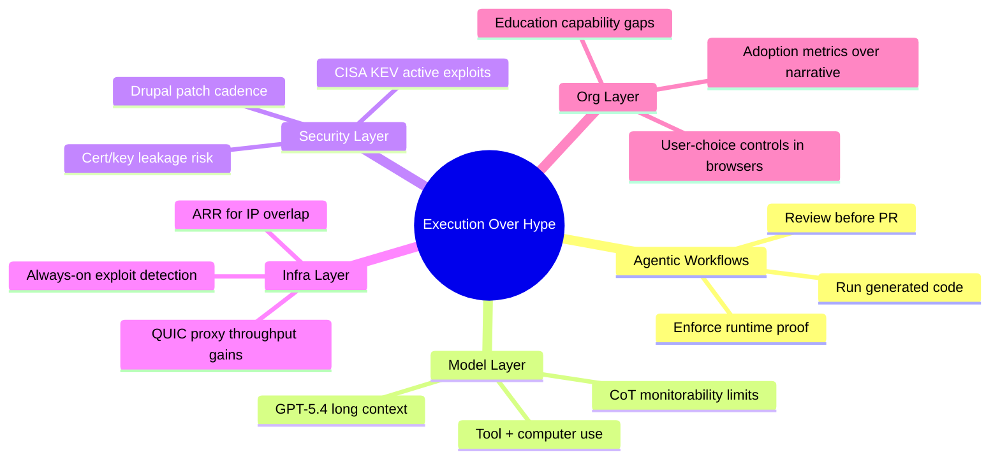

import Tabs from '@theme/Tabs';
import TabItem from '@theme/TabItem';
import TOCInline from '@theme/TOCInline';

Most of this cycle looked like standard AI marketing noise, but a few signals were operationally relevant: execution-first agent workflows, model upgrades with meaningful context/tooling implications, and a heavy set of security advisories that require immediate patch discipline. The pattern holds: teams shipping reliable software are the teams that run code, verify assumptions, and patch fast. ~~Prompting is QA~~ Execution is QA.

<!-- truncate -->

<TOCInline toc={toc} minHeadingLevel={2} maxHeadingLevel={2} />

## Agentic Engineering Requires Running the Code

> "Never assume that code generated by an LLM works until that code has been executed."
>
> — Simon Willison, [Agentic Engineering Patterns](https://simonwillison.net/guides/agentic-engineering-patterns/)

This remains the most useful framing in agentic development. An agent that cannot execute what it wrote offers you glorified autocomplete — and the anti-pattern keeps showing up: unreviewed AI code pushed to teammates as a "draft PR."

:::caution[Unreviewed PRs Are a Team Tax]
Require execution evidence in every agent-generated PR: command logs, failing test fixed, and final green run. No evidence, no merge. This cuts rework and avoids socializing broken code into review queues.
:::

| Pattern | What Works | Failure Mode |
|---|---|---|
| Manual agent loop | Generate → run → inspect → patch → rerun | Stopping at generation |
| PR discipline | Human review + runtime proof | "Looks fine" approvals |
| Test gating | CI blocks without tests/lint | Silent regressions in edge paths |

```yaml title="quality-gate.yml" showLineNumbers
name: quality-gate
on: [pull_request]

jobs:
  verify:
    runs-on: ubuntu-latest
    steps:
      - uses: actions/checkout@v4
      - name: Install deps
        run: composer install --no-interaction --prefer-dist
      - name: Static checks
        run: composer phpcs
      - name: Tests
        run: composer test
      # highlight-next-line
      - name: Enforce execution proof
        run: test -f artifacts/agent-run.log
```

```diff
- AI-generated code attached for review. Not tested.
+ Added execution log, failing test reproduction, and passing test run.
+ Reviewer checklist includes runtime proof and rollback note.
```

## GPT‑5.4: Concrete Improvements Worth Evaluating

OpenAI's GPT‑5.4 release matters for three concrete reasons: API availability (`gpt-5.4`, `gpt-5.4-pro`), **1M context window**, and broad tool/computer-use focus. Those specs change architecture choices for long-context assistants and codebase-scale reasoning.

> "Two new API models: gpt-5.4 and gpt-5.4-pro ... 1 million token context window."
>
> — OpenAI, [Introducing GPT‑5.4](https://openai.com/index/introducing-gpt-5-4/)

<Tabs>
<TabItem value="gpt54" label="gpt-5.4" default>

Balanced latency/cost profile for production workflows that need long context and tool calls.

</TabItem>
<TabItem value="gpt54pro" label="gpt-5.4-pro">

Better for harder reasoning and code tasks when quality beats latency/cost.

</TabItem>
</Tabs>

:::info[System Card Matters More Than Demo Clips]
The GPT‑5.4 Thinking System Card and CoT-control research highlight a constraint practitioners need to internalize: reasoning traces are not perfectly steerable. Treat monitorability and policy checks as hard requirements, not optional controls.
:::

## Security and CMS Updates: Patch Windows Are Tight

March 4, 2026 dropped multiple Drupal contrib XSS advisories (`SA-CONTRIB-2026-023`, `SA-CONTRIB-2026-024`), while Drupal core patch lines (`10.6.4`, `11.3.4`) shipped CKEditor5 `v47.6.0` updates. CISA also added five actively exploited vulnerabilities to KEV. None of this can wait for next sprint.

:::danger[Active Exploitation Is Already Happening]
KEV entries imply observed exploitation, not theoretical risk. For internet-facing systems, patch/mitigate first, then write retrospective notes.
:::

| Item | Date | Action |
|---|---|---|
| Drupal 10.6.4 | 2026-03 | Upgrade production sites on 10.x |
| Drupal 11.3.4 | 2026-03 | Upgrade 11.x and verify editor flows |
| SA-CONTRIB-2026-023 | 2026-03-04 | Update Calculation Fields to `>=1.0.4` |
| SA-CONTRIB-2026-024 | 2026-03-04 | Update Google Analytics GA4 to `>=1.1.14` |
| CISA KEV additions | 2026-03 | Immediate exposure assessment + remediation |

<details>
<summary>Advisory snapshot</summary>

- `CVE-2026-3528` (Calculation Fields, XSS)
- `CVE-2026-3529` (Google Analytics GA4, XSS)
- KEV additions include Hikvision, Rockwell, and Apple CVEs with active exploitation evidence.
- Delta CNCSoft-G2 advisory flags out-of-bounds write leading to possible RCE conditions.

</details>

## Infra Signals: Network Performance and Detection Upgrades

Cloudflare's ARR and QUIC proxy-mode changes are practical infrastructure wins: fewer private-IP overlap headaches and measurably better proxy throughput. Their always-on detection work also deserves attention — it moves beyond static request signatures by correlating payloads with server responses, which reduces false positives in meaningful ways.

```bash title="ops-checklist.sh"
#!/usr/bin/env bash
set -euo pipefail

echo "1) Verify tunnel overlap cases"
echo "2) Benchmark TCP proxy vs QUIC proxy throughput"
echo "3) Enable exploit+response correlation detections"
echo "4) Compare false positive rates over 7 days"
echo "5) Promote only if latency and FP targets are met"
```

## Ecosystem Updates: Education, Browser Controls, and Adoption Channels

There was a flood of "AI adoption" content this week. The pieces worth reading were the ones tied to operational behavior: GitHub+Andela examples of learning inside production workflows, Firefox emphasizing user choice for AI controls, and OpenAI pushing education capability tooling plus Excel/financial integrations for regulated analysis contexts.

The filter I keep applying: ignore brand narrative, keep artifacts. If a post does not include a measurable workflow change, it is content marketing and you can skip it.

:::warning[Measure Adoption or Don't Bother]
Track per-team deltas: lead time, escaped defects, and incident rate before/after AI workflow changes. If those metrics do not improve, roll back the process regardless of executive enthusiasm.
:::

## How These Signals Connect



## What To Do This Week

The pattern that keeps working is straightforward: execution evidence, patch discipline, and measurable workflow outcomes. None of those require a new framework or a vendor pitch deck — they require discipline and follow-through.

:::tip[Single Most Actionable Move]
Add a hard "execution proof" gate to every AI-assisted PR this week: required repro/test logs plus final green run artifact. This one change removes the highest-volume failure mode in agentic coding.
:::
