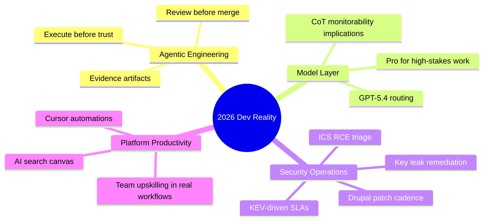

import Tabs from '@theme/Tabs';
import TabItem from '@theme/TabItem';
import TOCInline from '@theme/TOCInline';

Most headlines this week were marketing theater. The useful part was smaller and sharper: execution-backed agent workflows, clearer model tiering with GPT-5.4, and concrete security signals that require immediate patch triage. ~~“Ship fast and trust the model output”~~ is still how teams create expensive bugs.

<!-- truncate -->

<TOCInline toc={toc} minHeadingLevel={2} maxHeadingLevel={2} />

## Agentic Manual Testing Is the Line Between Demo and Engineering

> "Never assume that code generated by an LLM works until that code has been executed."
>
> — Simon Willison, [Agentic Engineering Patterns](https://simonwillison.net/guides/agentic-engineering-patterns/)

This is still the highest-leverage rule in AI-assisted development. The anti-pattern is also unchanged: unreviewed PRs generated by agents and dumped on teammates.

:::warning[Unreviewed Agent PRs Are Operational Debt]
Require an execution artifact on every agent-generated change: test output, runtime logs, or reproducible command transcript. If a PR has no verification evidence, block merge immediately and request rerun with trace.
:::

```yaml title="ci/pull_request_policy.yaml" showLineNumbers
policy:
  pull_request:
    require_human_review: true
    require_execution_evidence: true
    required_artifacts:
      - test_summary
      - failing_test_count
      - command_log
    reject_if:
      - no_artifacts
      - generated_code_without_runtime_check
      - skipped_security_tests
enforcement:
  owner: platform-team
  mode: blocking
```

```diff title=".github/workflows/pr.yml"
 jobs:
   validate:
     steps:
       - run: npm test
+      - name: Verify agent evidence
+        run: test -f artifacts/test_summary.json
+      - name: Block unverified generated code
+        run: ./scripts/check_agent_evidence.sh
```

## GPT-5.4: Useful Upgrade, Not Magic

OpenAI’s GPT-5.4 launch is practical for teams that hit context and tool-use limits, not a reason to rewrite architecture. Relevant facts: `gpt-5.4` and `gpt-5.4-pro`, broad product availability, and a 1M-token window.

<Tabs>
  <TabItem value="gpt54" label="gpt-5.4" default>
  Best default for production workloads where latency and cost matter.

  - Use for coding + tool orchestration in regular CI/CD paths.
  - Add strict eval gates; don’t confuse longer context with better judgment.
  </TabItem>
  <TabItem value="gpt54pro" label="gpt-5.4-pro">
  Use when the task is materially expensive to get wrong.

  - Better fit for complex reasoning, high-stakes planning, and deep codebase refactors.
  - Keep it behind routing rules; don’t burn budget on CRUD work.
  </TabItem>
</Tabs>

| Decision point | Use `gpt-5.4` | Use `gpt-5.4-pro` |
|---|---|---|
| Routine implementation | Yes | No |
| Architecture migration | Maybe | Yes |
| High-risk security analysis | Maybe | Yes |
| Cost-sensitive batch jobs | Yes | No |

:::info[CoT Control Result Matters]
The CoT-control finding is important because it supports monitorability: models are not cleanly obedient at hidden-reasoning shaping. Treat that as a safety signal to increase observable evaluation, not as a reason to hide more internals.
:::

## Security Signals: Patch Windows, Not Reading Lists

CISA KEV additions, ICS RCE on Delta CNCSoft-G2, Drupal advisories, and certificate leak impact data all point to one policy: shorten exposure windows.

> "CISA has added five new vulnerabilities to its Known Exploited Vulnerabilities (KEV) Catalog, based on evidence of active exploitation."
>
> — CISA, [KEV Update](https://www.cisa.gov/known-exploited-vulnerabilities-catalog)

:::danger[Exploit Evidence Means Deadline Compression]
If a CVE is in KEV, classify it as active threat intelligence, not backlog. Set patch SLA in hours/days, not “next sprint,” and record compensating controls only if deployment is blocked.
:::

```bash title="scripts/security-triage.sh"
#!/usr/bin/env bash
set -euo pipefail

echo "1) Pull latest advisories"
./bin/fetch-advisories --sources cisa,drupal,vendor

echo "2) Match against SBOM/inventory"
./bin/match-cves --inventory ./infra/asset-inventory.json --out ./artifacts/matches.json

echo "3) Escalate KEV and RCE"
./bin/prioritize --input ./artifacts/matches.json --rule "kev=true || impact=rce"

echo "4) Open patch tickets with SLA"
./bin/create-tickets --input ./artifacts/prioritized.json --sla-policy ./policy/sla.yaml
```

<details>
<summary>Security items worth immediate action</summary>

- CISA KEV additions: CVE-2017-7921, CVE-2021-22681, CVE-2021-30952, CVE-2023-41974, CVE-2023-43000.
- Delta Electronics CNCSoft-G2: out-of-bounds write with RCE risk (critical manufacturing context).
- Drupal contrib advisories:
  - `Google Analytics GA4` before `1.1.14` vulnerable to XSS (CVE-2026-3529).
  - `Calculation Fields` before `1.0.4` vulnerable to XSS (CVE-2026-3528).
- Drupal core patch releases:
  - `10.6.4` and `11.3.4` include CKEditor5 `v47.6.0` security-related updates.
- GitGuardian + Google study: 2,622 certificates remained valid among leaked-key mapped certs as of Sep 2025.
</details>

## Ecosystem Noise vs Useful Signals

Mozilla’s AI controls framing (“user choice”), Google Search AI mode updates, Cursor automations, GitHub+Andela adoption stories, and conference/news items are useful only when converted into operating changes.

| Signal | Reality check | Action |
|---|---|---|
| Browser AI controls | Privacy and autonomy are product differentiators now | Add browser-policy tests to enterprise rollout checklist |
| Cursor automations | Always-on agents can help or silently break things | Enforce trigger scoping + audit logs |
| GitHub + Andela AI workflows | Upskilling works when tied to production tasks | Pair AI usage metrics with defect-rate metrics |
| Search AI Canvas/visual fan-out | Fast discovery, uneven trust | Use for exploration, then verify in primary docs |

:::caution[Automation Without Guardrails Recreates Legacy Ops Failure]
Always-on agent triggers without explicit boundaries will execute stale intent forever. Add expiry to automation instructions and require weekly policy review.
:::

## The Bigger Picture



## Bottom Line

Execution evidence, model routing, and patch SLAs are the only parts that compound. Everything else is feed noise.

:::tip[Single Highest-ROI Move]
Add one blocking CI rule this week: reject any agent-authored PR that lacks executable verification artifacts. That one gate improves code quality, security posture, and team trust immediately.
:::
