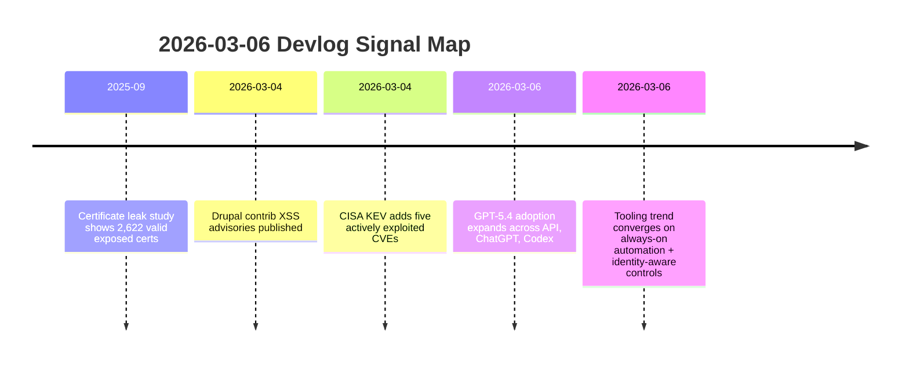

import Tabs from '@theme/Tabs';
import TabItem from '@theme/TabItem';
import TOCInline from '@theme/TOCInline';

Model capability keeps climbing. So does operational risk, and this week the risk side had more to say. GPT-5.4 brings real improvements for production coding and long-context work. Meanwhile, CISA added five actively exploited CVEs, Drupal shipped security releases, and leaked private keys are still floating around attached to valid certificates. The priority order writes itself: patch, instrument, then leverage the better models.

<!-- truncate -->

<TOCInline toc={toc} minHeadingLevel={2} maxHeadingLevel={2} />

## GPT-5.4: Stronger Models, Same Cost-Scope Questions

> "Two new API models: gpt-5.4 and gpt-5.4-pro ... 1 million token context window."
>
> — OpenAI announcement summary, [Introducing GPT‑5.4](https://openai.com/index/introducing-gpt-5-4/) and [model docs](https://developers.openai.com/api/docs/models/gpt-5.4)

Skip the headline number. What matters for daily work is that long context, better coding performance, and tool-use improvements ship together across the API, ChatGPT, and Codex CLI. You can prototype in ChatGPT and move to the API without switching model families or discovering capability gaps at the worst moment.

| Model | Best use | Tradeoff |
|---|---|---|
| `gpt-5.4` | Daily coding, analysis, multi-step tool workflows | Better cost/perf balance |
| `gpt-5.4-pro` | Hard reasoning, high-stakes generation, complex verification | Higher cost, slower iteration |
| `gpt-5.4` + long context | Large codebase refactors, long spec synthesis | Prompt bloat can hide bad requirements |

:::caution[A Million Tokens Won't Save Bad Architecture]
Long context lets you feed more information to the model. It does not make the model question your assumptions for you. Scope prompts to one deployable objective, require explicit acceptance checks, and throw out outputs that skip validation.
:::

<Tabs>
<TabItem value="api" label="API Usage" default>

Use `gpt-5.4` as the default model in CI-adjacent automation; reserve `gpt-5.4-pro` for gated review tasks where false positives are expensive.

</TabItem>
<TabItem value="chatgpt" label="ChatGPT">

Good for rapid analysis and synthesis, but production changes still need repo-local tests and policy checks.

</TabItem>
<TabItem value="codex" label="Codex CLI">

Best fit for end-to-end coding loops because edits, tests, and git state are in one execution path.

</TabItem>
</Tabs>

## Five KEV Additions, Two Drupal Advisories, and a Certificate Mess

CISA added five actively exploited vulnerabilities to KEV. Drupal published new releases (`10.6.4`, `11.3.4`) and two contrib advisories on March 4, 2026 (`SA-CONTRIB-2026-023`, `SA-CONTRIB-2026-024`). Delta CNCSoft-G2 disclosed an out-of-bounds write with RCE risk. GitGuardian and Google found 2,622 still-valid certificates linked to leaked private keys (as of September 2025).
That volume of signal makes ~~"monitor-only for now"~~ indefensible. Blocking controls with rollback plans, this week.

:::danger[Active Exploitation Means a Deadline, Not a Meeting]
When KEV lists active exploitation, patch windows become incident windows. The sequence is `inventory -> exposure check -> patch -> verify exploit path closed`, and it runs in one cycle.
:::

```yaml title="security-baseline.yaml" showLineNumbers
services:
  drupal:
    min_supported:
      core_10: "10.6.4"
      core_11: "11.3.4"
  dependency_policy:
    block_if:
      - kev_match: true
      - known_rce: true
# highlight-next-line
  cert_policy:
    rotate_if_key_leaked: true
    max_validity_days: 90
    ct_log_monitoring: true
  waf_policy:
    mode: "detect+block"
    require_full_transaction_detection: true
```

<details>
<summary>Security items tracked in this devlog</summary>

1. CISA KEV additions: CVE-2017-7921, CVE-2021-22681, CVE-2021-30952, CVE-2023-41974, CVE-2023-43000
2. Drupal core releases: 10.6.4 and 11.3.4 (CKEditor 47.6.0 update noted)
3. Drupal contrib advisories: Google Analytics GA4 `<1.1.14`, Calculation Fields `<1.0.4`
4. Delta CNCSoft-G2 out-of-bounds write with potential RCE
5. Certificate leakage impact study with 2,622 valid exposed certs

</details>

## Drupal and PHP: Boring Releases That Prevent Exciting Incidents

Drupal `10.6.x` and `11.3.x` define the safe baseline through December 2026 security coverage. If you are still running anything below `10.5.x`, you are outside supported coverage and that upgrade needs to jump the queue ahead of feature work. No negotiation on this one.

PHP JIT improvements keep landing too, which is welcome. But shipping unpatched CMS and plugin code faster does not count as progress.

```bash title="ops/drupal-security-rollout.sh" showLineNumbers
#!/usr/bin/env bash
set -euo pipefail

SITE_ROOT="${1:-/var/www/html}"

cd "$SITE_ROOT"

# highlight-next-line
drush status --fields=drupal-version
drush pm:security

# highlight-start
composer update drupal/core-recommended drupal/core-composer-scaffold drupal/core-project-message --with-all-dependencies
drush updb -y
drush cr
# highlight-end

drush pm:security
drush status --fields=drupal-version
```

```diff title="composer.json"
 {
   "require": {
-    "drupal/core-recommended": "^10.5"
+    "drupal/core-recommended": "^10.6.4 || ^11.3.4"
   }
 }
```

## AI Product Updates Worth Tracking (and What to Ignore)

ChatGPT for Excel with financial integrations, Cursor automations, Google AI Mode visual search and query fan-out, Canvas in AI Mode — they all target fewer tool hops between thinking and doing. Some of these will stick. Most will get quietly deprecated within a year.

The filter is simple: does it cut handoffs in a production workflow while keeping an audit trail? If yes, adopt. If it adds a new silo with no traceability, pass.

| Feature | Good use case | Hard limit |
|---|---|---|
| ChatGPT for Excel + finance integrations | Fast model building + traceable analysis drafts | Governance and data boundaries still required |
| Cursor automations | Always-on repetitive engineering tasks | Bad prompts automate bad outcomes |
| Google AI Mode Canvas | Quick doc/tool prototyping in search context | Not a substitute for source-of-truth repos |

:::info[Measuring AI Adoption by Something Other Than Seat Count]
OpenAI's education and enterprise value-model framing gets more useful when you tie it to capability measurement. Track defect rate, cycle time, and escaped incidents per AI-assisted workflow. Usage dashboards alone tell you nothing about whether the work got better.
:::

## Cloudflare Consolidating Identity, Network, and Detection

ARR for overlapping private IPs, QUIC-based proxy mode throughput gains, always-on exploit detection, user risk scoring, gateway auth proxy, and anti-deepfake onboarding controls. The direction is clear: policy enforcement is shifting from static network boundaries to continuous signals about identity and behavior. If your security posture still depends on "which subnet is this request from," you are falling behind.

> "Don't file pull requests with code you haven't reviewed yourself."
>
> — Simon Willison, [Agentic Engineering Patterns](https://simonwillison.net/guides/agentic-engineering-patterns/)

That advice extends to security automation. Auto-detection without operator review creates faster log noise, not faster protection.

## Community Signals: Ship Artifacts, Not Announcements

Stanford WebCamp 2026 CFP, WP Rig maintainer discussion, UI Suite Display Builder demos, GitHub + Andela production-learning stories, and Qwen team turbulence all showed up this week. The common thread across all of them is boring and reliable: teams that ship reviewable artifacts outlast teams that ship press releases. When leadership churn or product messaging dominates the feed, put your energy into reliability work. It compounds.

## Timeline



## Bottom Line

Production engineering in 2026 runs on policy, patches, and measurement. Stronger models multiply the output of teams that already have those basics covered. Without them, you are just generating more code to audit later.

:::tip[One Gate to Set Up Today]
Block deploys when KEV-matched vulns, unsupported Drupal versions, or leaked-key cert exposure is detected. Features ship after that gate passes. This is the single cheapest investment in not getting paged at 3 AM.
:::
