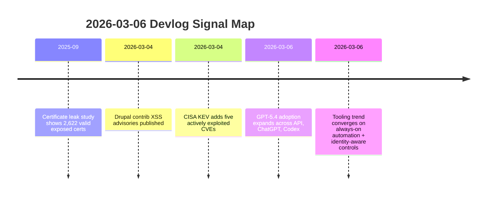

import Tabs from '@theme/Tabs';
import TabItem from '@theme/TabItem';
import TOCInline from '@theme/TOCInline';

The signal this week was simple: model capability is rising, but operational risk is rising faster. GPT-5.4 is legitimately strong for production coding and long-context workflows, yet the real work is still patching systems, controlling blast radius, and filtering marketing noise from actionable engineering change.  
If the stack is not patched and instrumented, a 1M-token context window is just a faster way to generate incident postmortems.

<!-- truncate -->

<TOCInline toc={toc} minHeadingLevel={2} maxHeadingLevel={2} />

## GPT-5.4 Is Better, but Cost and Scope Still Decide

> "Two new API models: gpt-5.4 and gpt-5.4-pro ... 1 million token context window."
>
> — OpenAI announcement summary, [Introducing GPT‑5.4](https://openai.com/index/introducing-gpt-5-4/) and [model docs](https://developers.openai.com/api/docs/models/gpt-5.4)

The useful part is not the headline. The useful part is the combination of long context, stronger coding/tool use, and availability across API, ChatGPT, and Codex CLI. That removes tool-friction between prototyping and production handoff.

| Model | Best use | Tradeoff |
|---|---|---|
| `gpt-5.4` | Daily coding, analysis, multi-step tool workflows | Better cost/perf balance |
| `gpt-5.4-pro` | Hard reasoning, high-stakes generation, complex verification | Higher cost, slower iteration |
| `gpt-5.4` + long context | Large codebase refactors, long spec synthesis | Prompt bloat can hide bad requirements |

:::caution[Context Window Is Not Judgment]
A 1M-token context does not fix weak architecture decisions. Keep prompts scoped to one deployable objective, enforce explicit acceptance checks, and reject outputs that skip validation.
:::

<Tabs>
  <TabItem value="api" label="API Usage" default>
Use `gpt-5.4` as the default model in CI-adjacent automation; reserve `gpt-5.4-pro` for gated review tasks where false positives are expensive.
  </TabItem>
  <TabItem value="chatgpt" label="ChatGPT">
Good for rapid analysis and synthesis, but production changes still need repo-local tests and policy checks.
  </TabItem>
  <TabItem value="codex" label="Codex CLI">
Best fit for end-to-end coding loops because edits, tests, and git state are in one execution path.
  </TabItem>
</Tabs>

## Security Feed: This Week Was a Patch Week, Not a Blog Week

CISA added five actively exploited vulnerabilities to KEV. Drupal published new releases (`10.6.4`, `11.3.4`) and two contrib advisories on March 4, 2026 (`SA-CONTRIB-2026-023`, `SA-CONTRIB-2026-024`). Delta CNCSoft-G2 published an out-of-bounds write with RCE risk. GitGuardian + Google found 2,622 still-valid certs linked to leaked private keys (as of September 2025).  
That is enough data to drop ~~“monitor-only for now”~~ and enforce blocking controls with rollback plans.

:::danger[Known Exploitation Means Deadline, Not Discussion]
When KEV lists active exploitation, patch windows become incident windows. Enforce: `inventory -> exposure check -> patch -> verify exploit path closed` in the same cycle.
:::

```yaml title="security-baseline.yaml" showLineNumbers
services:
  drupal:
    min_supported:
      core_10: "10.6.4"
      core_11: "11.3.4"
  dependency_policy:
    block_if:
      - kev_match: true
      - known_rce: true
# highlight-next-line
  cert_policy:
    rotate_if_key_leaked: true
    max_validity_days: 90
    ct_log_monitoring: true
  waf_policy:
    mode: "detect+block"
    require_full_transaction_detection: true
```

<details>
<summary>Security items tracked in this devlog</summary>

1. CISA KEV additions: CVE-2017-7921, CVE-2021-22681, CVE-2021-30952, CVE-2023-41974, CVE-2023-43000  
2. Drupal core releases: 10.6.4 and 11.3.4 (CKEditor 47.6.0 update noted)  
3. Drupal contrib advisories: Google Analytics GA4 `<1.1.14`, Calculation Fields `<1.0.4`  
4. Delta CNCSoft-G2 out-of-bounds write with potential RCE  
5. Certificate leakage impact study with 2,622 valid exposed certs  

</details>

## Drupal + PHP: Quiet Releases That Prevent Loud Incidents

Drupal `10.6.x` and `11.3.x` now define the safe baseline through December 2026 security coverage windows. If still on pre-`10.5.x`, that is outside safe support and needs upgrade priority over feature work.  
PHP JIT support updates are useful, but shipping unpatched CMS/plugin code faster is not progress.

```bash title="ops/drupal-security-rollout.sh" showLineNumbers
#!/usr/bin/env bash
set -euo pipefail

SITE_ROOT="${1:-/var/www/html}"

cd "$SITE_ROOT"

# highlight-next-line
drush status --fields=drupal-version
drush pm:security

# highlight-start
composer update drupal/core-recommended drupal/core-composer-scaffold drupal/core-project-message --with-all-dependencies
drush updb -y
drush cr
# highlight-end

drush pm:security
drush status --fields=drupal-version
```

```diff title="composer.json"
 {
   "require": {
-    "drupal/core-recommended": "^10.5"
+    "drupal/core-recommended": "^10.6.4 || ^11.3.4"
   }
 }
```

## AI Product Additions: Keep What Removes Context Switching

ChatGPT for Excel + financial integrations, Cursor automations, Google AI Mode visual search/query fan-out, and Canvas in AI Mode all target one thing: fewer tool hops.  
The line between useful and noise is whether it reduces handoffs in a production workflow with auditability.

| Feature | Good use case | Hard limit |
|---|---|---|
| ChatGPT for Excel + finance integrations | Fast model building + traceable analysis drafts | Governance and data boundaries still required |
| Cursor automations | Always-on repetitive engineering tasks | Bad prompts automate bad outcomes |
| Google AI Mode Canvas | Quick doc/tool prototyping in search context | Not a substitute for source-of-truth repos |

:::info[Adoption Channels Are Finally Talking About Measurement]
OpenAI’s education/adoption material and enterprise value-model framing are useful when tied to capability measurement, not vanity usage metrics. Track defect rate, cycle time, and escaped incidents per AI-assisted workflow.
:::

## Cloudflare’s Direction: Identity + Network + Detection in One Plane

ARR for overlapping private IPs, QUIC-based proxy mode throughput gains, always-on exploit detection, user risk scoring, gateway auth proxy, and anti-deepfake onboarding controls all point to the same pattern: policy is moving from static network edges to continuous identity and behavior signals.

> "Don't file pull requests with code you haven't reviewed yourself."
>
> — Simon Willison, [Agentic Engineering Patterns](https://simonwillison.net/guides/agentic-engineering-patterns/)

That quote applies to security automation too: auto-detection without operator review policy is just faster log spam.

## Community and Ecosystem Signal: Real Builders vs Narrative Fog

Stanford WebCamp 2026 CFP, WP Rig maintainer discussion, UI Suite Display Builder demos, GitHub + Andela production-learning stories, and Qwen team turbulence all surfaced one consistent reality: durable progress comes from teams that ship reviewable artifacts, not from announcement velocity.  
When leadership churn or product messaging gets loud, reliability work is the better bet.

## The Bigger Picture



## Bottom Line

Production engineering in 2026 is not “model-first.” It is policy-first, patch-first, and measurement-first, with stronger models as force multipliers only after those basics are enforced.

:::tip[Single Action That Pays Off Immediately]
Set one non-negotiable release gate: block deploys when KEV-matched vulns, unsupported Drupal versions, or leaked-key cert exposure is detected. Ship features after that gate passes, not before.
:::
