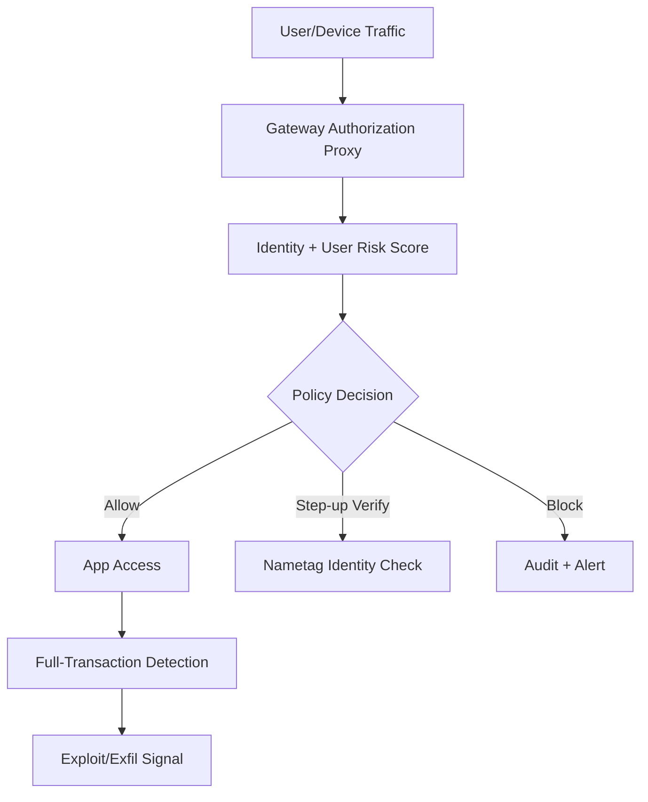
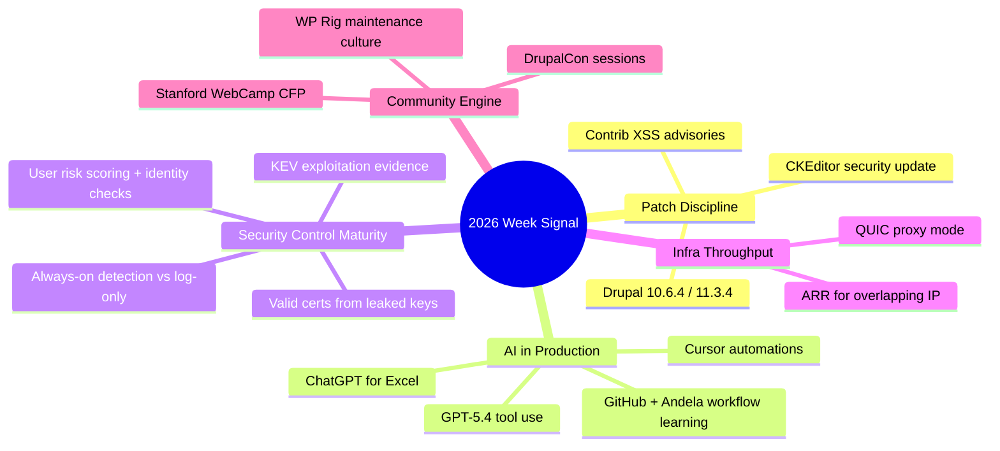

import Tabs from '@theme/Tabs';
import TabItem from '@theme/TabItem';
import TOCInline from '@theme/TOCInline';

Most headlines this week were marketing wrappers around old patterns, but there were still concrete shifts worth acting on: Drupal patch cadence, cloud-side detection quality, identity risk scoring, and practical AI workflow integration. The useful signal is where operational burden drops without hiding risk. The noise is everything pretending to be net-new while just adding UI chrome.
<!-- truncate -->

<TOCInline toc={toc} minHeadingLevel={2} maxHeadingLevel={2} />

## Conferences, Community, and What’s Actually Useful

Stanford WebCamp 2026 opened CFPs (online on **April 30, 2026**, hybrid on **May 1, 2026**). Dripyard is stacking DrupalCon Chicago with training/sessions, and UI Suite’s Display Builder walkthrough shows a real demand: shipping layout outcomes faster without turning every content team into Twig maintainers. The WP Rig podcast with Rob Ruiz lands in the same place for WordPress: starter systems still matter when they teach architecture instead of cargo-cult snippets.

> "Stanford WebCamp has opened its call for session proposals for the 2026 conference."
>
> — Stanford WebCamp, [Announcement](https://events.stanford.edu/)

| Item | Why it matters | Practical take |
|---|---|---|
| Stanford WebCamp CFP | Good venue for architecture talks that survive beyond one framework cycle | Submit operational postmortems, not trend decks |
| Dripyard at DrupalCon Chicago | Agency-level implementation patterns are getting more productized | Mine session topics for repeatable delivery templates |
| UI Suite Display Builder video | Visual composition pressure is real in Drupal projects | Guardrail with strict component contracts |
| WP Rig episode #207 | Theme tooling still defines maintainability debt | Treat starter themes as policy, not boilerplate |

:::info[Community Signal]
When conferences emphasize templates, display builders, and starter kits, that is not "low-code hype." It is a staffing reality signal: teams need opinionated scaffolds because senior review bandwidth is scarce.
:::

## AI Product Releases: Separate Throughput Gains from Branding

OpenAI pushed **GPT-5.4**, a **GPT-5.4 Thinking System Card**, CoT-Control findings, education tooling, and ChatGPT-for-Excel plus financial integrations. Google expanded AI Mode with visual query fan-out details and Canvas in U.S. Search. Cursor added automations. GitHub + Andela published field learning on production AI use. Accenture’s "five value models" and the new Adoption channel are useful only when translated into delivery checkpoints, not slideware.

> "Reasoning models struggle to control their chains of thought, reinforcing monitorability as an AI safety safeguard."
>
> — OpenAI, [Research note](https://openai.com/)

<Tabs>
  <TabItem value="shipping" label="Shipping Value" default>
  
| Release | Real value | Ignore this trap |
|---|---|---|
| GPT-5.4 | Better coding/tool use at scale, long-context workflows | Treating larger context as a substitute for decomposition |
| ChatGPT for Excel | Faster analyst workflows in constrained environments | Letting generated models bypass reconciliation controls |
| Cursor automations | Always-on agent loops for repetitive project ops | Unbounded trigger scopes with no audit trail |
| Google Canvas in AI Mode | Fast drafting/prototyping inside search | Shipping artifacts straight from search outputs |

  </TabItem>
  <TabItem value="safety" label="Safety/Control">
  
| Release | Governance implication |
|---|---|
| CoT-Control findings | Internal reasoning remains hard to constrain directly; monitor outputs and tool traces instead |
| Firefox AI controls (Ajit Varma) | User-choice framing aligns with enterprise policy toggles and opt-in controls |
| AI in education initiative | Skills gap closure needs measurement artifacts, not just access claims |

  </TabItem>
</Tabs>

:::caution[Model Upgrade Rule]
Upgrade only when eval deltas are tied to one production KPI (cycle time, escaped defects, false-positive rate). If the KPI does not move in two weeks, roll back the rollout scope.
:::

## Drupal + PHP Runtime: Boring Patch Work Still Wins

Drupal **10.6.4** and **11.3.4** are patch releases ready for production, with CKEditor5 moved to **v47.6.0** including a security update (reviewed by Drupal Security Team as not exploitable in built-in implementation). Drupal 10.4.x security support is already ended; 10.5.x support ends June 2026; 10.6.x and 11.3.x run through December 2026. PHP JIT support availability matters for targeted workloads, not blanket toggles.

> "Drupal 10.6.x will receive security support until December 2026."
>
> — Drupal.org, [10.6.4 release](https://www.drupal.org/project/drupal/releases/10.6.4)

```diff title="composer.json (example upgrade delta)"
--- a/composer.json
+++ b/composer.json
@@ -8,7 +8,7 @@
   "require": {
-    "drupal/core-recommended": "^10.5",
+    "drupal/core-recommended": "^10.6.4",
     "drupal/core-composer-scaffold": "^10.6",
     "drupal/core-project-message": "^10.6"
   }
```

```yaml title="upgrade-policy.yaml" showLineNumbers
stack:
  drupal:
    min_supported: "10.5.x"
    target: "10.6.4"
    eol_block:
      - "10.4.x"
  editor:
    ckeditor5: "47.6.0"
gates:
  # highlight-next-line
  block_deploy_if_security_support_ended: true
  require_release_note_review: true
  require_smoke_tests: ["content_edit", "media_embed", "search_index"]
```

:::danger[Contrib Security Window]
Drupal contrib advisories `SA-CONTRIB-2026-023` (Calculation Fields, CVE-2026-3528) and `SA-CONTRIB-2026-024` (Google Analytics GA4, CVE-2026-3529) are XSS class issues. Any site below fixed versions must patch immediately and rotate admin session cookies after remediation.
:::

## Security Reality Check: Exploits, Keys, and Detection Quality

CISA added five KEVs (including Hikvision, Rockwell, multiple Apple CVEs), Delta CNCSoft-G2 published an out-of-bounds write with potential RCE impact, and GitGuardian + Google mapped private-key leaks to cert reality: 2,622 valid certs exposed as of Sep 2025. The "89% Problem" report on dormant open source packages is the same supply-chain story in a different shirt: abandoned code comes back through AI-assisted reuse.

```bash title="security-triage.sh" showLineNumbers
#!/usr/bin/env bash
set -euo pipefail

# highlight-start
echo "[1] Pull KEV delta and map to asset inventory"
echo "[2] Match Drupal contrib advisories to installed module versions"
echo "[3] Revoke/rotate keys linked to still-valid certs"
echo "[4] Raise package-health gate for AI-suggested dependencies"
# highlight-end

echo "Fail deployment if any step returns unresolved critical findings."
```

| Threat signal | Immediate action | Owner |
|---|---|---|
| CISA KEV additions | Enrich vuln scanner with KEV flag and exploit evidence | SecOps |
| Delta CNCSoft-G2 RCE path | Segment OT networks and restrict remote access paths | OT Security |
| Valid certs mapped to leaked keys | Revoke certs + rotate private keys + audit issuance pipeline | PKI Team |
| Dormant package resurrection | Add maintenance/activity score to dependency policy | Platform Eng |

:::warning[Do Not Run “Log-Only” Forever]
Cloudflare’s always-on detections (Attack Signature Detection + Full-Transaction Detection) exist because "log vs block" stalemates leave production exposed for months. Keep a bounded observation phase, then enforce.
:::

## Cloudflare and Network Controls: Less Manual Routing, More Policy Feedback

ARR (Automatic Return Routing) addresses overlapping private IP space without manual NAT/VRF sprawl. QUIC-based Proxy Mode doubled throughput in Cloudflare One client testing and reduced latency by cutting user-space TCP overhead. Cloudflare also pushed identity/security layers: deepfake/laptop-farm controls with Nametag, Gateway Authorization Proxy for clientless devices, and dynamic User Risk Scoring.



:::tip[Network Policy Shortcut]
Implement ARR and risk-aware policy decisions in the same quarter. Solving address overlap without adaptive auth just moves the bottleneck from routing to access control tickets.
:::

## Research and Model Ecosystem Notes

A physics preprint on extending single-minus amplitudes to gravitons cited GPT-5.2 Pro assistance in derivation/verification flow. That is useful as workflow evidence, not proof of scientific correctness by default. Simon Willison’s anti-pattern note is the needed counterweight: unreviewed AI-generated PRs are still engineering malpractice, no matter how fluent the diff looks. Qwen 3.5 momentum plus team-departure rumors is a reminder that open-weight strategy has people risk, not just benchmark risk.

> "Don't file pull requests with code you haven't reviewed yourself."
>
> — Simon Willison, [Agentic Engineering Patterns: Anti-patterns](https://simonwillison.net/guides/agentic-engineering-patterns/)

<details>
<summary>Full changelog digest covered in this devlog</summary>

- Stanford WebCamp 2026 CFP and schedule.
- Google Search AI Mode visual fan-out explainer and Canvas rollout (U.S.).
- Firefox podcast transcript on new AI controls and user choice.
- GitHub + Andela AI learning in production workflows.
- Dripyard DrupalCon Chicago sessions/training.
- PHP JIT compilation support update.
- Delta Electronics CNCSoft-G2 CSAF vulnerability note.
- CISA KEV catalog additions (5 CVEs).
- OpenAI GPT-5.4 release, CoT-Control note, GPT-5.4 Thinking System Card.
- OpenAI education opportunity tooling/certification update.
- OpenAI ChatGPT for Excel + financial integrations.
- Adoption news channel and AI value model framing.
- Drupal 10.6.4 and 11.3.4 release notes and support windows.
- Drupal contrib advisories SA-CONTRIB-2026-023 and -024.
- Cloudflare ARR, QUIC Proxy Mode, always-on detections, Nametag partnership, Gateway Authorization Proxy, User Risk Scoring.
- GitGuardian + Google leaked key/certificate exposure study.
- "89% Problem" dormant OSS package risk narrative.
- WP Rig podcast episode #207.
- UI Suite Display Builder video walkthrough.
- Qwen ecosystem watch item and team change concerns.
- Physics preprint on graviton amplitudes with model-assisted derivation.

</details>

## The Bigger Picture



## Bottom Line

The durable pattern this week is simple: patch on time, instrument real exploit outcomes, and bind AI usage to measured delivery metrics. Everything else is branding.

:::tip[Single Highest-ROI Move]
Create one weekly "risk-to-release" review that combines four feeds in one page: Drupal/PHP patch status, KEV overlap, leaked-key/cert exposure, and AI automation guardrails. If a team cannot show all four in one view, they are operating blind.
:::
