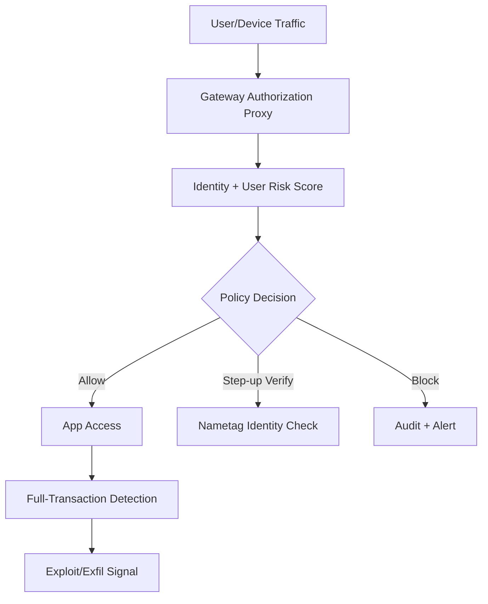

import Tabs from '@theme/Tabs';
import TabItem from '@theme/TabItem';
import TOCInline from '@theme/TOCInline';

Another week, another avalanche of press releases cosplaying as innovation. Somewhere between the fifth "revolutionary AI integration" and the third "next-generation platform update," a few things actually deserved attention: Drupal patch cadence, cloud detection upgrades, identity risk scoring, and AI workflow integration that survives contact with production. Everything else was furniture polish on particleboard.
<!-- truncate -->

<TOCInline toc={toc} minHeadingLevel={2} maxHeadingLevel={2} />

## Conferences and Community Worth Tracking

Stanford WebCamp 2026 opened CFPs (online on **April 30, 2026**, hybrid on **May 1, 2026**). Dripyard is stacking DrupalCon Chicago with training and sessions, and UI Suite's Display Builder walkthrough reflects a demand that keeps growing: teams want to ship layout outcomes faster without making every content editor learn Twig. Over on the WordPress side, the WP Rig podcast with Rob Ruiz hits a similar nerve — starter systems still matter, but only when they teach architecture rather than encouraging copy-paste habits.

> "Stanford WebCamp has opened its call for session proposals for the 2026 conference."
>
> — Stanford WebCamp, [Announcement](https://events.stanford.edu/)

| Item | Why it matters | Practical take |
|---|---|---|
| Stanford WebCamp CFP | Good venue for architecture talks that survive beyond one framework cycle | Submit operational postmortems, not trend decks |
| Dripyard at DrupalCon Chicago | Agency-level implementation patterns are getting more productized | Mine session topics for repeatable delivery templates |
| UI Suite Display Builder video | Visual composition pressure is real in Drupal projects | Guardrail with strict component contracts |
| WP Rig episode #207 | Theme tooling still defines maintainability debt | Treat starter themes as policy, not boilerplate |

## AI Product Releases: Throughput vs. Branding

OpenAI shipped **GPT-5.4**, a **GPT-5.4 Thinking System Card**, CoT-Control findings, education tooling, and ChatGPT-for-Excel plus financial integrations. Google expanded AI Mode with visual query fan-out details and Canvas in U.S. Search. Cursor added automations. GitHub and Andela published field notes on production AI use. Accenture's "five value models" and the new Adoption channel might be useful — if you translate them into delivery checkpoints instead of letting them stay as slide decks.

> "Reasoning models struggle to control their chains of thought, reinforcing monitorability as an AI safety safeguard."
>
> — OpenAI, [Research note](https://openai.com/)

<Tabs>
<TabItem value="shipping" label="Shipping Value" default>


| Release | Real value | Ignore this trap |
|---|---|---|
| GPT-5.4 | Better coding/tool use at scale, long-context workflows | Treating larger context as a substitute for decomposition |
| ChatGPT for Excel | Faster analyst workflows in constrained environments | Letting generated models bypass reconciliation controls |
| Cursor automations | Always-on agent loops for repetitive project ops | Unbounded trigger scopes with no audit trail |
| Google Canvas in AI Mode | Fast drafting/prototyping inside search | Shipping artifacts straight from search outputs |

</TabItem>
<TabItem value="safety" label="Safety/Control">


| Release | Governance implication |
|---|---|
| CoT-Control findings | Internal reasoning remains hard to constrain directly; monitor outputs and tool traces instead |
| Firefox AI controls (Ajit Varma) | User-choice framing aligns with enterprise policy toggles and opt-in controls |
| AI in education initiative | Skills gap closure needs measurement artifacts, not just access claims |

</TabItem>
</Tabs>

:::caution[Model Upgrade Rule]
Upgrade only when eval deltas are tied to one production KPI (cycle time, escaped defects, false-positive rate). If the KPI does not move in two weeks, roll back the rollout scope.
:::

## Drupal and PHP Runtime: Patch Releases Ready for Production

Drupal **10.6.4** and **11.3.4** dropped as patch releases. CKEditor5 moves to **v47.6.0**, which includes a security update (the Drupal Security Team reviewed it and confirmed the built-in implementation is not exploitable). Support timeline to remember: 10.4.x security support already ended, 10.5.x ends June 2026, and both 10.6.x and 11.3.x run through December 2026. PHP JIT availability matters for specific workloads — don't blanket-toggle it on and call it a day.

> "Drupal 10.6.x will receive security support until December 2026."
>
> — Drupal.org, [10.6.4 release](https://www.drupal.org/project/drupal/releases/10.6.4)

```diff title="composer.json (example upgrade delta)"
--- a/composer.json
+++ b/composer.json
@@ -8,7 +8,7 @@
   "require": {
-    "drupal/core-recommended": "^10.5",
+    "drupal/core-recommended": "^10.6.4",
     "drupal/core-composer-scaffold": "^10.6",
     "drupal/core-project-message": "^10.6"
   }
```

:::danger[Contrib Security Window]
Drupal contrib advisories `SA-CONTRIB-2026-023` (Calculation Fields, CVE-2026-3528) and `SA-CONTRIB-2026-024` (Google Analytics GA4, CVE-2026-3529) are XSS class issues. Any site below fixed versions must patch immediately and rotate admin session cookies after remediation.
:::

## Security: Exploits, Leaked Keys, and Detection That Matters

CISA added five KEVs (including Hikvision, Rockwell, multiple Apple CVEs). Delta CNCSoft-G2 published an out-of-bounds write with potential RCE impact. GitGuardian and Google mapped private-key leaks to certificate reality: 2,622 valid certs were found exposed as of September 2025. And the "89% Problem" report on dormant open-source packages? Same supply-chain story, different coat of paint — abandoned code keeps coming back through AI-assisted reuse, and nobody wants to own the dependency hygiene.

| Threat signal | Immediate action | Owner |
|---|---|---|
| CISA KEV additions | Enrich vuln scanner with KEV flag and exploit evidence | SecOps |
| Delta CNCSoft-G2 RCE path | Segment OT networks and restrict remote access paths | OT Security |
| Valid certs mapped to leaked keys | Revoke certs + rotate private keys + audit issuance pipeline | PKI Team |
| Dormant package resurrection | Add maintenance/activity score to dependency policy | Platform Eng |

:::warning[Do Not Run "Log-Only" Forever]
Cloudflare's always-on detections (Attack Signature Detection + Full-Transaction Detection) exist for a reason. The "log vs block" stalemate leaves production exposed for months. Set a bounded observation window, then enforce. Pick a date, write it down, hold yourself to it.
:::

## Cloudflare and Network Controls: Routing and Policy in One Quarter

ARR (Automatic Return Routing) solves the overlapping-private-IP-space headache without manual NAT/VRF sprawl. QUIC-based Proxy Mode doubled throughput in Cloudflare One client testing and cut latency by eliminating user-space TCP overhead. On the identity side, Cloudflare shipped deepfake and laptop-farm controls through Nametag, a Gateway Authorization Proxy for clientless devices, and dynamic User Risk Scoring.



## Research and Model Ecosystem Updates

A physics preprint on extending single-minus amplitudes to gravitons cited GPT-5.2 Pro assistance in derivation and verification. Worth noting as workflow evidence — not as proof that model output is scientifically correct by default. Simon Willison's anti-pattern note provides the necessary counterweight: unreviewed AI-generated PRs are still engineering malpractice, regardless of how clean the diff reads. Meanwhile, Qwen 3.5 momentum combined with team-departure rumors is a reminder that open-weight strategy carries people risk on top of benchmark risk.

> "Don't file pull requests with code you haven't reviewed yourself."
>
> — Simon Willison, [Agentic Engineering Patterns: Anti-patterns](https://simonwillison.net/guides/agentic-engineering-patterns/)

<details>
<summary>Full changelog digest covered in this devlog</summary>

- Stanford WebCamp 2026 CFP and schedule.
- Google Search AI Mode visual fan-out explainer and Canvas rollout (U.S.).
- Firefox podcast transcript on new AI controls and user choice.
- GitHub + Andela AI learning in production workflows.
- Dripyard DrupalCon Chicago sessions/training.
- PHP JIT compilation support update.
- Delta Electronics CNCSoft-G2 CSAF vulnerability note.
- CISA KEV catalog additions (5 CVEs).
- OpenAI GPT-5.4 release, CoT-Control note, GPT-5.4 Thinking System Card.
- OpenAI education opportunity tooling/certification update.
- OpenAI ChatGPT for Excel + financial integrations.
- Adoption news channel and AI value model framing.
- Drupal 10.6.4 and 11.3.4 release notes and support windows.
- Drupal contrib advisories SA-CONTRIB-2026-023 and -024.
- Cloudflare ARR, QUIC Proxy Mode, always-on detections, Nametag partnership, Gateway Authorization Proxy, User Risk Scoring.
- GitGuardian + Google leaked key/certificate exposure study.
- "89% Problem" dormant OSS package risk narrative.
- WP Rig podcast episode #207.
- UI Suite Display Builder video walkthrough.
- Qwen ecosystem watch item and team change concerns.
- Physics preprint on graviton amplitudes with model-assisted derivation.

</details>

## Why this matters for Drupal and WordPress

Drupal 10.6.4 and 11.3.4 patch releases plus two contrib XSS advisories make this week's update cycle non-optional for any production Drupal site. WordPress teams face the same pressure from WP Rig starter-theme debt and the CKEditor5 security update that ships through both ecosystems. Supply-chain signals like leaked private keys and dormant package reuse apply directly to the plugin and module ecosystems where abandoned extensions get forked and repackaged without audit.

## What to Do With All This

Patch on time. Instrument real exploit outcomes. Tie AI usage to delivery metrics you can measure. ~~Everything else is branding~~ — well, most of it is.
