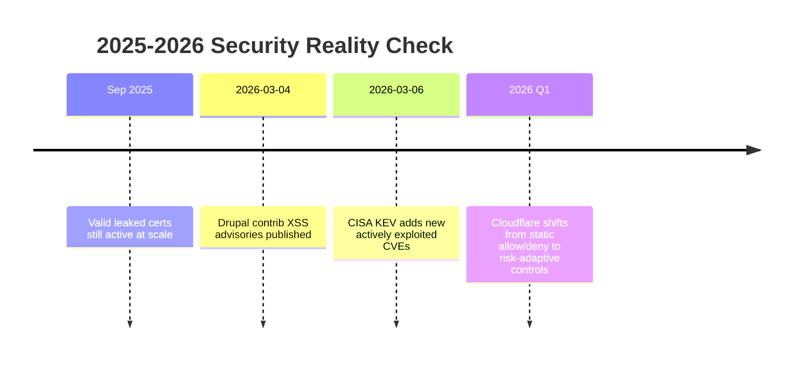
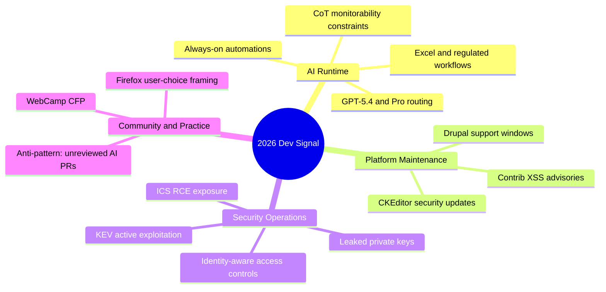

import Tabs from '@theme/Tabs';
import TabItem from '@theme/TabItem';
import TOCInline from '@theme/TOCInline';

Fewer shiny announcements this cycle, more operational consequences. GPT-5.4 shipped with context, cost, and control changes that affect real architecture decisions. Drupal tightened support windows. Security teams got yet another week of KEV additions, leaked keys, and identity bypasses showing up in production — none of it hypothetical. The common thread: discipline in how you respond to these matters more than knowing they happened.

<!-- truncate -->

<TOCInline toc={toc} minHeadingLevel={2} maxHeadingLevel={2} />

## GPT-5.4 Model Routing and What the 1M Context Window Changes

OpenAI introduced `gpt-5.4` and `gpt-5.4-pro` across API, ChatGPT, and Codex CLI, with a 1M-token context window and an August 31, 2025 cutoff. The part worth paying attention to: this changes architecture choices for long-context retrieval, coding agents, and review loops. Whether you upgrade depends on what you're building, not on the announcement itself.

> "Introducing GPT-5.4, OpenAI's most capable and efficient frontier model for professional work."
>
> — OpenAI, [Introducing GPT‑5.4](https://openai.com/index/introducing-gpt-5-4/)

| Decision area | `gpt-5.4` | `gpt-5.4-pro` | Practical call |
|---|---|---|---|
| Throughput-sensitive automation | Better fit | Usually overkill | Default to `gpt-5.4` |
| Hard reasoning / high-stakes review | Strong | Stronger | Escalate only when error cost is high |
| Cost discipline | Lower | Higher | Gate with task classifier |
| 1M context workflows | Yes | Yes | Keep context hygiene anyway |

<Tabs>
<TabItem value="prod-policy" label="Prod Policy" default>

```yaml title="model-routing.yaml" showLineNumbers
routing:
  default_model: gpt-5.4
  escalation_model: gpt-5.4-pro
  rules:
- name: "security_review"
match: ["cve", "kev", "authz", "rce"]
// highlight-next-line
model: gpt-5.4-pro
- name: "bulk_refactor"
match: ["lint", "format", "rename", "boilerplate"]
model: gpt-5.4
- name: "financial_reporting"
match: ["excel", "forecast", "regulated"]
// highlight-next-line
model: gpt-5.4-pro
  context:
max_tokens: 1000000
hygiene:
- deduplicate_chunks
- strip_stale_threads
- cap_retrieval_top_k
```

</TabItem>
<TabItem value="anti-pattern" label="Anti-Pattern">

```diff
- Send every task to the strongest model by default
+ Route by failure cost and verification burden

- Keep appending context forever because window is 1M
+ Prune context aggressively; stale context still poisons output

- Treat system card notes as academic
+ Convert model limitations into runtime guardrails
```

</TabItem>
</Tabs>

:::caution[Chain-of-thought control remains unreliable]
The CoT-control result has direct operational consequences: reasoning traces cannot be steered reliably. Any policy control that assumes perfect hidden-thought obedience will break. Monitor observable behavior, tool calls, and outputs instead.
:::

## AI Products Are Entering Regulated Workflows

OpenAI's education push, ChatGPT-for-Excel with financial integrations, and the new "Adoption" channel all point the same direction — productization for enterprises that carry compliance overhead. Cursor automations fits the pattern too: always-on agents are shipping everywhere, and the hard part has shifted from ~~prompting~~ to building runbooks with measurable controls.

:::info[What this means for teams shipping AI]
If your AI rollout lacks model routing, audit logs, approval gates, and rollback paths, you're still running a pilot. Production requires controls you can measure and explain to an auditor.
:::

## Web Platform and Dev Community Updates Worth Tracking

High-signal community updates:
- Stanford WebCamp 2026 CFP is open (online April 30, hybrid May 1).
- Firefox's new AI controls emphasize user choice.
- Google Search AI Mode added Canvas and expanded visual query fan-out workflows.
- GitHub + Andela highlighted AI adoption inside real delivery teams.
- Simon Willison's anti-pattern warning remains correct: unreviewed AI PRs burn teams.

> "Don't file pull requests with code you haven't reviewed yourself."
>
> — Simon Willison, [Agentic Engineering Patterns](https://simonwillison.net/guides/agentic-engineering-patterns/)

:::tip[A review gate that holds up]
Require a human-authored PR summary covering risk, changed behavior, and rollback plan before merge. If the author can't articulate those three things plainly, the PR goes back.
:::

## Drupal and WordPress Releases: Patch Cadence as Security Posture

Drupal 10.6.4 and 11.3.4 shipped as bugfix releases, with CKEditor5 at `47.6.0` (including an upstream XSS fix). Support windows are explicit: Drupal 10.4.x is out; 10.5.x support ends June 2026; 10.6.x and 11.3.x carry through December 2026. Two contrib advisories (`SA-CONTRIB-2026-023`, `024`) flagged moderately critical XSS risk.

> "Sites on any Drupal version prior to 10.5.x should upgrade to a supported release as soon as possible."
>
> — Drupal release notes, [10.6.4](https://www.drupal.org/project/drupal/releases/10.6.4)

```bash title="drupal-release-checklist.sh"
#!/usr/bin/env bash
set -euo pipefail

drush status --fields=drupal-version
drush pm:security --format=table
drush updatedb -y
drush config:import -y
drush cache:rebuild
php -v
```

<details>
<summary>Field notes from the ecosystem stream</summary>

- Dripyard is pushing training, presentations, and template sessions at DrupalCon Chicago.
- UI Suite Display Builder is reducing Twig/CSS friction for layout-heavy teams.
- WP Rig conversation (#207) reinforces starter-toolkit value for maintainable theme development.
- If you ship WordPress or Drupal at client scale, release hygiene beats framework tribalism.

</details>

## Security Feed: KEV, ICS, Certificates, and Identity Risks Converging

CISA added five actively exploited CVEs to KEV (Hikvision, Rockwell, Apple). Delta CNCSoft-G2 surfaced an out-of-bounds write with possible RCE impact. GitGuardian and Google mapped leaked private keys to real cert exposure — 2,622 valid certs were found in September 2025 before disclosure remediation began. On the controls side, Cloudflare pushed several updates: always-on detections, user risk scoring, gateway authorization proxy, and deepfake-resistant onboarding with Nametag.



:::danger[Immediate action sequence]
Patch KEV-relevant assets first, rotate exposed keys second, and enforce adaptive identity checks third. Reversing that order increases active exploit exposure while teams debate architecture.
:::

## Network Engineering: ARR and QUIC Proxy Mode Deliver Measurable Gains

Cloudflare's Automatic Return Routing (ARR) handles overlapping private IP environments without manual NAT/VRF complexity — it relies on stateful flow tracking instead. Their QUIC-based Proxy Mode rebuild removes user-space TCP overhead and reports roughly 2x throughput gains. Both are infrastructure changes that show up in latency numbers users notice.

## Connecting the Dots



## Bottom Line

Model upgrades, framework patches, and security controls have collapsed into one operating surface this week. Teams that split these across separate meetings and separate owners will keep shipping avoidable incidents. The fix is straightforward.

:::tip[Single highest-ROI move]
Stand up one `model-routing.yaml` and one weekly review that covers KEV additions, framework releases, and key exposure — in a single runbook, owned by one team. Three failure classes, one place to catch them before they compound.
:::
