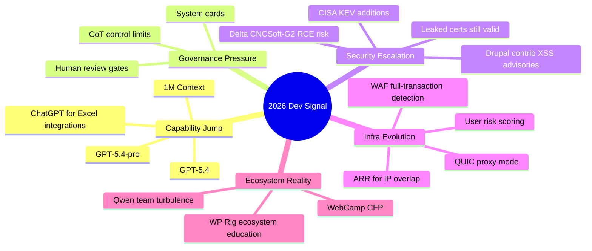

import Tabs from '@theme/Tabs';
import TabItem from '@theme/TabItem';
import TOCInline from '@theme/TOCInline';

Model capability jumped again this week. So did operational risk. GPT‑5.4 brings real upside for engineering work, but KEV additions, Drupal contrib XSS advisories, and leaked cert data are a blunt reminder: shipping fast without controls means you're accumulating exposure, not velocity.
<!-- truncate -->

<TOCInline toc={toc} minHeadingLevel={2} maxHeadingLevel={2} />


## GPT‑5.4: What You Get and What to Watch

> "Two new API models: gpt-5.4 and gpt-5.4-pro ... 1 million token context window."
>
> — OpenAI launch/docs roundup, [Introducing GPT‑5.4](https://openai.com/index/introducing-gpt-5-4/)

**What changed:** two production models (`gpt-5.4`, `gpt-5.4-pro`), ChatGPT/Codex CLI availability, August 31, 2025 cutoff, and 1M context. The CoT-control research and GPT‑5.4 thinking system card suggest OpenAI is leaning toward practical reliability over benchmark performance. Whether that holds up across diverse production workloads remains to be seen.

| Model | Best Use | Cost Profile | Failure Mode to Watch |
|---|---|---:|---|
| `gpt-5.4` | General coding, tool use, long-context synthesis | Lower | Overconfident summaries on weak source docs |
| `gpt-5.4-pro` | Hard debugging, architecture tradeoffs, deep review | Higher | Expensive misuse on routine tasks |
| Older frontier models | Legacy pipelines | Mixed | ~~Good enough forever~~ slow quality drift vs new baselines |

<Tabs>
<TabItem value="ship-fast" label="Ship Fast" default>

Use `gpt-5.4` for CI assistants, code migration, and doc generation.
Escalate only hard tickets to `gpt-5.4-pro`.

</TabItem>
<TabItem value="ship-safe" label="Ship Safe">

Gate both models behind evals and budget caps.
No model gets direct write access to production infra.

</TabItem>
</Tabs>

```yaml title="ai-release-gate.yaml" showLineNumbers
models:
  gpt-5.4:
    max_context: 1000000
    knowledge_cutoff: "2025-08-31"
    allowed_tasks:
      - code_review
      - test_generation
      - doc_summarization
  gpt-5.4-pro:
    allowed_tasks:
      - root_cause_analysis
      - architecture_decisions
policy:
  # highlight-start
  require_human_review: true
  block_prod_credentials: true
  # highlight-end
  monthly_cost_cap_usd: 1500
```

:::info[Pricing Reality Check]
Check [LLM Prices](https://www.llm-prices.com/) for current snapshots, then lock internal routing rules by task criticality. Sending CRUD-grade work to premium reasoning models is the fastest way to blow through your budget without gaining anything.
:::

## Search and Browser AI: Better UX, Same Governance Gap

Google's AI Mode visual search fan-out and Canvas rollout in U.S. search reduce friction for mixed visual/text workflows. Meanwhile, Mozilla's new Firefox AI controls take the opposite stance and put user choice front and center. Both moves are worth watching.

> "We believe in user choice"
>
> — Mozilla, [Ajit Varma on Firefox's new AI controls](https://blog.mozilla.org/)

:::caution[Productivity Feature != Governance]
Canvas and visual AI shortcuts speed up drafting and prototyping. They also speed up bad decisions when source traceability is weak. If the output feeds product, legal, or security decisions, require citation capture.
:::

## Drupal and PHP: Bugfix Releases and Contrib XSS Flags

Drupal `10.6.4` and `11.3.4` shipped as bugfix releases with CKEditor5 `v47.6.0` updates. More important for security-conscious teams: Drupal contrib advisories flagged XSS risk in GA4 and Calculation Fields modules. On the PHP side, JIT compilation support is available, but don't bother unless profiling shows CPU-bound hotspots worth optimizing.

> "Drupal 10.6.x will receive security support until December 2026."
>
> — Drupal release notes, [Drupal 10.6.4](https://www.drupal.org/project/drupal/releases)

<details>
<summary>Supported-version snapshot and security notes</summary>

- Drupal 10.6.x security support through December 2026.
- Drupal 10.5.x security support through June 2026.
- Drupal 10.4.x security support ended.
- SA-CONTRIB-2026-024 (GA4) and SA-CONTRIB-2026-023 (Calculation Fields): both XSS class issues with affected version ranges documented.

</details>

```bash title="drupal-maintenance-check.sh" showLineNumbers
#!/usr/bin/env bash
set -euo pipefail

drush status --fields=drupal-version
drush pm:security
# highlight-next-line
drush pm:update drupal google_analytics_ga4 calculation_fields -y
drush cr
drush updb -y
```

## Security Feed: Five KEVs, RCE Risk, and Leaked Certs

CISA added five KEVs this week. Delta CNCSoft-G2 published an out-of-bounds write with RCE impact potential. GitGuardian and Google mapped leaked keys to valid cert exposure — meaning those credentials are still live and exploitable. On the defensive side, Cloudflare shipped identity and detection controls including attack signature detection, full-transaction detection, user risk scoring, gateway auth proxy, and anti-deepfake onboarding flows.

```diff title="security-baseline.diff"
- allow_kev_exceptions: true
- waf_mode: log_only
+ allow_kev_exceptions: false
+ waf_mode: block_with_transaction_detection
+ require_identity_reverification_on_high_risk: true
+ rotate_exposed_keys_within_hours: 4
```

:::danger[KEV Means Patch Now]
If CVEs are in CISA KEV and your environment is exposed, patching is not a planning discussion. It is an outage-prevention task. Track MTTR in hours, not in sprint labels.
:::

## Ecosystem Notes: Conferences, Agents, and a Useful Warning

Stanford WebCamp 2026 CFP is open. GitHub and Andela published content on AI learning inside production workflows — practical stuff, not thought-leadership fluff. Cursor automations point toward more always-on agent behavior in editors. And Simon Willison's anti-pattern warning deserves repeating here, because I keep seeing teams ignore it.

> "Don't file pull requests with code you haven't reviewed yourself."
>
> — Simon Willison, [Agentic Engineering Patterns](https://simonwillison.net/guides/agentic-engineering-patterns/)

## Putting It Together



## Bottom Line

The stack that wins here is predictable: stronger models behind stricter review gates, faster patch response, and routing rules you can measure for cost and risk. None of that is exciting. All of it compounds.

:::tip[Single Action That Pays Off Immediately]
Create one `ai-and-security-release-gate` policy that blocks deployment when any of these fail: KEV exposure unresolved, unreviewed AI-generated diff, missing source traceability, or model routing outside approved cost tiers.
:::
