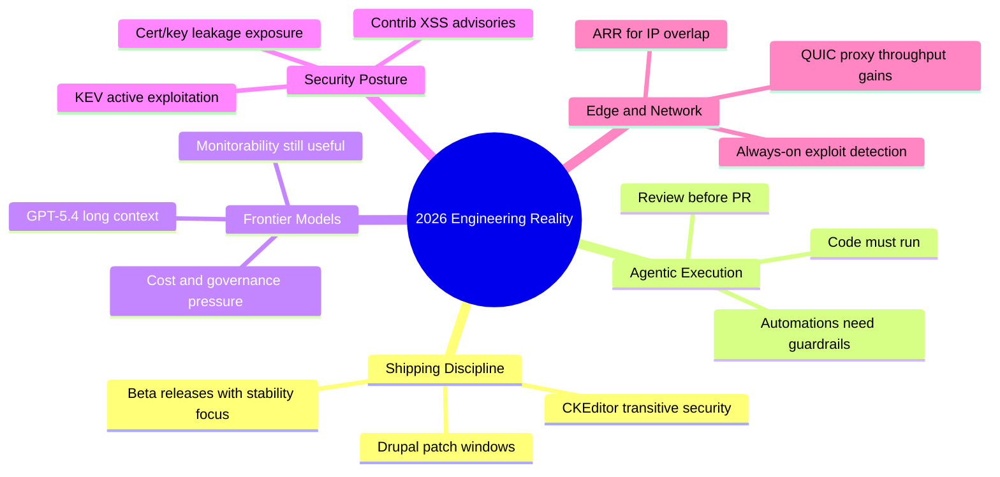

import Tabs from '@theme/Tabs';
import TabItem from '@theme/TabItem';
import TOCInline from '@theme/TOCInline';

Most “AI + web” news this week split cleanly into two buckets: shipping discipline and marketing theater. The useful signals were patch-level release hygiene (Drupal, contrib advisories), practical agent workflows (execute and verify), and network/security architecture changes that cut toil. The noise was mostly branding wrapped around features that only matter if teams actually change their operating model.

<!-- truncate -->

<TOCInline toc={toc} minHeadingLevel={2} maxHeadingLevel={2} />

## Release Cadence Is a Reliability Feature, Not Changelog Decoration

> "Display Builder 1.0.0-beta3 is out... focuses on stability... but also ships meaningful new features."
>
> — UI Suite Initiative, [Announcement](https://www.drupal.org/project/ui_suite_display_builder)

> "Drupal 10.6.5... ready for use on production sites... Drupal 10.4.x security support has ended."
>
> — Drupal Core Release Notes, [10.6.5](https://www.drupal.org/project/drupal/releases/10.6.5)

> "Drupal 11.3.5... CKEditor5 is updated to v47.6.0... security update for a Cross-Site Scripting (XSS) vulnerability."
>
> — Drupal Core Release Notes, [11.3.5](https://www.drupal.org/project/drupal/releases/11.3.5)

**WHY this matters:** patch releases are now carrying dependency-level security movement (CKEditor) fast enough that “skip one sprint” becomes a risk decision, not a convenience decision.

| Stream | Current patch signal | Support window | Operational call |
|---|---|---|---|
| Drupal 10.6.x | 10.6.5 (bugfix + CKEditor movement) | Until Dec 2026 | Standardize monthly patch lane |
| Drupal 10.5.x | Still supported | Until Jun 2026 | Plan retirement now |
| Drupal 10.4.x | Security support ended | Ended | Upgrade immediately |
| Drupal 11.3.x | 11.3.5 (bugfix + CKEditor security context) | Until Dec 2026 | Treat as active secure baseline |
| UI Suite Display Builder | 1.0.0-beta3 stability push | Pre-1.0 track | Safe for targeted pilots, not blind rollout |

:::caution[Patch parity beats version vanity]
Running “latest minor” is irrelevant if patch rollout lags and contrib advisories are ignored. Enforce `core + contrib + transitive dependency` updates as one gate, or security posture drifts silently.
:::

## Agentic Engineering Is Just Testing Culture With Better Tooling

> "Never assume that code generated by an LLM works until that code has been executed."
>
> — Simon Willison, [Agentic manual testing](https://simonwillison.net/2026/Mar/)

> "Don't file pull requests with code you haven't reviewed yourself."
>
> — Simon Willison, [Anti-patterns](https://simonwillison.net/2026/Mar/)

Cursor automations landing means more always-on agents. That helps only if review and execution are mandatory. ~~“Agentic” means autonomous coding~~; in practice it means faster draft generation plus stricter verification discipline.

```yaml title="ops/agent-guardrails.yaml" showLineNumbers
agent:
  mode: "auto"
  pr_policy:
    require_human_review: true
    require_execution_evidence: true
  checks:
    - lint
    - unit
    - integration
    # highlight-next-line
    - manual_verification_for_ui_paths
  fail_on:
    - missing_test_output
    - unverifiable_claims
```

```diff title="policies/review.diff"
- PR opened after prompt output and quick glance.
+ PR opens only after executable validation artifacts are attached.
+ Required artifacts:
+ - test logs
+ - failing->passing diff
+ - risk notes for unchanged but touched paths
```

:::warning[Automation without review is incident pre-production]
Always-on agents that merge unreviewed output are a reliability regression disguised as productivity. If review bandwidth is the bottleneck, reduce scope per change; do not remove review.
:::

## GPT-5.4 and Friends: Real Upgrade, Real Cost Surface

OpenAI shipped `gpt-5.4` and `gpt-5.4-pro` with 1M-token context and strong coding/tool use positioning, alongside a Thinking System Card and CoT-control research notes. Product add-ons (ChatGPT for Excel, financial integrations, education programs) are only valuable when governance and evaluation are already in place.

<Tabs>
  <TabItem value="model" label="Model Layer" default>
  
  | Item | Practical impact |
  |---|---|
  | GPT-5.4 / GPT-5.4-pro | Better long-context workflows and tool orchestration |
  | 1M-token context | Fewer chunking hacks, more prompt-cost pressure |
  | CoT-control findings | Monitorability remains a real control point |
  
  </TabItem>
  <TabItem value="product" label="Product Layer">
  
  | Item | Practical impact |
  |---|---|
  | ChatGPT for Excel | Faster analyst loops, requires data handling policy |
  | Financial integrations | Better workflow continuity, new compliance boundary |
  | Education tools/certifications | Capability lift only if teachers/admins get measurement tooling |
  
  </TabItem>
</Tabs>

:::info[Model upgrades are procurement decisions now]
Long-context frontier models force explicit token budgeting, data residency checks, and output evaluation standards. Treat model selection like infra architecture, not “try the shiny one.”
:::

## Security and Network Signals Were More Concrete Than Most AI News

The highest-value items this week were security advisories and transport architecture changes:

- CISA KEV added actively exploited vulnerabilities.
- ICS advisory on Delta Electronics CNCSoft-G2 out-of-bounds write with RCE potential.
- Drupal contrib advisories: `Google Analytics GA4` and `Calculation Fields` XSS exposures.
- Google + GitGuardian found 2,622 still-valid certs tied to leaked private keys.
- Cloudflare pushed “always-on detections” and full-transaction exploit visibility.
- Cloudflare ARR and QUIC proxy-mode redesign showed measurable path-level performance gains.

| Signal | Risk type | Immediate action |
|---|---|---|
| CISA KEV additions | Known active exploitation | Patch/vuln management SLA in hours, not weeks |
| CNCSoft-G2 advisory | OT/ICS RCE exposure | Segment network + vendor patch validation |
| Drupal SA-CONTRIB-2026-024/023 | XSS in contrib modules | Upgrade affected modules immediately |
| Valid certs from leaked keys | Credential compromise at scale | Rotate keys, revoke certs, enforce secret scanning |
| Always-on WAF detections | False positive vs missed attack trade-off | Enable correlated request+response detection |
| ARR + QUIC proxy mode | Throughput/latency + overlap handling | Revisit tunnel architecture assumptions |

```bash title="security/release-audit.sh" showLineNumbers
#!/usr/bin/env bash
set -euo pipefail

# highlight-start
drush pm:security --format=list
drush cr
drush updb -y
# highlight-end

# Manual gate: fail pipeline if any moderately critical+ advisory remains
drush pm:security --format=json | jq '.[] | select(.severity!="Low")' >/tmp/security-findings.json
test ! -s /tmp/security-findings.json
```

:::danger[Patch deferral is now an exploit strategy for attackers]
When CISA KEV and module advisories align in the same week, delayed patching stops being “tech debt” and becomes active exposure management failure.
:::

## Ecosystem Signal: Useful Community Work, Plus Predictable Hype Cycles

Good signals:
- Docker spotlighting MCP product strategy leadership (Cecilia Liu) is a sign the ecosystem is formalizing secure AI tooling requirements.
- GitHub + Andela focus on production workflow learning beats “prompt tips” content.
- Firefox AI controls emphasizing user choice is the correct default stance.
- Stanford WebCamp CFP and DrupalCon sessions still matter because practitioner feedback loops outperform social media takes.
- WP Rig episode reinforces starter-toolkit pedagogy over copy-paste theme cargo culting.
- “Blog to book” remains valid for distribution, not for technical depth.

Noisy signals:
- “Department of War” discourse and Qwen team turbulence are strategically interesting, but low immediate impact for teams shipping software this sprint.

<details>
<summary>Full signal ledger (compiled items and why they matter)</summary>

| Item | Why it matters |
|---|---|
| UI Suite Display Builder beta3 | Stability-first pre-1.0 maturity signal |
| Docker MCP strategy interview | Product governance and secure toolchain direction |
| Blog to book | Packaging strategy, not engineering progress |
| Drupal 10.6.5 / 11.3.5 | Patch discipline + support-window clarity |
| Agentic manual testing | Execution evidence as baseline |
| GPT-5.4 + System Card + CoT-control | Model capability and safety monitorability |
| Stanford WebCamp CFP | Near-term community implementation surface |
| Google visual search fan-out + Canvas in AI Mode | UX-level AI integration in mainstream search |
| Firefox AI controls | User choice as product principle |
| GitHub + Andela | Workforce AI adoption grounded in production |
| Dripyard at DrupalCon | Practical community transfer of techniques |
| PHP JIT support now available | Runtime performance implications for selected workloads |
| Delta CNCSoft-G2 advisory | OT/ICS RCE operational risk |
| CISA KEV additions | Active exploitation priority list |
| Drupal contrib SA-CONTRIB-2026-024/023 | Concrete XSS patch obligations |
| GitGuardian + Google cert leak study | Secret leakage mapped to real cert abuse risk |
| Cloudflare ARR + QUIC proxy rewrite | Architecture-level reliability/performance wins |
| Cloudflare always-on detections | Better exploit confirmation fidelity |
| Five AI value models / Adoption channel | Useful sequencing model if tied to measurable outcomes |
| ChatGPT for Excel + finance integrations | Analyst acceleration with compliance boundary |
| Cursor automations | Agent ops move from ad hoc to scheduled |
| WP Rig podcast | Strong theme-dev learning path |
| Qwen team turbulence | Model ecosystem volatility risk |
| Department of War update | Policy/geopolitical context, low direct dev action |

</details>

## The Bigger Picture



## Bottom Line

The best teams this quarter will look boring on the surface: fast patching, strict review gates, clear model governance, and relentless exploit-driven prioritization. That beats headline chasing every time.

:::tip[Single highest-ROI move this week]
Create one release gate that fails deployment when any of these are true: unresolved KEV-mapped CVEs, unresolved moderately-critical+ Drupal advisories, or missing execution evidence for agent-generated changes.
:::
