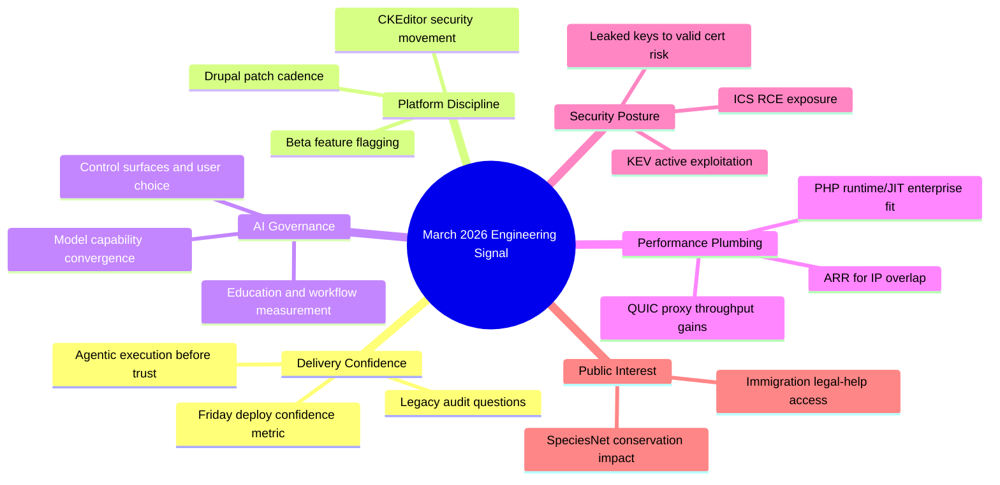

import Tabs from '@theme/Tabs';
import TabItem from '@theme/TabItem';
import TOCInline from '@theme/TOCInline';

This cycle had a lot of announcements, but only a subset changes engineering decisions. The useful signal clusters into five buckets: release-risk discovery, patch cadence discipline, AI governance vs. AI marketing, network/runtime performance, and hard security posture updates. Everything else is content.

<!-- truncate -->

<TOCInline toc={toc} minHeadingLevel={2} maxHeadingLevel={2} />

## Legacy Risk Discovery Beats Dashboard Theater

Ally Piechowski's audit prompts are still the fastest way to find where delivery is actually broken.

> "What's the one area you're afraid to touch?"
>
> — Ally Piechowski, [How I audit a legacy Rails codebase](https://piechowski.io/post/how-i-audit-a-legacy-rails-codebase/)

Those questions map directly to deployment risk, hidden coupling, and test blind spots. Pair that with Simon Willison's agentic testing principle and the policy becomes obvious: ~~"generated code is probably fine"~~ is not an engineering standard.

> "Never assume that code generated by an LLM works until that code has been executed."
>
> — Simon Willison, [Agentic Engineering Patterns](https://simonwillison.net/guides/agentic-engineering-patterns/)

```yaml title="release-gates.yaml" showLineNumbers
policy:
  deploy:
    block_on:
      - unknown_failure_domains
      - prod_incidents_without_tests
      - missing_error_visibility
  test:
    required:
      - unit
      - integration
      - smoke
      - agentic_manual_execution
  interview:
    developer_questions:
      - "What's the one area you're afraid to touch?"
      - "What broke in production in the last 90 days that tests missed?"
    em_questions:
      # highlight-next-line
      - "Which feature has been blocked for over a year?"
```

:::warning[Friday Deploys Are a Symptom, Not a Ritual]
If Friday deploys never happen, confidence is already broken. Track "time-to-safe-deploy" weekly and tie it to one concrete fix: either remove a flaky test cluster or add production error visibility for one critical path.
:::

## Drupal and Composable CMS: Patch Discipline, Not Hype

Drupal 10.6.4/10.6.5 and 11.3.4/11.3.5 shipped as patch lines, but the real operational point is support windows and CKEditor5 security movement (47.6.0). If a site is still below 10.5.x, it is now a governance problem, not a backlog preference.

| Area | Verified update | Why it matters operationally |
|---|---|---|
| Drupal 10 | 10.6.4 and 10.6.5 patch releases | Keeps within supported line through Dec 2026 |
| Drupal 11 | 11.3.4 and 11.3.5 patch releases | Same CKEditor5 security posture and bugfix continuity |
| CKEditor5 | Updated to 47.6.0 in these streams | XSS-related security context requires fast patch adoption |
| UI Suite Display Builder | 1.0.0-beta3 | Stability-focused beta = lower integration pain |
| Decoupled Days 2026 | 6–7 Aug, Montréal; CFP until 1 Apr 2026 | Good venue for headless architecture case studies |
| Stanford WebCamp 2026 | CFP open; event Apr 30 + May 1 | Community pressure-tests implementation patterns |

<details>
<summary>Patch-window notes and event deadlines</summary>

- Drupal 10.6.x security support: through December 2026.  
- Drupal 10.5.x security support: through June 2026.  
- Drupal &lt;10.5.x: upgrade immediately to supported branches.  
- Drupal 11.3.x security coverage: through December 2026.  
- Decoupled Days CFP deadline: April 1, 2026.  
- Stanford WebCamp 2026: online April 30, hybrid May 1.

</details>

:::caution[Beta Stability Is Not Production Readiness]
Display Builder beta3 fixed real bugs, but treat all beta dependencies behind feature flags and rollbackable schema changes. Ship only after snapshot restore has been tested.
:::

## AI Product News: Separate Capability, Control, and Contracts

GPT-5.4 plus the GPT-5.4 Thinking System Card are useful because they expose constraints and behavior, not because the launch page says "most capable." The more important governance signal came from broader military-procurement discussion: model performance is converging, and control surfaces are becoming the differentiator.

> "Top-tier offerings have about the same performance."
>
> — Bruce Schneier, [Anthropic and the Pentagon](https://www.schneier.com/blog/archives/2026/03/anthropic-and-the-pentagon.html)

<Tabs>
<TabItem value="capability" label="Capability" default>

- OpenAI: GPT-5.4 and GPT-5.4-pro, large context, stronger coding/tool use.  
- OpenAI safety research: CoT-Control shows limits in suppressing reasoning traces.  
- Net: capability improved, but interpretability and control remain active constraints.

</TabItem>
<TabItem value="control" label="Control Surfaces">

- Mozilla/Firefox AI controls: user-choice framing is the right baseline.  
- Docker MCP strategy: secure/scalable tooling matters more than demo throughput.  
- Net: local policy, auditability, and defaults now decide real-world trust.

</TabItem>
<TabItem value="adoption" label="Adoption Reality">

- GitHub + Andela: AI value appears when integrated into production workflows.  
- OpenAI in education: capability gaps are operational, not just access-related.  
- Net: training plus measurable workflow outcomes beats "AI rollout" vanity metrics.

</TabItem>
</Tabs>

:::info[What to Measure Instead of "AI Adoption"]
Track three numbers by team: defect escape rate, cycle time on scoped tickets, and rollback frequency after AI-assisted changes. If those do not improve, the rollout is theater.
:::

## Infra and Runtime: Quiet Wins With Immediate Payoff

Cloudflare's ARR and QUIC proxy work is practical engineering: less routing pain and better throughput/latency. PHP runtime updates (JIT support and SQL Server connectivity improvements for runtime generation 2 / 8.2+) are also meaningful because they reduce friction in mixed enterprise stacks.

```diff title="network-path.diff"
- return traffic resolved by static routing/NAT exceptions
+ return traffic mapped by stateful flow tracking (ARR)
- proxy mode on user-space TCP stack
+ proxy mode on QUIC streams
+ observed impact: higher throughput, lower latency, fewer overlap incidents
```

```bash title="perf-smoke.sh" showLineNumbers
#!/usr/bin/env bash
set -euo pipefail

TARGET_URL="${1:-https://example.internal}"
CONN=20
DURATION=30s

echo "Running HTTP baseline..."
# highlight-next-line
vegeta attack -duration="$DURATION" -connections="$CONN" -targets=targets.txt | vegeta report

echo "Running QUIC-enabled client test..."
cloudflared access tcp --hostname "$TARGET_URL" --url localhost:8080 >/tmp/quic.log 2>&1 &
PID=$!
trap 'kill $PID' EXIT

vegeta attack -duration="$DURATION" -connections="$CONN" -targets=targets.txt | vegeta report
```

## Security Reality: KEV, ICS RCE, and Leaked Keys

CISA adding five actively exploited vulnerabilities to KEV is immediate patch intelligence, not a newsletter item. Delta CNCSoft-G2 remote code execution risk in critical manufacturing environments is the same story: internet-facing or bridged OT assets require explicit isolation and compensating controls now, not after quarterly planning.

GitGuardian + Google's certificate/private-key leakage analysis adds a concrete lesson: leaked credentials are not hypothetical debt; valid certs stay active long enough to be abused.

:::danger[Do This in the Next 24 Hours]
Build a KEV-to-asset match for internet-facing systems, revoke/rotate any exposed private keys tied to active certs, and enforce cert inventory ownership. No owner means no accountability means repeat incidents.
:::

## Applied AI in Public-Interest Work

SpeciesNet (open-source wildlife conservation model) and Electric Citizen's immigration legal-help landing page show the useful side of AI and civic tech: narrow scope, measurable outcomes, and clear human benefit. This is the opposite of generic "AI transformation" slides.

The WPBeginner "blog to book" angle is also practical for solo teams: long-form reuse is a distribution strategy, not content inflation, if editorial quality gates are enforced.

## The Bigger Picture



## Bottom Line

The reliable pattern is boring and effective: ship with explicit gates, patch fast on supported lines, treat AI as a controlled subsystem, and run security operations from exploited-intel feeds instead of vibes.

:::tip[Single Highest-ROI Move]
Add one `release-gates.yaml` policy to CI this week that blocks deployment on: unsupported framework versions, unowned critical certs, and missing executed smoke tests for AI-assisted code paths.
:::
