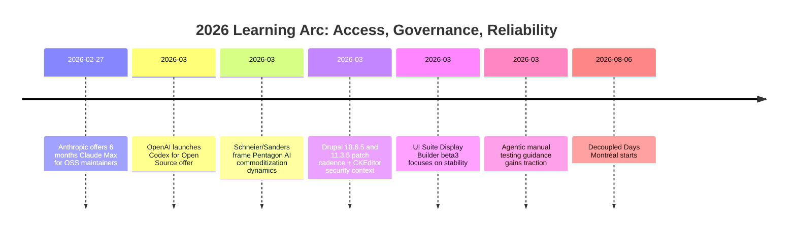

import Tabs from '@theme/Tabs';
import TabItem from '@theme/TabItem';
import TOCInline from '@theme/TOCInline';
import IdealImage from '@theme/IdealImage';

This week’s signal was clear: model vendors are buying developer gravity, while the useful work still happens in release gates, test execution, and boring upgrade hygiene. Shipping AI features is ~~prompt engineering~~ operational engineering. The teams with discipline keep moving; everyone else keeps publishing launch posts.

<IdealImage img={require('@site/static/img/vs-social-card.png')} alt="Devlog visual summary card" />

<!-- truncate -->

<TOCInline toc={toc} minHeadingLevel={2} maxHeadingLevel={2} />

## OSS Subsidies Are Now a Competitive Channel

Anthropic and OpenAI are both subsidizing maintainers. Anthropic announced six months of Claude Max for qualifying OSS maintainers on **February 27, 2026**. OpenAI answered with six months of ChatGPT Pro via Codex for Open Source.

> "six months of free Claude Max for maintainers of popular open source projects"
>
> — Simon Willison, [post](https://simonwillison.net/2026/Feb/27/claude-max-oss-six-months/)

> "six months of ChatGPT Pro ... with Codex"
>
> — OpenAI Dev Community, [Codex for OSS](https://developers.openai.com/codex/community/codex-for-oss)

| Program | Offer | Eligibility Signal | Practical Read |
|---|---|---|---|
| Anthropic Claude Max OSS | 6 months | 5,000+ stars or 1M+ npm downloads | Targets visible maintainers with distribution |
| OpenAI Codex for OSS | 6 months ChatGPT Pro + Codex | OSS maintainer criteria | Locks workflow into coding-agent daily use |

:::info[What Matters]
The subsidy is not generosity. It is customer acquisition aimed at maintainers who influence stacks, tooling defaults, and team habits. Accept the credits, then preserve portability.
:::

## Model Parity Is Rising, Procurement Is the Real Story

Bruce Schneier and Nathan E. Sanders framed the Pentagon contract wave better than most benchmark threads.

> "AI models are increasingly commodified."
>
> — Bruce Schneier, [Anthropic and the Pentagon](https://www.schneier.com/blog/archives/2026/03/anthropic-and-the-pentagon.html)

At the same time, OpenAI shipped GPT-5.4 / GPT-5.4-pro with a 1M-token context window and API + ChatGPT + Codex CLI availability: [Introducing GPT‑5.4](https://openai.com/index/introducing-gpt-5-4/), [model docs](https://developers.openai.com/api/docs/models/gpt-5.4).

<Tabs>
  <TabItem value="product" label="Product Lens" default>
    GPT-5.4 scale, context length, and packaging matter for teams consolidating toolchains.
  </TabItem>
  <TabItem value="governance" label="Governance Lens">
    Public-sector and regulated contracts are selecting vendors on reliability, access control, and procurement fit, not just eval deltas.
  </TabItem>
</Tabs>

:::warning[Procurement Risk]
If one provider outage can block deploys, coding support, and support automation at once, the architecture is under-designed. Keep fallback model routing in backlog as a release requirement.
:::

## Agentic Testing and Legacy Audits: Useful Questions, Not Theater

Ally Piechowski’s legacy Rails audit prompts are blunt and effective:

> "What’s the one area you’re afraid to touch?"
>
> — Ally Piechowski, [How I audit a legacy Rails codebase](https://piechowski.io/post/how-i-audit-a-legacy-rails-codebase/)

Simon Willison’s agentic testing point is the hard rule:

> "Never assume that code generated by an LLM works until that code has been executed."
>
> — Simon Willison, [Agentic Engineering Patterns](https://simonwillison.net/guides/agentic-engineering-patterns/)

```yaml title="ops/release-gate.yaml" showLineNumbers
audit_questions:
  - "What's the one area you're afraid to touch?"
  - "When's the last Friday deploy?"
  - "What prod break escaped tests in the last 90 days?"
checks:
  - name: unit
    required: true
  - name: integration
    required: true
  # highlight-next-line
  - name: manual-agentic-smoke
    required: true
# highlight-start
failure_policy:
  block_release: true
  require_human_ack: true
# highlight-end
```

:::caution[Friday Deploy Signal]
If teams avoid Friday deploys because rollback is messy, the deployment system is the problem. Fix observability and rollback automation before adding more AI codegen throughput.
:::

## Drupal and Decoupled Stack Signals: Keep Patch Cadence Tight

Drupal shipped 10.6.5 and 11.3.5 patch releases, both including CKEditor5 47.6.0 updates and security context. Support windows are explicit: Drupal 10.6.x and 11.3.x through **December 2026**, 10.5.x through **June 2026**.  
References: [Drupal 10.6.5](https://www.drupal.org/project/drupal/releases/10.6.5), [Drupal 11.3.5](https://www.drupal.org/project/drupal/releases/11.3.5)

UI Suite’s Display Builder 1.0.0-beta3 focused on stability plus feature increments: [announcement](https://www.ui-suite.com/blog/announcement-display-builder-1-0-0-beta3-is-out).  
Decoupled Days 2026 is set for **August 6–7, 2026** in Montréal; CFP open until **April 1, 2026**.

```diff
--- a/composer.json
+++ b/composer.json
@@
- "drupal/core-recommended": "^10.5",
+ "drupal/core-recommended": "^10.6.5 || ^11.3.5",
@@
- "ckeditor5/ckeditor5": "^47.5"
+ "ckeditor5/ckeditor5": "^47.6.0"
```

<details>
<summary>Release notes snapshot</summary>

- Drupal 10.4.x security support has ended.
- Drupal 10.5.x security support ends June 2026.
- Drupal 10.6.x and 11.3.x security coverage through December 2026.
- CKEditor5 updated to 47.6.0 with XSS-related security update context.

</details>

## PHP Runtime Updates: Good News, Still Needs Measurement

SQL Server connectivity improvements for PHP Runtime Generation 2 (8.2+) and PHP JIT availability are positive for compute-heavy and DB-bound workloads. Good defaults still require profiling before celebrating.

```php title="config/php/runtime.php"
<?php
if (!defined('APP_BOOTSTRAPPED')) { exit; }

return [
    'php_version' => '8.2',
    // highlight-next-line
    'jit' => 'tracing',
    'pdo_sqlsrv' => [
        // highlight-start
        'encrypt' => true,
        'trust_server_certificate' => false,
        // highlight-end
        'connection_timeout' => 15,
    ],
];
```

## Open Source Beyond Framework Changelogs

Google’s **SpeciesNet** shows an open-source AI model being used for wildlife conservation outcomes, not just benchmark screenshots: [overview](https://blog.google/technology/ai/speciesnet-wildlife-conservation/).  
Electric Citizen’s immigration legal-help landing page in Minnesota is the same pattern in civic delivery: focused UX under stress conditions, not portfolio glitter: [case note](https://www.electriccitizen.com/).

Docker’s interview with Cecilia Liu on MCP strategy is worth reading as product direction context: [post](https://www.docker.com/blog/celebrating-women-in-ai-3-questions-with-cecilia-liu-on-leading-dockers-mcp-strategy/).  
WPBeginner’s “blog into a book” piece is a reminder that distribution repackaging still wins: [article](https://www.wpbeginner.com/).

## The Bigger Picture



## Bottom Line

Execution quality is the moat: verify generated code, enforce release gates, stay current on patch lines, and treat vendor credits as temporary fuel instead of architecture.

:::tip[Single Action That Pays Off]
Add one non-negotiable CI gate this week: block release when generated or hand-written changes lack executed integration or agentic smoke tests against production-like data paths.
:::
