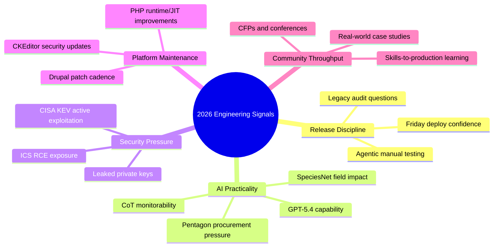

import Tabs from '@theme/Tabs';
import TabItem from '@theme/TabItem';
import TOCInline from '@theme/TOCInline';

This week had a clear pattern: strong teams are tightening release discipline while the market keeps shipping AI press releases at industrial scale. The useful signals were concrete: patch timelines, exploit catalogs, runtime improvements, and operator-grade testing patterns. The fluff was still fluff.

<!-- truncate -->

<TOCInline toc={toc} minHeadingLevel={2} maxHeadingLevel={2} />

## Stop Calling It “Legacy,” Start Asking Better Questions

> “What’s the one area you’re afraid to touch?”
>
> “When’s the last time you deployed on a Friday?”
>
> “What broke in production in the last 90 days that wasn’t caught by tests?”
>
> — Ally Piechowski, [How I audit a legacy Rails codebase](https://piechowski.io/post/how-i-audit-a-legacy-rails-codebase/)

Those questions expose system risk faster than another architecture diagram. Pair that with Simon Willison’s blunt point about **agentic engineering**: code is untrusted until executed. ~~“Looks right”~~ is not a test strategy.

:::caution[Release confidence is measurable]
Track “Friday deploy confidence” as an explicit metric. If nobody will deploy late-week, the problem is test signal quality or rollback posture, not calendar superstition.
:::

```yaml title=".github/workflows/release-gate.yml" showLineNumbers
name: release-gate
on:
  pull_request:
  push:
    branches: [main]

jobs:
  quality:
    runs-on: ubuntu-latest
    steps:
      - uses: actions/checkout@v4
      - name: Install deps
        run: composer install --no-interaction --prefer-dist
      # highlight-next-line
      - name: Unit + integration tests must pass before merge
        run: vendor/bin/phpunit --testsuite=unit,integration
      # highlight-start
      - name: Smoke runtime behavior in container
        run: docker compose run --rm app ./scripts/smoke.sh
      - name: Block deploy on unresolved sev-1 alerts
        run: ./scripts/check_alert_budget.sh --max-open-sev1=0
      # highlight-end
```

## AI Announcements: Keep the Useful Parts, Ignore the Theater

OpenAI’s GPT-5.4 launch, system card, and CoT-control work are meaningful in one narrow way: better model capability plus clearer safety instrumentation. Google’s **SpeciesNet** is useful because it solves a real conservation workflow, not because it has a big model attached.

> “AI models are increasingly commodified... there is little to differentiate one from the other.”
>
> — Bruce Schneier & Nathan E. Sanders, [Anthropic and the Pentagon](https://www.schneier.com/blog/archives/2026/03/anthropic-and-the-pentagon.html)

The commodification argument is right. Differentiation now lives in deployment quality, governance, and integration into existing operations.

<Tabs>
  <TabItem value="signal" label="High Signal" default>
  - SpeciesNet: direct field utility for wildlife monitoring.
  - CoT-control research: practical safety/monitorability implications.
  - Education tooling: useful only when tied to measurable capability gaps.
  </TabItem>
  <TabItem value="noise" label="Low Signal">
  - Generic “AI strategy” narratives with no deployment metrics.
  - Vendor claims with zero latency/cost/error-budget numbers.
  - “Most capable” claims without workload-specific benchmarks.
  </TabItem>
</Tabs>

## Security Reality Check: KEV, ICS Bugs, and Leaked Keys

The hard data this week was not subtle: CISA added five actively exploited CVEs; Delta CNCSoft-G2 has RCE risk; Google + GitGuardian found 2,622 still-valid certificates tied to leaked private keys (as of Sep 2025). That is operational risk, not abstract risk.

| Signal | Why it matters now | Immediate action |
|---|---|---|
| CISA KEV additions | Active exploitation, not hypothetical | Patch by KEV priority, not by ticket age |
| Delta CNCSoft-G2 out-of-bounds write | ICS RCE path | Segment network + vendor patch coordination |
| 2,622 valid certs from leaked keys | Identity trust collapse risk | Rotate keys/certs and audit CT continuously |

:::danger[Certificate leaks are incident-class events]
Treat leaked private keys as compromised credentials even if no abuse is observed yet. Revoke, rotate, and reissue immediately; then verify dependent services and trust stores.
:::

```diff
- Security backlog sorted by "oldest first"
+ Security backlog sorted by KEV exploit status and blast radius
+ Certificate/key leaks trigger immediate rotation playbook
+ ICS vulnerabilities require separate containment runbook
```

## Drupal and PHP: Boring Patch Work That Saves Production

Drupal 10.6.4/10.6.5 and 11.3.4/11.3.5 reinforced the same message: stay current, especially with CKEditor5 security-related updates. 10.4.x is out of security support. Running unsupported minors while debating architecture purity is pure negligence.

SQL Server connectivity improvements for PHP Runtime Generation 2 (8.2+) and new JIT support are practical when tied to profiling, not faith-based optimization.

:::info[Version policy is a product decision]
Drupal 10.6.x and 11.3.x support windows already define your maintenance cadence. Ignoring those windows shifts cost from planned maintenance to emergency remediation.
:::

<details>
<summary>Release notes that changed upgrade priority this week</summary>

- Drupal 10.6.5 and 11.3.5 shipped as production-ready patch releases.
- CKEditor5 updated to v47.6.0 with a security fix involving General HTML Support.
- Drupal 10.4.x security support ended; pre-10.5.x sites need urgent upgrade planning.
- UI Suite Display Builder `1.0.0-beta3` focused on stability plus incremental features.

</details>

## Ecosystem Signals Worth Tracking (Not Worshipping)

Decoupled Days 2026 (Montréal), Stanford WebCamp CFP, Docker MCP leadership interview, Firefox AI controls, GitHub + Andela learning workflows, Electric Citizen’s legal-help delivery, and even “blog-to-book” content ops all point to one thing: teams are operationalizing, not theorizing.

If a conference talk cannot show production constraints, skip it. If an AI story cannot show workflow impact, skip it faster.

## The Bigger Picture



## Bottom Line

Most teams don’t have an AI problem. They have a release-discipline and vulnerability-prioritization problem wearing an AI costume.

:::tip[Single highest-ROI move]
Adopt a weekly “risk-first ship gate”: KEV patch status, unsupported-version count, failed runtime smoke tests, and unresolved production regressions from the last 90 days. Promote nothing that fails any one of those checks.
:::
