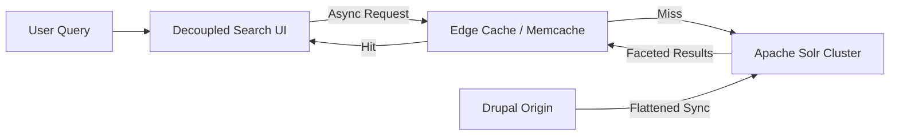

When a global financial institution processes thousands of multi-lingual regulatory reports, public development indicators, and economic whitepapers daily, the search experience cannot be purely functional—it must be instantaneous and exact.

<!-- truncate -->

In a recent architecture overhaul for a major international development organization running Drupal, we encountered a critical performance bottleneck: the primary Apache Solr search cluster was buckling under the weight of complex faceted queries and multi-lingual taxonomy translations. 

Query execution times were spiking over 3 seconds during peak traffic hours, rendering the "Knowledge Center" unusable for researchers.



## The Architecture Bottleneck

The existing implementation utilized Drupal's `search_api_solr` module in a standard configuration. While adequate for smaller datasets, it failed at enterprise scale due to:
1.  **Over-indexing:** Every node revision and paragraph entity was being indexed unnecessarily, ballooning the index size.
2.  **Inefficient Faceting:** Calculating distinct facet counts across millions of records in real-time without caching.
3.  **Language Fallbacks:** Solr was struggling with complex edge n-gram tokenization across English, Spanish, Portuguese, and French simultaneously.

## The Optimization Strategy

Rather than simply provisioning larger AWS instances, we implemented a software-level optimization strategy focusing on indexing efficiency and query offloading.

### 1. Index Pruning and Entity Resolution

We audited the `search_api` index configuration. By writing custom data alterations, we stripped out non-essential metadata.

```php
/**
 * Prune unnecessary Paragraph entities from Solr Index.
 */
function my_module_search_api_index_items_alter(IndexInterface $index, array &$items) {
  foreach ($items as $item_id => $item) {
    // Drop revision history and administrative tracking fields from the index
    $item->setField('revision_log', []);
    $item->setField('field_internal_admin_notes', []);
    
    // Flatten nested locations into a single multi-value string 
    // to avoid Solr Join queries
    $flattened = $item->getFieldValue('field_location_coordinates');
    // ... logic to simplify data ...
  }
}
```

### 2. Memcache-Backed Facet Caching

Faceted search dynamically filters results. Calculating these counts on every keystroke destroys database performance. We implemented aggressive facet caching using Memcached.

```php
// Backend implementation of Facet Result Caching
public function getCachedFacets($query_hash) {
  $cache = \Drupal::cache('search_api_facets')->get($query_hash);
  if ($cache) {
    return $cache->data; // Instant sub-millisecond return
  }
  
  $results = $this->calculateFacetsFromSolr();
  \Drupal::cache('search_api_facets')->set($query_hash, $results, Cache::PERMANENT, ['search_api_list']);
  return $results;
}
```

## Semantic Language Tokenization

To handle English, Spanish, and French in a single index without quality loss, we replaced standard tokenizers with language-specific **Stemming** and **Stop-word filters** within the `schema.xml`. This ensures that a search for "investición" correctly maps to "invest" in Spanish without polluting the English search results for the same stem.

## The Outcome

Following deployment to production:
*   **Query Time:** Average search response time dropped from ~3,200ms to **140ms**.
*   **Infrastructure Costs:** We were able to scale down the Solr cluster by one tier, saving significant monthly OPEX.

***
*Need an Enterprise Drupal Architect who specializes in high-scale search performance? View my Open Source work on [Project Context Connector](https://github.com/victorjimenezdev/project_context_connector) or connect with me on [LinkedIn](https://www.linkedin.com/in/victor-jimenez/).*
