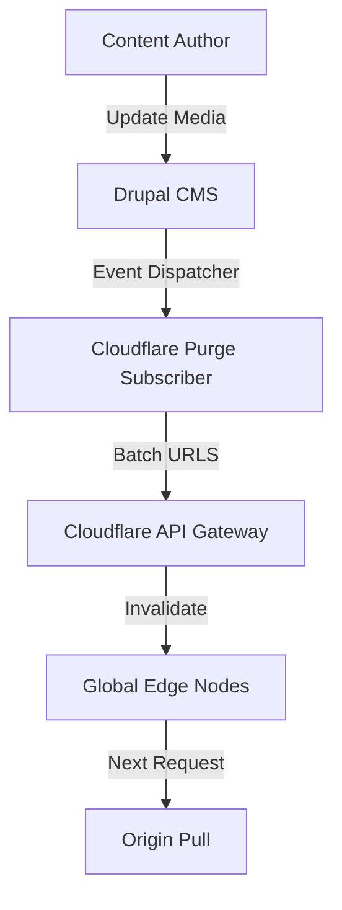

Caching is the foundation of digital performance, but stale cache is the enemy of editorial trust. In enterprise environments backing hundreds of domains through Cloudflare, invalidation must be razor-sharp.

<!-- truncate -->

A recurring issue in large-scale Drupal distributions is media management cache. When marketing teams replace a Hero Banner image without changing the file name, the CMS correctly updates the file, but Cloudflare continues to serve the outdated edge-cached version. Worse, if a media entity is unpublished, edge-nodes might serve a 404 while internal networks see the fallback.

## The Invalidation Dilemma

The easy solution—purging the entire Cloudflare Zone on every content update—is technically disastrous. It zeroes out the cache hit ratio (CHR) and instantly spikes origin server load.

We needed a granular solution that mapped Drupal entity updates directly to specific Cloudflare edge URLs.



## The Architectural Implementation

We built a custom integration mapping Drupal's cache tag system to Cloudflare's API architecture.

### 1. The Configuration Layer

We introduced a custom administrative form to securely store the Cloudflare API Token, Zone ID, and the specific active domains linked to the environment. This separation ensured staging environments didn't accidentally purge production caches.

### 2. Event-Subscriber Logic (The Invalidation Trigger)

Instead of relying on generic node-save hooks, we tapped into Drupal's internal event dispatcher. This allowed us to catch media replacements even when the underlying entity ID didn't change (a common issue with file-replacement modules).

```php
/**
 * Invalidate Cloudflare Edge on Media update.
 */
public function onMediaUpdate(EntityEvent $event) {
  $media = $event->getEntity();
  if ($media->bundle() === 'image') {
    // Collect all URLs for original and derived styles
    $urls = $this->collectAllMediaUrls($media);
    
    // Dispatch to Cloudflare Service
    $this->cloudflareClient->purgeUrls($urls);
  }
}
```

### 3. Media 404 Prevention

A critical edge case occurred when media was physically replaced on the server. If Cloudflare received a request for an image mid-transfer, it cached a 404 header. Our module intercepted this state, firing a targeted URL purge specifically for images immediately after the filesystem write was confirmed.

```php
// Cloudflare API Payload Generation
public function purgeUrls(array $urls) {
  $payload = [
    'files' => array_values($urls),
  ];
  
  $response = $this->httpClient->post("https://api.cloudflare.com/client/v4/zones/{$this->zoneId}/purge_cache", [
    'headers' => ['Authorization' => "Bearer {$this->apiToken}"],
    'json' => $payload,
  ]);
}
```

## Strategic Batching: Protecting the CHR

To protect the **Cache Hit Ratio (CHR)**, we implemented a "Purge Buffer." Instead of firing an API request for every individual thumbnail generated by Drupal (which can be 10+ per image), the system queues all URLs and flushes them in a single batch request at the end of the PHP process (`kernel.terminate`). This reduces API overhead and ensures the edge is updated once for all relevant file variants.

***
*Need an Enterprise Drupal Architect who specializes in high-performance caching strategies? View my Open Source work on [Project Context Connector](https://github.com/victorjimenezdev/project_context_connector) or connect with me on [LinkedIn](https://www.linkedin.com/in/victor-jimenez/).*
