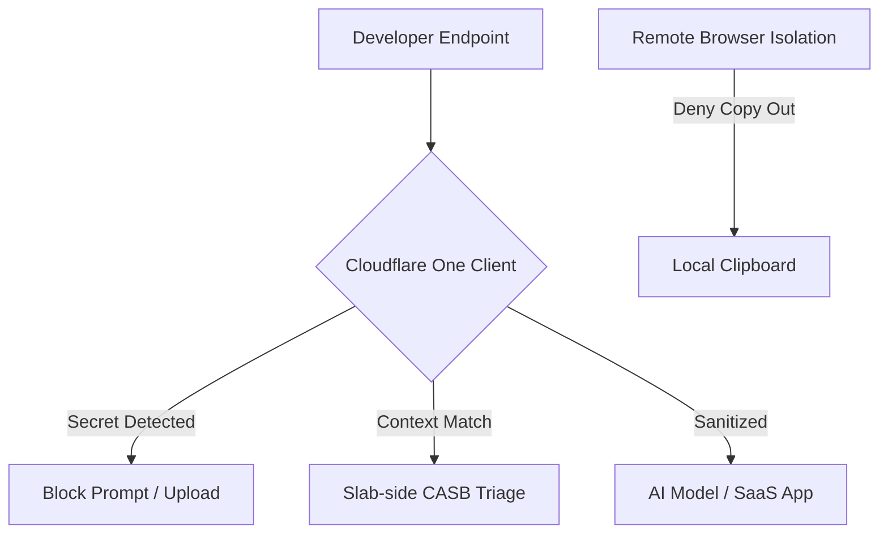

Cloudflare's March 6, 2026 post on endpoint-to-prompt security is useful because it reframes AI risk as a data-movement problem, not a model-brand problem.



For Drupal and WordPress teams using AI coding tools, the practical implication is simple: if you only secure repos and CI, but ignore clipboard flows, prompt flows, and SaaS-side scans, your secrets and regulated content can still leak through "normal" developer behavior.

<!-- truncate -->

## What Cloudflare Actually Added

In **"From the endpoint to the prompt: a unified data security vision in Cloudflare One"** (published **March 6, 2026**), Cloudflare ties four controls into one model:

- Browser-based RDP clipboard direction controls.
- Operation-level logging for SaaS actions (including prompt-like operations such as `SendPrompt`).
- Endpoint DLP enforcement in the Cloudflare One Client.
- API CASB scanning support for Microsoft 365 Copilot interactions with DLP profile matching.

This is the right framing for CMS engineering teams because plugin/module code, credentials, customer data, and admin artifacts move across all four surfaces.

## Translation to CMS Guardrails

### 1) Secrets boundary: Never let credentials become prompt content

For WordPress/Drupal teams, block these from AI prompts and uploads using DLP profiles.

```json
/* Cloudflare One DLP Profile Snippet */
{
  "name": "CMS Secret Detection",
  "rules": [
    {
      "pattern": "DRUPAL_HASH_[a-zA-Z0-9]{32}",
      "action": "block"
    },
    {
      "pattern": "wp-config\\.php",
      "action": "block"
    }
  ]
}
```

## The Clipboard Isolation Strategy

The most common leak path is not a git push; it is a copy/paste from a production admin session into a personal AI tool. By strictly controlling the clipboard direction on remote browser isolation (RBI) sessions, you ensure that the production data layer remains decoupled from the developer's chat history.

***
*Need an Enterprise Security Architect who specializes in Cloudflare One and AI-assisted CMS workflows? View my Open Source work on [Project Context Connector](https://github.com/victorstack-ai/project_context_connector) or connect with me on [LinkedIn](https://www.linkedin.com/in/victor-jimenez/).*

### 2) Prompt boundary: classify prompt operations as data egress

Treat operations such as `SendPrompt`, file upload, and share as controlled exfil paths:

- Log and retain operation-mapped events with user, app, repo/project context.
- Alert when prompt operations occur from privileged users outside approved AI apps.
- Require higher friction (step-up auth or block) for prompts containing customer or production markers.

If your SIEM does not parse prompt-adjacent operations, you cannot prove policy enforcement after an incident.

### 3) Endpoint boundary: control clipboard direction on risky remote access

For contractors and BYOD workflows accessing production panels:

- Allow copy **into** remote sessions when needed for productivity.
- Deny copy **out of** remote sessions by default for production and support environments.
- Add exception policies with expiry and ticket reference.

This closes the common leak path where database rows or stack traces are copied from admin sessions into personal AI tools.

### 4) SaaS boundary: scan Copilot and sanctioned AI surfaces for DLP matches

Cloudflare CASB + DLP findings should be triaged like vulnerability findings:

- Critical: publicly exposed files with DLP profile matches.
- High/Medium: broad internal sharing + DLP matches.
- Required action: containment owner, SLA, and evidence of remediation.

Do not treat these as compliance-only alerts; they are often early leak indicators.

## A Minimal Enforcement Matrix for Drupal/WordPress Teams

| Surface | Control | Block Condition | Owner |
|---|---|---|---|
| Endpoint/Remote access | Clipboard direction policy | Copy-out from production support/admin sessions | SecOps |
| Browser/SWG | DLP on prompt and upload traffic | Secret/profile match in prompt body or attachment | SecOps + Platform |
| SaaS (Copilot/AI apps) | API CASB + DLP findings | Public/shared artifact with DLP match | Security engineering |
| CI/CD | Secret scanning + protected vars | New high-entropy secret in commit or logs | DevOps |
| Git workflow | PR policy checks | AI-assisted PR lacks security checklist acknowledgment | Module/Plugin maintainers |

## Implementation Pattern That Works

1. Define a small set of DLP profiles tied to CMS reality: credentials, customer identifiers, and project codename/internal taxonomy.
2. Apply policy to prompt, upload, and clipboard-adjacent paths first; do not start with "monitor-only everywhere."
3. Route findings into one triage queue with vulnerability-style severity and owner assignment.
4. Add release gate checks for unresolved critical DLP findings touching plugin/module release branches.

## Bottom Line

Cloudflare's endpoint-to-prompt model is most valuable when turned into explicit egress guardrails, not dashboard visibility.

For Drupal and WordPress teams using AI coding assistants, enforce three hard boundaries:

- **Secrets must not enter prompts.**
- **Prompt operations must be auditable as data egress events.**
- **Clipboard and SaaS flows must be policy-controlled, not trust-based.**

That is what turns "AI security strategy" into operational security.

## References

- [Cloudflare Blog (March 6, 2026): From the endpoint to the prompt: a unified data security vision in Cloudflare One](https://blog.cloudflare.com/unified-data-security/)
- [Cloudflare Changelog (March 1, 2026): Clipboard controls for browser-based RDP](https://developers.cloudflare.com/changelog/post/2026-03-01-rdp-clipboard-controls/)
- [Cloudflare One Docs: Data loss prevention](https://developers.cloudflare.com/cloudflare-one/data-loss-prevention/)
- [Cloudflare One Docs: Microsoft 365 integration](https://developers.cloudflare.com/cloudflare-one/integrations/cloud-and-saas/microsoft-365/)

