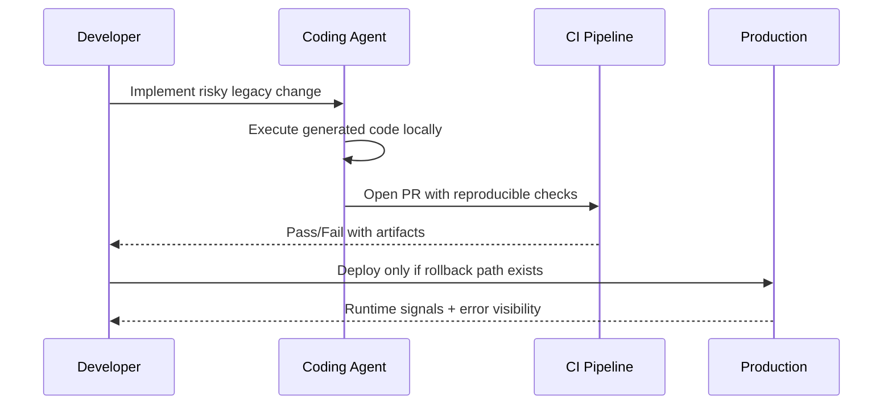

import Tabs from '@theme/Tabs';
import TabItem from '@theme/TabItem';
import TOCInline from '@theme/TOCInline';

OpenAI matching Anthropic’s maintainer subsidy with six months of ChatGPT Pro changed one concrete thing: access cost, not model trust. Access matters, but it does not remove the boring engineering work of testing, rollback discipline, and release hygiene. The useful signal across this batch is the same old one: systems fail where teams avoid touching them.

<!-- truncate -->

<TOCInline toc={toc} minHeadingLevel={2} maxHeadingLevel={2} />

## OSS Maintainer Subsidies Are Here; Procurement Questions Are Not

Anthropic announced six months of free Claude Max for qualifying OSS maintainers (5,000+ GitHub stars or 1M+ npm downloads) on February 27, 2026, and OpenAI launched a comparable six-month ChatGPT Pro/Codex offer.

> "Now OpenAI have launched their comparable offer: six months of ChatGPT Pro..."
>
> — Simon Willison, [Codex for Open Source note](https://developers.openai.com/codex/community/codex-for-oss)

<Tabs>
  <TabItem value="openai" label="OpenAI (Codex for OSS)" default>
  Six months of ChatGPT Pro with Codex access for qualifying maintainers. The practical gain is throughput on maintenance and review tasks.
  </TabItem>
  <TabItem value="anthropic" label="Anthropic (Claude Max)">
  Six months of Claude Max for maintainers meeting project popularity thresholds. Same pricing tier baseline ($200/mo equivalent) changes cost pressure for maintainers.
  </TabItem>
</Tabs>

| Program | Qualification signal | Duration | Direct engineering impact |
|---|---|---:|---|
| OpenAI Codex for OSS | Maintainer-focused eligibility | 6 months | Faster issue triage and patch drafting if review discipline exists |
| Anthropic Claude Max for OSS | 5k+ stars or 1M+ npm downloads | 6 months | Similar acceleration, same need for human acceptance gates |

:::caution[Do Not Treat Subsidy as Quality]
Keep CI, integration tests, and release approval exactly as strict as before. Free model access lowers cost; it does not lower regression probability.
:::

## Three Legacy Questions That Save Months of Guesswork

Ally Piechowski’s audit prompts are operationally sharp because they bypass architecture theater and expose fear boundaries inside teams.

> "What’s the one area you’re afraid to touch?"
>
> — Ally Piechowski, [How I Audit a Legacy Rails Codebase](https://piechowski.io/post/how-i-audit-a-legacy-rails-codebase/)

> "What broke in production in the last 90 days that wasn’t caught by tests?"
>
> — Ally Piechowski, [How I Audit a Legacy Rails Codebase](https://piechowski.io/post/how-i-audit-a-legacy-rails-codebase/)

Simon Willison’s agentic manual testing point lands in the same place: generated code is untrusted until executed.



:::tip[Use These in the Next Audit Interview]
Ask all three prompts to both developers and engineering leadership, then map answers to one backlog: fragile zone, blocked feature, and recent escaped defect. Prioritize by customer impact, not by component ownership.
:::

## Drupal: Real Deadlines, Real Patch Work

Drupal 10.6.5 and 11.3.5 are patch releases ready for production. Both include CKEditor5 47.6.0, with a security fix reviewed by Drupal Security Team.  
Support windows matter more than release headline text:

- Drupal `10.6.x` security support: until December 2026  
- Drupal `10.5.x` security support: until June 2026  
- Drupal `10.4.x`: security support ended  
- Drupal `11.3.x` security coverage: until December 2026

```bash title="upgrade-drupal-core.sh" showLineNumbers
composer show drupal/core-recommended | head -n 5
composer require drupal/core-recommended:^10.6.5 drupal/core-composer-scaffold:^10.6.5 drupal/core-project-message:^10.6.5 --update-with-all-dependencies
composer update --with-all-dependencies
vendor/bin/drush updatedb -y
vendor/bin/drush cr
vendor/bin/drush status

# highlight-next-line
composer require drupal/core-recommended:^11.3.5 drupal/core-composer-scaffold:^11.3.5 drupal/core-project-message:^11.3.5 --update-with-all-dependencies
composer update --with-all-dependencies
vendor/bin/drush updatedb -y
vendor/bin/drush cr
vendor/bin/drush status
```

<details>
<summary>Release notes to track in backlog</summary>

- `drupal 10.6.5`: patch release, production-ready, CKEditor5 47.6.0 update.
- `drupal 11.3.5`: patch release, production-ready, CKEditor5 47.6.0 update.
- `Decoupled Days 2026`: August 6-7 in Montréal; CFP open until April 1, 2026.
- `UI Suite Display Builder 1.0.0-beta3`: stability-focused beta with bug fixes plus feature additions.
- `SQL Server connectivity improvements for PHP Runtime Generation 2 (8.2+)`: relevant for teams running SQL Server-backed PHP apps in modern runtimes.

</details>

:::warning[Upgrade Path Is Not Optional]
Teams still on Drupal 10.4.x are running without supported security coverage. ~~Minor releases are just housekeeping~~ is how incidents start.
:::

## AI Coverage Worth Keeping, and Coverage Worth Questioning

SpeciesNet is one of the few AI stories where output quality ties directly to an external mission: wildlife conservation operations. That is tangible.

Schneier and Sanders on Pentagon contracts is also worth reading because it avoids fan-fiction and centers market dynamics:

> "AI models are increasingly commodified."
>
> — Bruce Schneier & Nathan E. Sanders, [Anthropic and the Pentagon](https://www.schneier.com/blog/archives/2026/03/anthropic-and-the-pentagon.html)

If top-tier model performance keeps converging, selection pressure shifts to integration quality, governance posture, and procurement constraints. Model benchmark one-upmanship becomes secondary.

## Smaller Notes That Still Matter in Practice

- Docker’s International Women’s Day interview with Cecilia Liu is useful mainly for MCP product direction context, not for slogans.
- WPBeginner’s “blog into a book” piece is practical for distribution repackaging; content reuse beats blank-page production every time.
- Electric Citizen’s LawHelpMN immigration resource launch is a strong civic web example: focused information architecture under time pressure.

Closing action list is straightforward: take the maintainer credits if eligible, run ruthless execution checks on agent-written code, and schedule Drupal patch windows now instead of explaining missed support deadlines later.
