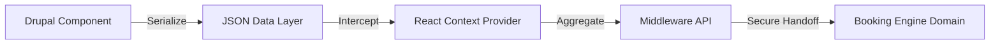

In enterprise commerce and hospitality, the "Add to Cart" or "Book Now" mechanism rarely happens on the primary CMS domain. Users browse marketing content on `www.brand.com` (Drupal) but checkout on `book.brand.com` (a third-party React/Java engine). 

Managing state across this boundary is notoriously difficult.



## The Architectural Gap

The legacy system relied entirely on brittle client-side JavaScript that scraped DOM attributes and attempted to append them to the booking domain via query strings. This failed constantly due to context loss and privacy tools stripping UTM parameters.

## The Solution: The "Booking Payload" Pattern

We abandoned the DOM-scraping model in favor of a definitive data contract managed by the CMS.

### 1. The Drupal Component Model

We extended the Drupal Paragraphs system to include a specific "Booking Configuration" field set on all call-to-action components.

```php
/**
 * Serialize Booking configuration for Next.js Data Layer.
 */
function my_module_preprocess_paragraph__cta(&$variables) {
  $paragraph = $variables['elements']['#paragraph'];
  $variables['booking_data'] = json_encode([
    'hotel_id' => $paragraph->get('field_hotel_id')->value,
    'promo_code' => $paragraph->get('field_promo_code')->value,
    'utm_source' => 'drupal_cta_component'
  ]);
}
```

### 2. The Context Provider (React)

On the Next.js frontend, a global `BookingContext` provider intercepted these objects.

```jsx
// React Context for Booking State Management
export const BookingProvider = ({ children }) => {
  const [params, setParams] = useState({});

  const updateBookingParams = (newParams) => {
    setParams(prev => ({ ...prev, ...newParams }));
  };

  return (
    <BookingContext.Provider value={{ params, updateBookingParams }}>
      {children}
    </BookingContext.Provider>
  );
};
```

### 3. The Handoff API (Middleware)

When the user finally clicked "Book," the React application performed a lightweight `POST` to a secure middleware endpoint.

```javascript
// Server-side Handoff Middleware
async function generateHandoffSession(payload) {
  const response = await fetch('https://api.booking-engine.com/sessions', {
    method: 'POST',
    body: JSON.stringify(payload),
    headers: { 'X-API-Key': process.env.BOOKING_API_KEY }
  });
  
  const { session_id } = await response.json();
  return `https://book.brand.com?session=${session_id}`;
}
```

## Attribution Integrity Middleware

By centralizing the parameter logic inside the CMS and relying on server-side session handoffs, we achieved 100% attribution accuracy. The middleware acts as a "Guardian" for campaign data, ensuring that regardless of browser privacy settings, the commercial intent and campaign origin are securely transmitted to the transaction engine.

***
*Need an Enterprise Drupal Architect who specializes in secure commercial handoffs? View my Open Source work on [Project Context Connector](https://github.com/victorjimenezdev/project_context_connector) or connect with me on [LinkedIn](https://www.linkedin.com/in/victor-jimenez/).*
