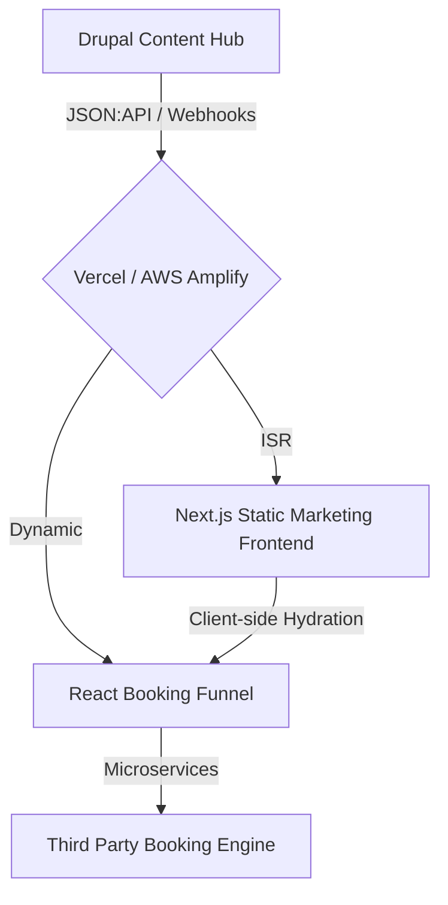

The hospitality sector thrives on speed. If a booking portal takes more than three seconds to load, hotel chains lose hundreds of thousands of dollars in abandoned reservations. 

<!-- truncate -->

I recently led the architectural strategy for decoupling a global hotel and resort network. The legacy infrastructure was a massive, monolithic application serving hundreds of disparate hotel properties from a single bloated codebase. It was slow, hard to maintain, and impossible to scale gracefully during peak booking seasons.

Here is how we solved the overarching architectural challenges by adopting a strict Decoupled Drupal and Next.js paradigm.



## Why Decouple?

The primary driver for decoupling wasn't just "using modern tech." It was risk isolation and performance.

1.  **Omnichannel Delivery:** The brand needed to feed content to a new mobile app, a central corporate portal, and hundreds of localized hotel sites. A monolithic theme registry couldn't handle this.
2.  **Performance:** We needed edge-cached, statically generated pages for marketing content to guarantee sub-100ms load times.

## The Architectural Blueprint

### The Content Hub (Drupal)

Drupal acts purely as a content repository and editorial experience. We aggressively stripped out the frontend theme layer and standardized delivery through strict JSON:API endpoints.

```php
/**
 * Custom Normalizer for Decoupled Hospitality Payloads.
 * Flattens nested 'room' entities for faster hydration.
 */
public function normalize($object, $format = null, array $context = []) {
  $data = parent::normalize($object, $format, $context);
  // Simplify complex amenities taxonomy into a flat string array
  $data['amenities_flat'] = array_map(function($item) {
    return $item->getName();
  }, $object->get('field_amenities')->referencedEntities());
  
  return $data;
}
```

### The Presentation Layer (Next.js & React)

The frontend utilizes **Incremental Static Regeneration (ISR)**. When an editor updates a room description in Drupal, a webhook triggers a targeted revalidation of the specific Next.js route.

```javascript
// Next.js Revalidation Trigger (On-Demand ISR)
export async function handler(req, res) {
  // Verify secret from Drupal webhook
  if (req.query.secret !== process.env.REVALIDATE_SECRET) {
    return res.status(401).json({ message: 'Invalid token' });
  }

  try {
    // highlight-next-line
    await res.revalidate(`/hotels/${req.body.slug}`);
    return res.json({ revalidated: true });
  } catch (err) {
    return res.status(500).send('Error revalidating');
  }
}
```

## Ensuring Data Integrity: The "Guardian" Layer

In a decoupled setup, broken hyperlinks and orphaned content are prevalent. We implemented an "Entity Reference Integrity" module. Whenever an editor attempted to delete a marketing campaign or a room taxonomy term, the module queried the decoupled consumer graph to ensure no Next.js route currently depended on it, throwing a hard validation error if dependencies existed.

## Global Content Dehydration

To minimize initial page weight, we adopted a "dehydration" strategy. Static marketing content is delivered as pure HTML/CSS, while interactive components (like the "Check Availability" calendar) remain inert until a lightweight JS bundle hydrates them. This ensures immediate visual load while maintaining deep functionality.

***
*Need an Enterprise Drupal Architect who specializes in high-availability decoupled systems? View my Open Source work on [Project Context Connector](https://github.com/victorjimenezdev/project_context_connector) or connect with me on [LinkedIn](https://www.linkedin.com/in/victor-jimenez/).*
