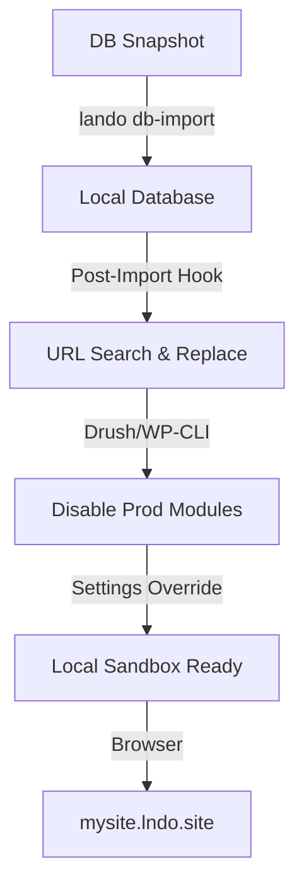

Nothing destroys developer productivity faster than local environment issues. Specifically, infinite redirect loops.

<!-- truncate -->

You pull the latest production database snapshot for a massive hospitality portal, type `lando start`, navigate to `mysite.lndo.site`, and boom—you are instantly force-redirected back to the live production URL.

This is a classic enterprise sandboxing failure, and it happens across Drupal and WordPress constantly when database configurations aren't properly sanitized for local development.



## The Anatomy of the Redirect Loop

In platforms like Pantheon, site variables, sub-domain configurations, and caching modules are aggressively baked into the database. When you pull that database locally, the application still believes it is in a "live" state.

1.  **WordPress Home/Site URL:** The `wp_options` table strictly enforces the production base URL.
2.  **Drupal Trusted Host Patterns:** The `settings.php` file rejects `*.lndo.site` because it expects the production DNS.
3.  **Forced HTTPS/Environment Redirects:** Custom PHP logic detects the lack of a production load balancer environment variable and forces a redirect.

## Implementing the Fix

To solve this permanently across a team of 20+ developers, we instituted strict Lando automation and configuration overrides.

### 1. Context-Aware Configuration (`settings.local.php`)
We implemented environment-aware database configuration. By checking for the `LANDO_INFO` environment variable, the application dynamically overrides base URLs.

```php
if (isset($_ENV['LANDO_INFO'])) {
  $settings['trusted_host_patterns'] = ['.*'];
  $config['system.performance']['css']['preprocess'] = FALSE;
  $config['system.performance']['js']['preprocess'] = FALSE;
  // Disable HTTPS redirects
  $settings['reverse_proxy'] = FALSE;
}
```

### 2. Post-DB-Import Sanitization Hooks

Pulling the database is only step one. We authored custom Lando tooling scripts (`.lando.yml`) that run immediately after `lando db-import` completes.

```yaml
# .lando.yml snippet for automated sanitization
events:
  post-db-import:
    - lando drush cset system.site mail "dev@local.site" -y
    - lando drush pmu simple_sso samlauth -y
    - lando wp search-replace https://prod.site https://site.lndo.site
```

### 3. Nginx Route Overrides
We configured Lando's internal Nginx routing to ignore strict HTTP-to-HTTPS redirects defined in the codebase, preventing browser-level redirect loops.

## Automated DB Sanitization

Executing these commands manually is prone to error. By embedding the sanitization login into the `.lando.yml` events, we ensure that every developer—regardless of their seniority level—is working in a perfectly configured sandbox every time they pull fresh data. This "Shift Left" on environment parity saves dozens of hours in debugging non-existent production bugs that were actually just local configuration drifts.

***
*Need an Enterprise CMS Architect who specializes in developer experience and local sandboxing? View my Open Source work on [Project Context Connector](https://github.com/victorjimenezdev/project_context_connector) or connect with me on [LinkedIn](https://www.linkedin.com/in/victor-jimenez/).*
