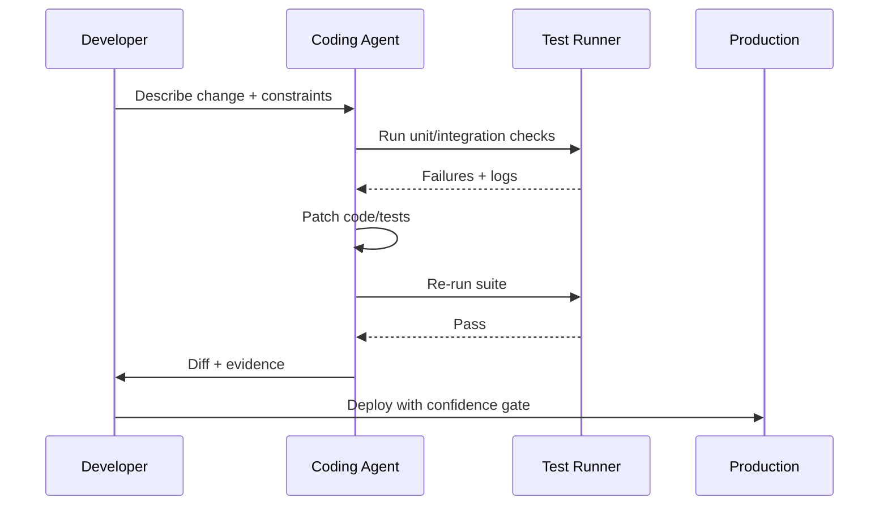

import Tabs from '@theme/Tabs';
import TabItem from '@theme/TabItem';
import TOCInline from '@theme/TOCInline';

OpenAI matching Anthropic on maintainer perks matters less for generosity and more for one blunt reason: AI coding tools are entering commodity pricing territory for serious open-source maintainers. The important story is no longer “which model is magical,” it’s who reduces operating friction without locking teams into brittle workflows. The rest of this devlog follows that same standard: signal tied to execution, not launch-page adjectives.

<!-- truncate -->

<TOCInline toc={toc} minHeadingLevel={2} maxHeadingLevel={2} />

## OSS Maintainer Subsidies Are Now a Competitive Layer

> "Anthropic announced six months of free Claude Max for maintainers of popular open source projects."
>
> — Simon Willison, [link](https://simonwillison.net/2026/Feb/27/claude-max-oss-six-months/)

> "Now OpenAI have launched their comparable offer: six months of ChatGPT Pro..."
>
> — Simon Willison citing OpenAI, [link](https://developers.openai.com/codex/community/codex-for-oss)

<Tabs>
  <TabItem value="openai" label="OpenAI Codex for OSS" default>
    Framing: direct response to Anthropic's maintainer offer, with ChatGPT Pro access and Codex in the package.  
    Practical value: useful if the project already relies on ChatGPT/Codex review and patch loops.
  </TabItem>
  <TabItem value="anthropic" label="Anthropic Claude Max OSS">
    Framing: six-month support for maintainers meeting popularity thresholds.  
    Practical value: strongest where teams already ship through Claude-heavy workflows.
  </TabItem>
</Tabs>

| Program | Public framing | Eligibility signal | Engineering reality |
|---|---|---|---|
| OpenAI Codex for OSS | Comparable maintainer support offer | OSS maintainer criteria | Tool subsidy helps, but repo hygiene and test reliability still dominate outcomes |
| Anthropic Claude Max OSS (announced Feb 27, 2026) | Free Claude Max for selected maintainers | 5,000+ stars or 1M+ npm downloads | High threshold excludes most useful but smaller infra projects |

~~Model quality decides everything~~. In practice, context handling, execution loop reliability, and integration friction decide team velocity.

## Legacy Rails Audit Questions That Expose Delivery Risk Fast

Ally Piechowski’s prompt set is excellent because it forces teams to stop hiding behind “coverage percentage.”

> “What’s the one area you’re afraid to touch?”
>
> — Ally Piechowski, [link](https://piechowski.io/post/how-i-audit-a-legacy-rails-codebase/)

> “What broke in production in the last 90 days that wasn’t caught by tests?”
>
> — Ally Piechowski, [link](https://piechowski.io/post/how-i-audit-a-legacy-rails-codebase/)

:::tip[Run these interviews before backlog planning]
Interview one senior IC, one on-call engineer, and the CTO/EM separately. Compare answers, then rank gaps by blast radius: revenue, security, or deploy frequency. If answers disagree, documentation is already stale and planning assumptions are wrong.
:::

## Agentic Manual Testing: Execution Is the Only Truth

> "Never assume that code generated by an LLM works until that code has been executed."
>
> — Simon Willison, [link](https://simonwillison.net/guides/agentic-engineering-patterns/)

Teams still skip this and then act surprised when “working code” fails on first run. The defining difference in agentic engineering is not generation, it is execution plus verification.



## Drupal 10.6.5 and 11.3.5: Patch Releases With Real Security Implications

Drupal 10.6.5 and 11.3.5 both include CKEditor 5 v47.6.0 updates. Drupal Security Team review says the specific CKEditor XSS issue is not exploitable in built-in implementations, but that does not remove the upgrade requirement for custom integrations.

> "Drupal 10.6.x will receive security support until December 2026."
>
> — Drupal.org release note, [Drupal 10.6.5](https://www.drupal.org/project/drupal/releases/10.6.5)

> "Drupal 11.3.x will receive security coverage until December 2026."
>
> — Drupal.org release note, [Drupal 11.3.5](https://www.drupal.org/project/drupal/releases/11.3.5)

```bash title="drupal-upgrade-checklist.sh" showLineNumbers
composer show drupal/core-recommended --latest
# highlight-next-line
composer require drupal/core-recommended:^10.6.5 drupal/core-composer-scaffold:^10.6.5 drupal/core-project-message:^10.6.5 --update-with-all-dependencies
drush updatedb -y
drush config:export -y
drush cache:rebuild
php -d memory_limit=-1 ./vendor/bin/phpunit --testsuite=unit
php -d memory_limit=-1 ./vendor/bin/phpunit --testsuite=kernel
php -d memory_limit=-1 ./vendor/bin/phpunit --testsuite=functional
drush status
git diff -- composer.lock web/core
```

:::warning[Support windows are now a planning constraint]
Drupal 10.4.x security support has ended, and 10.5.x support ends in June 2026. Teams still sitting below 10.5.x are burning time that should go into test hardening and custom-module compatibility checks.
:::

<details>
<summary>Release details worth tracking in backlog grooming</summary>

- Drupal 10.6.5: patch release, production-ready, CKEditor5 updated to v47.6.0.
- Drupal 11.3.5: patch release, production-ready, CKEditor5 updated to v47.6.0.
- Support timelines:
  - 10.6.x security support until December 2026.
  - 10.5.x security support until June 2026.
  - 10.4.x security support ended.
</details>

## Ecosystem Notes Worth Logging (Not Just Liking)

| Item | Why it matters | Immediate action |
|---|---|---|
| Decoupled Days 2026 (Montréal, Aug 6-7; CFP until Apr 1, 2026) | Strong signal for headless/API-first implementation patterns | Submit implementation talks with real migration metrics |
| UI Suite Display Builder 1.0.0-beta3 | Stability pass plus features in Drupal UI tooling | Re-test layout edge cases before adopting in production builders |
| SQL Server connectivity improvements for PHP Runtime Generation 2 (8.2+) | PHP/SQL Server shops get fewer friction points in modern runtimes | Validate `sqlsrv`/`pdo_sqlsrv` matrix in CI for 8.2+ |
| Docker MCP strategy interview with Cecilia Liu | Useful product direction hints around secure AI tooling | Map MCP use to concrete policy controls, not demos |
| SpeciesNet open-source conservation model | Good example of applied AI with domain value, not chatbot cosplay | Study governance and deployment constraints for field data |
| Electric Citizen + LawHelpMN immigration legal help page | Civic delivery under urgent conditions | Prioritize information architecture and trust signals in crisis pages |
| WPBeginner “Blog into Book” workflow | Content repackaging can work if editing discipline exists | Treat as editorial production pipeline, not copy-paste monetization |

## Pentagon Contracts and Model Commoditization: Governance Is the Differentiator

> "AI models are increasingly commodified... little to differentiate one from the other."
>
> — Bruce Schneier and Nathan E. Sanders, [link](https://www.schneier.com/blog/archives/2026/03/anthropic-and-the-pentagon.html)

The point is not brand loyalty. The point is procurement plus oversight. Performance parity at the top tier shifts risk toward auditing, data boundaries, and operational controls. Teams treating model choice as the whole strategy are arguing about the paint while the wiring is exposed.

:::caution[Procurement checklist for AI in sensitive domains]
Require contract language on logging boundaries, model update notice periods, and incident disclosure timelines. Add third-party security review rights before signing anything tied to regulated or public-sector workloads.
:::

## Closing Notes for Teams Shipping Code This Quarter

Adopt the subsidy programs if they reduce real engineering costs, but tie them to measurable output: lead time, escaped defects, and CI pass stability. Use the Rails audit questions to expose hidden delivery risk before roadmap theater starts. Upgrade Drupal branches on the published support timelines, and treat agentic testing as mandatory execution evidence, not optional polish.
