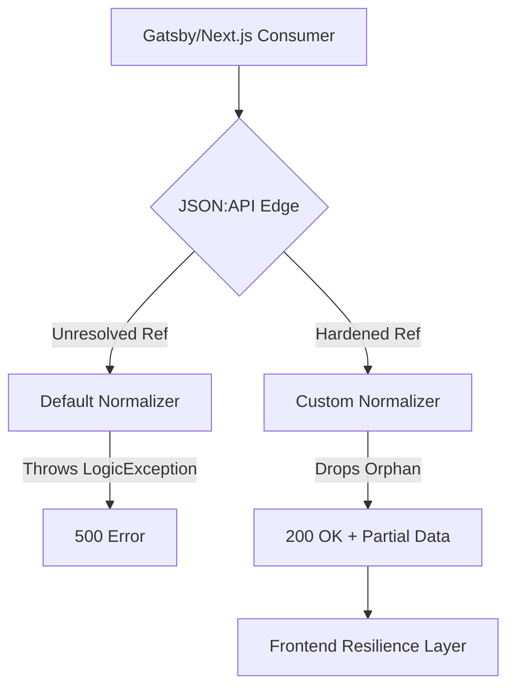

When building a decoupled frontend for a global travel brand, the boundary between the CMS (Drupal) and the presentation layer (React/Next.js) is critical. If the API fails, the booking engine halts.

<!-- truncate -->

Recently, we encountered systemic instablity during the integration of new "Location" and "Cruise" data schemas into our headless architecture. The frontend team was experiencing intermittent 500 errors when fetching large location payload sets due to unresolved entity references.

## The Challenge

The core challenge was translating deeply nested Drupal content structures (e.g., A Cruise entity -> Port of Call -> Geographic Taxonomy -> Associated Hotel Reference) into a flat, highly performant JSON response.

When the built-in Drupal JSON:API attempts to resolve an entity reference that has been deleted or unpublished (like an inactive `field_hotel_reference`), it can trigger fatal errors in the normalization pipeline, cascading into 500 Internal Server Errors for the decoupled application.



## The Solution: Strict Schema Enforcement and Regression Suites

Instead of patching the frontend to "handle nulls," we hardened the API layer itself.

### 1. Robust Reference Handling (The "Zero-500" Normalizer)
We implemented a custom normalizer decorator that intercepts all `EntityReferenceFieldItem` objects. If the target entity is missing, it returns a `null` value instead of allowing the core normalizer to attempt an unauthorized or impossible load.

```php
// Custom normalizer preventing 500s on orphaned references
public function normalize($object, $format = null, array $context = []) {
  $attributes = parent::normalize($object, $format, $context);
  
  // Guard clause for unpublished/missing entity references
  if ($object->getFieldDefinition()->getType() === 'entity_reference') {
    $entity = $object->entity;
    if (!$entity || !$entity->isPublished()) {
      return null; // Gracefully drop the reference
    }
  }
  
  return $attributes;
}
```

### 2. Comprehensive API Regression Testing
To ensure stability, we integrated a full suite of API regression tests using Playwright. This ensures that even as the Drupal schema evolves, the "Contract" between backend and frontend remains intact.

```typescript
// Playwright API Schema Validation
test('Cruise endpoint returns valid schema', async ({ request }) => {
  const response = await request.get('/jsonapi/node/cruise');
  const body = await response.json();
  
  expect(response.ok()).toBeTruthy();
  // highlight-next-line
  expect(body.data).toEqual(expect.arrayContaining([
    expect.objectContaining({
      type: 'node--cruise',
      attributes: expect.objectContaining({
        title: expect.any(String),
        field_cruise_id: expect.any(String)
      })
    })
  ]));
});
```

## Advanced Optimization: Sparse Fieldsets and Query Complexity

In enterprise travel data, payloads can be massive. We utilized **Sparse Fieldsets** to reduce bandwidth and memory overhead. Instead of requesting the full entity, the frontend specifies exactly which fields it requires:

`GET /jsonapi/node/cruise?fields[node--cruise]=title,field_price,field_dates`

Additionally, we implemented the **Query Complexity** gate. If a frontend developer attempts to perform a query with too many `include` parameters (e.g., nesting depth > 3), the API returns a 400 Bad Request. This prevents "Denial of Service by Query" where complex recursive inclusions would otherwise exhaust PHP memory limits.

## Security: Sanitizing the Data Stream

A critical enterprise requirement is ensuring PII (Personally Identifiable Information) never leaks into public JSON:API streams. We utilized Drupal's access control layer to ensure that even if a field is "exposed" via the API, the current user (typically an anonymous frontend "consumer" user) has zero view permissions for sensitive fields like internal hotel contact numbers or guest ID numbers.

***
*Need an Enterprise Drupal Architect who specializes in high-availability decoupled systems? View my Open Source work on [Project Context Connector](https://github.com/victorjimenezdev/project_context_connector) or connect with me on [LinkedIn](https://www.linkedin.com/in/victor-jimenez/).*
