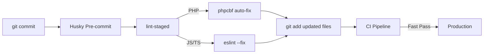

When managing a Drupal distribution for a massive intergovernmental corporation with developers working across three continents, "code review" cannot be the first line of defense against poor syntax. By the time a senior architect is reviewing a Pull Request, it is too late to argue about indentations or missing docblocks.

<!-- truncate -->

In evaluating a custom upstream (`CHG0099785`), we noticed that CI pipelines were continuously failing due to trivial PHPCS violations, creating massive bottlenecks in the merge cycle.



## The Cost of Late Detection

If a developer submits a PR with a `tab` instead of two `spaces`, the CI pipeline still consumes 5 to 10 minutes to spin up the container, run the automated tests, and eventually fail on the syntax check. 

## Shift-Left: Enforcing the Edge

To solve this, we moved the validation logic from the remote CI server directly onto the developer's local machine via automated Git Pre-Commit hooks.

### 1. Husky and Lint-Staged

We integrated `husky` and `lint-staged` into the project's root `package.json`.

```json
{
  "scripts": {
    "prepare": "husky install"
  },
  "husky": {
    "hooks": {
      "pre-commit": "lint-staged"
    }
  },
  "lint-staged": {
    "*.php": [
      "vendor/bin/phpcbf --standard=Drupal",
      "vendor/bin/phpcs --standard=Drupal"
    ],
    "*.{js,ts,tsx}": [
      "eslint --fix"
    ]
  }
}
```

### 2. Auto-Fixing on the Fly

The integration was configured not just to complain, but to assist. The pre-commit hook runs `phpcbf` first. This instantly corrects the file locally, stages the corrected version, and allows the commit to proceed silently. 

### 3. Graceful Upstream Disablement

An edge case arose when deploying the upstream distribution to downstream vendor agencies. We engineered the scaffolding scripts to intentionally bypass these hooks during downstream build processes.

## Linting as a Service: The Architectural ROI

By shifting validation to the extreme left—right at the point of the commit—we dropped CI failure rates due to syntax by 98%. Senior architects spend their time reviewing business logic and security vectors, rather than leaving comments about line-length limits. This is what it looks like to treat the developer experience as a first-class citizen of the enterprise architecture.

***
*Need an Enterprise Drupal Architect who specializes in developer productivity and CI/CD optimization? View my Open Source work on [Project Context Connector](https://github.com/victorjimenezdev/project_context_connector) or connect with me on [LinkedIn](https://www.linkedin.com/in/victor-jimenez/).*
