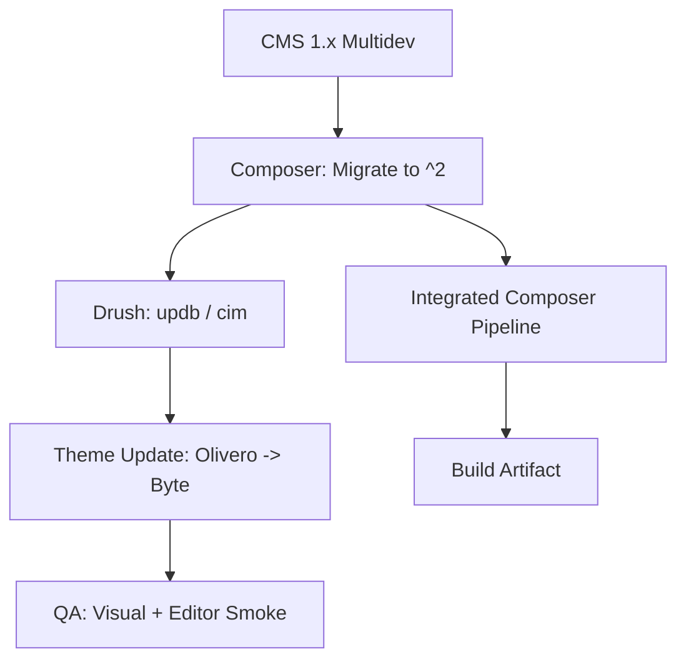

Pantheon announced on **March 6, 2026** that new sites created from the Drupal CMS upstream now use Drupal CMS 2. This is not a blanket platform upgrade: Pantheon explicitly says existing Drupal CMS sites are not auto-updated, and Drupal 10/11 upstream sites are not affected.

That split matters operationally. Teams can misread this as "new upstream available, apply update everywhere." For managed portfolios, that interpretation is risky.

The important point: this is not a patch-level update. Treat it as a controlled migration.



## What Actually Changed

From Pantheon and Drupal.org sources:

- Pantheon updated the Drupal CMS upstream to version 2 for newly created sites.
- Existing Drupal CMS sites require deliberate upgrade work and validation.
- CMS 2 introduces architectural shifts, including Canvas as default editing UX and the Byte site template.
- Pantheon's Drupal CMS guidance flags concrete break risks for 1.x to 2.0 upgrades.

The important point: this is not a patch-level update. Treat it as a controlled migration.

## Breaking-Change Surface You Need to Map First

Pantheon's own Drupal CMS doc calls out the highest-risk breaks for CMS 1.x sites, including theme removal and recipe package splits.

```bash
# Update sequencing for Drupal CMS 2
composer require drupal/cms:^2 -W
composer require drupal/site_template_helper:^1
vendor/bin/drush theme:enable byte
vendor/bin/drush theme:set-default byte
vendor/bin/drush cr
```

- `drupal_cms_olivero` is removed and replaced by `byte`; post-upgrade, unresolved theme config can trigger missing theme errors.
- Several content-type recipe packages are replaced by `drupal_cms_site_template_base`.
- Composer plugin allowlist requirements change (`drupal/site_template_helper` must be explicitly allowed), or Integrated Composer builds can fail.
- `automatic_updates` is marked obsolete and should be uninstalled after upgrade.

For managed Drupal teams, the real blast radius is usually:

- Theme dependency assumptions in custom front-end work.
- Content model dependencies on replaced recipe packages.
- CI/CD breakage from Composer allow-plugins drift.
- Inconsistent environments if Dev is upgraded but promotion criteria are weak.

## Update Sequencing for Managed Teams

The safest order is environment-first and evidence-driven:

1. Classify sites by upstream: Drupal CMS vs Drupal 10/11 core upstreams.
2. For Drupal CMS 1.x sites, branch to Multidev first; do not start in Dev/Test/Live.
3. Inventory content using recipe-provided types (Blog, News, Events, etc.) before any package removals.
4. Update `composer.json` constraints from `^1` to `^2`, apply package replacements, and update allow-plugins.
5. Run DB updates and config validation in Multidev; switch theme to `byte` before declaring success.
6. Validate editor workflows (Canvas, content creation, revisions), not just homepage rendering.
7. Merge to Dev only with explicit rollback criteria and owner sign-off.

This sequencing aligns with Pantheon's Multidev-first guidance and reduces production surprise.

## The Integration Test Gate: Beyond Code Success

A successful build artifact does not guarantee a successful Drupal CMS 2 site. Because CMS 2 relies heavily on recipes and configuration-as-code, you must validate the **Canvas** editor experience and the integrity of the **Byte** theme mappings in Multidev before merging any code to production.

***
*Need an Enterprise Drupal Architect who specializes in Pantheon upstream migrations and CI/CD optimization? View my Open Source work on [Project Context Connector](https://github.com/victorstack-ai/project_context_connector) or connect with me on [LinkedIn](https://www.linkedin.com/in/victor-jimenez/).*

## Deployment Checklist

Use this as a release gate before promotion:

- Upstream classification documented per site (CMS upstream vs Drupal 10/11 upstream).
- Dependency diff approved (`composer.lock` + removed packages + plugin allowlist updates).
- Theme migration completed and verified (`drupal_cms_olivero` references removed, `byte` active as intended).
- Content integrity check completed for replaced content-type recipes.
- Drush update + cache rebuild + watchdog checks clean in Multidev.
- Editor smoke tests passed (create/edit/publish, media, menus, forms).
- Config export/import cycle passes without unexpected drift.
- Rollback path tested (known-good tag + DB backup + owner on-call).

If one item is missing, delay promotion. CMS 2 adoption is optional per-site, outage time is not.

## WordPress and Cross-CMS Relevance

WordPress teams on Pantheon are not directly impacted by this Drupal CMS upstream change. But multi-CMS platform teams should still adopt the same discipline:

- classify by upstream/product line,
- avoid "one update policy for all sites",
- enforce environment-gated promotion with explicit rollback checks.

That process is reusable across Drupal and WordPress estates, even when only one CMS has breaking changes.

## Bottom Line

Pantheon's Drupal CMS 2 upstream update is a positive move for new builds, but for existing managed Drupal estates it is a migration event, not a maintenance click. The teams that avoid incidents will be the ones that map the breaking surface early, run Multidev-first sequencing, and enforce a release gate that checks content and editor workflows, not only code deploy success.

## Sources

- [Pantheon release note (March 6, 2026): Upstream update for Drupal CMS 2 now available](https://docs.pantheon.io/release-notes/2026/03/upstream-drupal-cms-2-available)
- [Pantheon docs: Drupal CMS on Pantheon (includes 1.x to 2.0 upgrade warnings and recommended steps)](https://docs.pantheon.io/drupal-cms)
- [Drupal.org: Drupal CMS releases](https://www.drupal.org/project/cms/releases)
- [Drupal.org: cms 2.0.0 release notes](https://www.drupal.org/project/cms/releases/2.0.0)
- [Pantheon docs: WordPress and Drupal Core Updates](https://docs.pantheon.io/core-updates)
