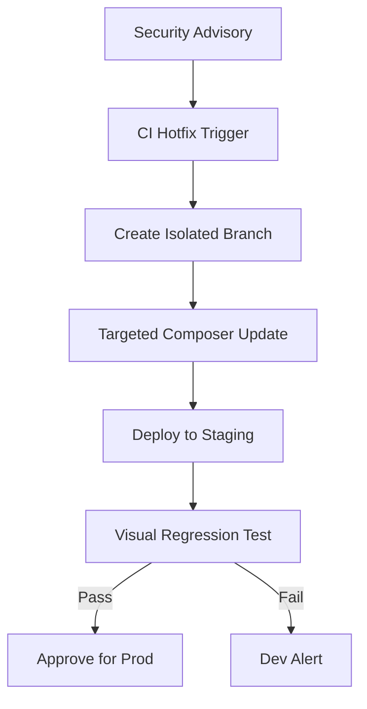

When the Drupal Security Team issues a highly critical PSA warning of an impending Remote Code Execution (RCE) vulnerability, the clock starts ticking. For a single site, applying the patch takes minutes. For an enterprise running 20+ legacy platforms on a custom upstream, hitting a 24-hour Service Level Agreement (SLA) requires rigorous automation.

<!-- truncate -->

In a recent engagement managing infrastructure for a major hospitality network (`sonesta-8`), a critical security advisory required immediate core patching. Manual deployment was not an option due to the sheer volume of environments and necessary regression tests.

Manual deployment was not an option due to the sheer volume of environments and necessary regression tests.



## The Bottleneck of Manual Patching

Applying a theoretical `sg-920` security update across an enterprise architecture typically fails for three reasons:
1.  **Dependency Conflicts:** Running `composer update drupal/core-recommended` often introduces breaking changes in transitive dependencies like Symfony or Twig if the `composer.lock` is stale.
2.  **Database Updates:** Security patches occasionally include schema updates (`hook_update_N`) that must run post-deployment via `drush updb`. Missing this step leaves the site vulnerable.

## The 24-Hour SLA Pipeline

To meet our strict security SLAs, we engineered a completely decoupled, agent-driven deployment pipeline.

### 1. Isolated Security Branches

We constructed a CI/CD job template specifically for security hotfixes. When triggered, the pipeline creates an isolated `security-hotfix/SA-CORE` branch from the current production tag.

### 2. Automated Composer Resolution

The pipeline executes a targeted update strictly constrained by our platform PHP versions.

```yaml
# GitLab CI snippet for Security Patching
security_patch:
  script:
    - git checkout -b security-hotfix/$SA_ID
    - composer update drupal/core-recommended drupal/core-composer-scaffold --with-dependencies
    - git add composer.json composer.lock
    - git commit -m "security: apply $SA_ID patch"
    - git push origin security-hotfix/$SA_ID
```

### 3. Immediate Visual Diffing

Instead of waiting for human QA, the deployment to the staging environment automatically triggers a Playwright/Percy visual regression suite.

```javascript
// Playwright Visual Regression Check
test('Compare Staging against Production', async ({ page }) => {
  await page.goto(process.env.STAGING_URL);
  await expect(page).toHaveScreenshot({ 
    maxDiffPixels: 100,
    threshold: 0.1 
  });
});
```

## Regression Gates: The Final Frontier

By enforcing a visual regression gate, we eliminate the fear of "breaking the site" with a security patch. If the visual diff returns a 0% variance, the pipeline automatically flags the security branch as "Ready for Production." This allows security teams to move at the speed of the exploit, rather than the speed of the manual QA cycle.

***
*Need an Enterprise Drupal Architect who specializes in high-security rapid response? View my Open Source work on [Project Context Connector](https://github.com/victorjimenezdev/project_context_connector) or connect with me on [LinkedIn](https://www.linkedin.com/in/victor-jimenez/).*
