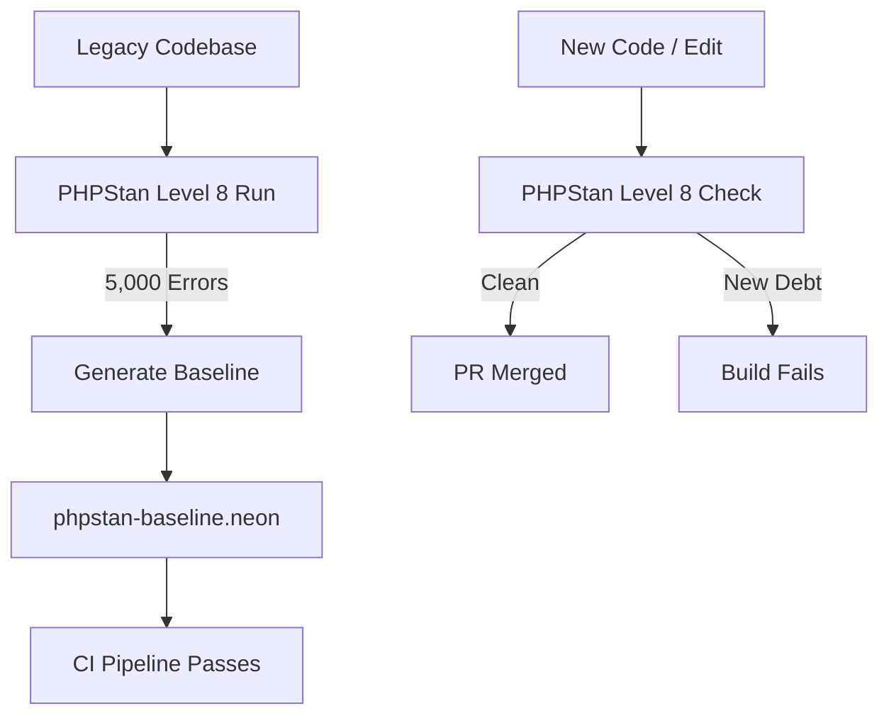

Modernizing a legacy PHP application presents a paradox: you critically need strict static analysis to prevent future bugs, but turning on a tool like PHPStan immediately throws 5,000 errors, completely breaking the CI pipeline.



## The Impossible Migration

The naive approach is to halt feature development for a month and force the team to fix all 5,000 errors. From a business perspective, this is financial suicide. The alternative is to leave PHPStan disabled, allowing the technical debt to accumulate.

## The "Baseline" Deployment Strategy

To enforce future quality while respecting past debt, we implemented the PHPStan Baseline pattern. 

### 1. Generating the Debt Ledger

We configured PHPStan to its maximum strictness (Level 8) and piped the output into a specialized baseline file.

```neon
# phpstan.neon
includes:
    - phpstan-baseline.neon

parameters:
    level: 8
    paths:
        - src
    # highlight-next-line
    reportUnmatchedIgnoredErrors: true
```

### 2. The Baseline Fingerprint

The baseline acts as a cryptographic signature of the existing technical debt.

```neon
# phpstan-baseline.neon snippet
parameters:
    ignoreErrors:
        -
            message: "#^Argument of an invalid type mixed supplied for foreach, only iterables are supported\\.$#"
            count: 42
            path: src/Controller/LegacyController.php
```

### 3. Incremental Eradication: The "Boy Scout" Rule

We introduced a rule regarding the baseline: if you touch a file to add a feature, you must resolve the baseline errors for that file. As you fix bugs, PHPStan will require you to remove those errors from the baseline, effectively "shrinking" the debt footprint.

## A Culture of Gradual Perfection

Over a six-month period, the baseline shrank from 5,000 errors to under 300, without a single dedicated "refactoring sprint." The application became highly deterministic and type-safe simply by enforcing a strict boundary on new code. 

When dealing with enterprise technical debt, the strategy isn't to burn the house down; it's to stop adding fuel to the fire.

***
*Need an Enterprise Drupal Architect who specializes in static analysis and debt remediation? View my Open Source work on [Project Context Connector](https://github.com/victorjimenezdev/project_context_connector) or connect with me on [LinkedIn](https://www.linkedin.com/in/victor-jimenez/).*
