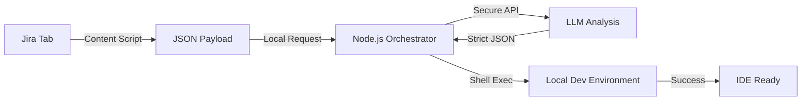

Enterprise Agile environments are undeniably slow. Developers easily spend 30% of their day just reading Jira tickets, interpreting scattered requirements, searching for the right database dumps, and manually spinning up Lando or Docker environments before writing a single line of code.

<!-- truncate -->

When managing large-scale decoupled architectures across Drupal and WordPress, this manual friction acts as a massive bottleneck to throughput.

This article details a custom automated workflow I engineered—"The Ticket Agent"—which fundamentally alters how requirements move from a Jira board to a ready-to-code local IDE.

## The "VictorStack" Approach

Instead of relying on fragile Jira API webhooks or requiring developers to context-switch into terminal windows to set up their databases, I built an integrated pipeline: a privacy-first Chrome Extension that communicates with a local Node.js background worker, powered by a deterministic LLM.

The result? You click one button on a Jira ticket, watch a progress bar for 30 seconds, and your local environment is running with the correct CMS branch, database, and scaffolded module boilerplate matching the ticket's Acceptance Criteria.



## Architecture Deep Dive

### Step 1: DOM Extraction (No Jira API Tokens Required)

Enterprise Jira instances are heavily locked down. Requesting API tokens for custom scripts is often an IT security nightmare. My Chrome Extension sidesteps this entirely.

Because the developer is already authenticated in their browser session, the Extension uses a content script to scrape the DOM directly.

```javascript
// Lightweight Scraper logic for Atlassian Jira
async function scrapeJiraContext() {
  const summary = document.querySelector('[data-test-id="issue.views.issue-base.foundation.summary.heading"]')?.innerText;
  const description = document.querySelector('[data-test-id="issue.views.field.rich-text.description"]')?.innerText;
  const criteria = [...document.querySelectorAll('.ak-renderer-extension')].map(el => el.innerText).join('\n');

  return { summary, description, criteria };
}
```

### Step 2: Strict LLM Processing & Schema Refinement

The raw scraped text is messy. It contains Jira macro formatting, irrelevant comments, and ambiguous instructions. The Chrome Extension sends this text payload to a local Node.js endpoint which routes it to an LLM (typically a highly-quantized local model or a secure enterprise API).

**The LLM's strict directive:**
Output *only* a rigid JSON schema representing the technical requirements.

```json
{
  "project_type": "drupal10",
  "branch_name": "feature/PROJ-1234-decoupled-search",
  "dependencies": ["search_api_solr"],
  "scaffold_module": "custom_search_enhancer",
  "confidence_score": 0.98
}
```

### Step 3: Execution (The Magic)

With a strict JSON payload, the local Node.js worker executes deterministic shell commands using a child-process wrapper.

```javascript
// Node.js Execution Wrapper (Abstraction)
async function provisionEnvironment(config) {
  const commands = [
    `git checkout -b ${config.branch_name}`,
    `lando start`,
    `lando drupal-sync-db`,
    `lando composer require drupal/${config.dependencies[0]}`
  ];

  for (const cmd of commands) {
    console.log(`Executing: ${cmd}`);
    await execShellCommand(cmd);
  }
}
```

The developer's terminal pops up, runs the sequence, and drops them directly into a ready state.

## Business Impact

By removing the "environment setup" phase from the sprint cycle:

*   **Recaptured Time:** Saves roughly 4 to 5 hours per developer, per week.
*   **Reduced Human Error:** Eliminates "I forgot to install that dependency" or "I was working against the wrong database snapshot" errors.
*   **Accelerated Onboarding:** New contractors can literally click a button and have the enterprise stack running locally without a 3-day initiation process.


***
*Looking for an Architect who doesn't just write code, but builds the AI systems that multiply your team's output? View my enterprise CMS case studies at [victorjimenezdev.github.io](https://victorjimenezdev.github.io) or connect with me on LinkedIn.*
