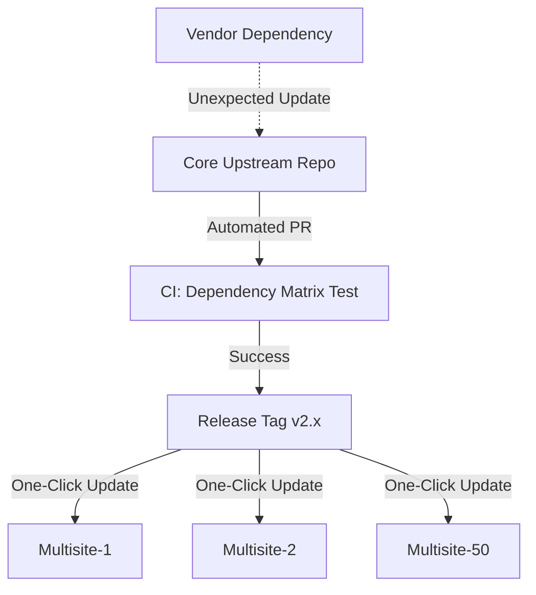

Managing a single enterprise Drupal application is challenging. Managing a "Custom Upstream" that acts as the foundational codebase for 50+ divergent websites is an entirely different discipline.

<!-- truncate -->

Organizations like global financial banks or international universities often utilize platforms like Pantheon to manage massive multi-site architectures. Instead of maintaining 50 separate repositories, they build a single Custom Upstream repository containing core configurations, design systems, and primary modules.

Sub-sites deploy from this upstream. When the upstream breaks, the blast radius is organization-wide.



## The Chaos of Composer Plugins

A common failure point in this model is dependency drift. In a recent enterprise engagement, a critical update to a Design System module (`outline_design_system`) triggered cascading conflicts within Composer.

The downstream sites required specific versions of `doctrine/annotations` that conflicted with the upstream's requirements for the `PsrCachedReader`. When the automated CI pipeline (`upstream:update-dependencies`) ran, it failed silently, leaving downstream sites unable to pull security updates.

## Engineering the Solution

To restore governance, we had to enforce strict architectural rules on the `composer.json` level.

### 1. Restoring Missing Bridges

We deliberately injected `doctrine/annotations` explicitly into the upstream's Composer requirements to anchor the version.

```json
{
  "require": {
    "drupal/core-recommended": "^10.3",
    "doctrine/annotations": "1.14.3",
    "psr/cache": "^3.0"
  },
  "config": {
    "allow-plugins": {
      "composer/installers": true,
      "drupal/core-composer-scaffold": true
    }
  }
}
```

### 2. Disabling Toxic Pre-Commit Hooks

We intercepted rogue pre-commit hooks at the upstream level using custom `composer.scripts`. This ensured that downstream environments didn't fail due to missing local binaries.

```bash
# composer.json snippet for sanitizing hooks
"scripts": {
  "post-install-cmd": [
    "rm -rf .git/hooks/pre-commit",
    "echo 'Platform hooks sanitized' "
  ]
}
```

## Governance through CI Gates

Managing an enterprise upstream requires visualizing the deployment graph before executing the command. We implemented a "Canary Build" in our CI pipeline. Before any upstream update is tagged, the CI system attempts a dry-run update on three diverse "Canary" downstream sites. If the dependency resolution fails on even one site, the upstream tag is blocked.

***
*Need an Enterprise Drupal Architect who specializes in complex multisite governance? View my Open Source work on [Project Context Connector](https://github.com/victorjimenezdev/project_context_connector) or connect with me on [LinkedIn](https://www.linkedin.com/in/victor-jimenez/).*
