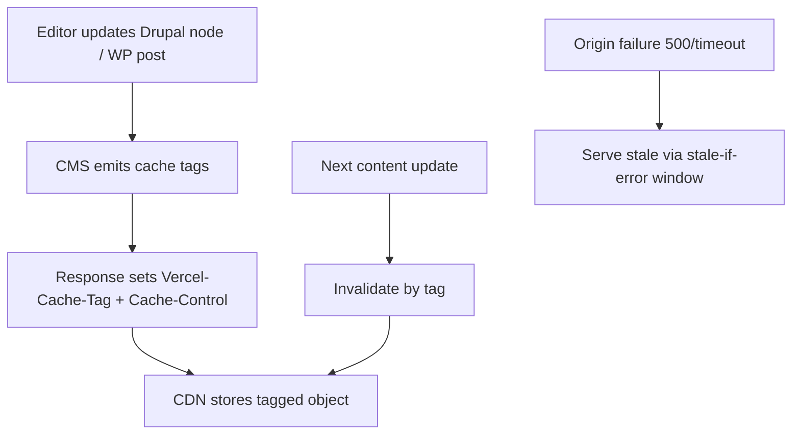

import Tabs from '@theme/Tabs';
import TabItem from '@theme/TabItem';
import TOCInline from '@theme/TOCInline';

Three announcements stand out for CMS teams running **Drupal** or **WordPress** behind modern edge platforms: tag-based cache invalidation, `stale-if-error`, and redirect scaling. The rest is mostly platform noise unless it changes reliability, security boundaries, or release safety in real projects.  
<!-- truncate -->

<TOCInline toc={toc} minHeadingLevel={2} maxHeadingLevel={2} />

## What made the cut (and why)

| Item selected | Drupal/WordPress impact | Primary domain |
|---|---|---|
| Tag-based cache invalidation on Vercel CDN | Purge only changed content after publish/update, instead of full-cache purges | Performance, publishing workflow |
| `stale-if-error` support | Keep CMS pages serving during origin/PHP/database failures | Reliability, incident response |
| Redirect scaling improvements | Handles large legacy URL maps after migrations/replatforms | SEO, migration safety |
| Vercel Queues (beta) | Async processing for webhooks, indexing, media, search sync | Architecture, background jobs |
| Activity log now tracks all project/team changes | Better auditability for hosting/security ops | Security, governance |
| Private Blob + Sandbox header injection + Sandboxes GA | Safer handling of sensitive files and untrusted code workflows | Security, CI/CD hardening |
| `vercel logs` historical querying improvements | Faster triage of CMS production regressions | Operations, debugging |

## Cache invalidation that matches CMS publishing

> "Responses can now be tagged using the `Vercel-Cache-Tag` header... and invalidate it together, rather than purging your entire cache when content changes."
>
> — Vercel Changelog, [Tag-based cache invalidation](https://vercel.com/changelog)

> "Vercel CDN now supports the `stale-if-error` directive with Cache-Control headers..."
>
> — Vercel Changelog, [stale-if-error support](https://vercel.com/changelog)

For Drupal and WordPress, this is direct operational value. Editors update one node/post; the platform should invalidate only affected routes, not torch the whole edge cache and spike origin load.



<Tabs>
  <TabItem value="drupal" label="Drupal" default>
  Map Drupal cache metadata to response headers in the delivery layer for headless routes, then invalidate by tag on publish hooks or queue consumers. Treat cache tags as first-class release artifacts, not an afterthought.
  </TabItem>
  <TabItem value="wordpress" label="WordPress">
  Emit tags per post, taxonomy, and key listing pages from your headless/API edge responses. On post update, invalidate only related tags and keep `stale-if-error` long enough to survive short outages.
  </TabItem>
</Tabs>

:::tip[Cache policy that survives production]
Set conservative `s-maxage` plus meaningful `stale-if-error` for public pages, then test origin-down behavior before launch. If you have no failure-mode test, you have no cache strategy.
:::

```bash title="verify-cache-headers.sh"
curl -I https://example.com/news/some-post | grep -Ei "cache-control|vercel-cache-tag|age"
```

## Redirect scale is a CMS migration problem, not a platform footnote

Drupal and WordPress migrations routinely carry massive legacy URL maps. Long redirect chains and giant rule lists destroy latency and crawl budget.

`vercel` improving redirect handling at high scale matters when:
- WordPress permalink structures changed during rebuilds.
- Drupal path aliases moved from legacy patterns.
- Old campaign URLs still get traffic years later.

:::caution[Redirect debt is SEO debt]
Export all legacy URLs, collapse chains to single-hop redirects, and benchmark lookup latency before cutover. A migration is not complete until redirect behavior is measured under real traffic.
:::

## Queues and full activity logs: boring updates that prevent outages

Queues plus complete activity logs are immediately practical for CMS teams:
- Queue webhook-triggered jobs (revalidation, search indexing, image tasks) instead of doing heavy work inline.
- Track every settings and permission change across environments during incidents and audits.

The glamorous release is never the one that saves your weekend. This one does.

## Private Blob, header injection, and Sandboxes GA: real security boundaries

These are relevant when Drupal/WordPress teams run untrusted automation around plugins/modules, uploads, or generated code.

- **Private Blob**: store sensitive exports/reports without accidental public URLs.
- **Header injection in sandboxed outbound HTTP**: secrets stay outside sandbox runtime.
- **Sandboxes GA**: isolate untrusted code execution from production infra.

:::warning[Don’t run untrusted plugin or module code in your main CI runner]
Use isolated sandbox execution and scoped network policy. CMS ecosystems are dependency-heavy; trust boundaries must be explicit or you will eventually run hostile code in the wrong place.
:::

## AI Gateway model churn and `vercel logs` upgrades: use with discipline

Most model-release announcements are marketing churn for CMS maintainers. The part that matters is operational ergonomics:
- Better log querying helps diagnose plugin/module regressions faster.
- Model routing can assist incident triage and release note synthesis.

AI Gateway is ~~only for chatbots~~ useful when attached to deterministic checks: coding standards, tests, security scans, and deployment guardrails.

<details>
<summary>Practical rollout order for Drupal/WordPress teams</summary>

1. Implement cache tags + `stale-if-error` on public routes.
2. Fix redirect chains and validate large-map lookup latency.
3. Move async CMS side effects to queues.
4. Enforce sandboxed execution for untrusted code paths.
5. Improve log-query workflows for faster incident triage.

</details>

## What to do next

Prioritize cache tagging and stale fallback first, because that directly improves uptime and editor experience. Then fix redirect architecture and isolate untrusted execution paths; those two changes remove the most common migration and security failures in Drupal/WordPress delivery stacks.

***
*Looking for an Architect who doesn't just write code, but builds the AI systems that multiply your team's output? View my enterprise CMS case studies at [victorjimenezdev.github.io](https://victorjimenezdev.github.io) or connect with me on LinkedIn.*
