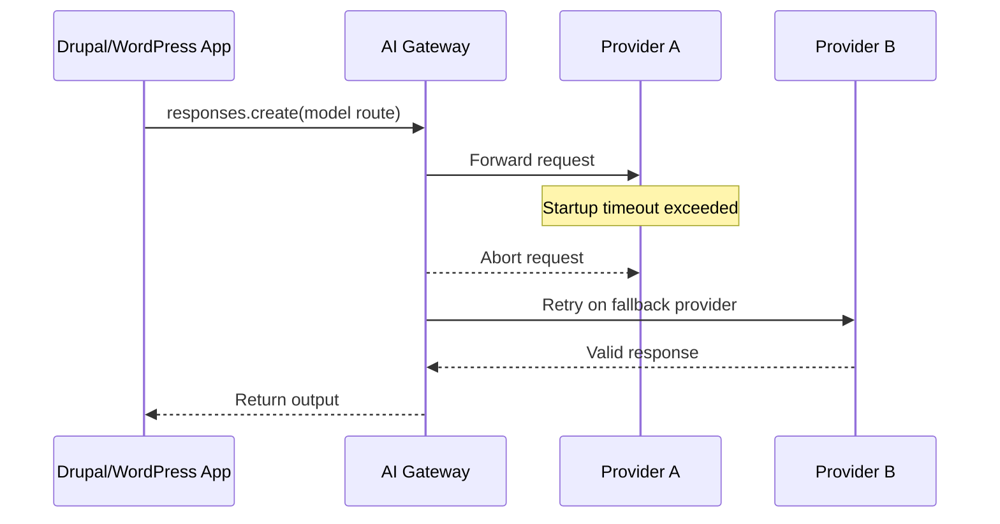

import Tabs from '@theme/Tabs';
import TabItem from '@theme/TabItem';

Two items survived filtering, and both are operationally relevant for CMS teams: AI Gateway support for OpenAI **Responses API**, and provider-level timeout failover. The second "Responses API" item was the same announcement repeated with slightly different wording, so it was deduped instead of treated as a separate signal.

<!-- truncate -->

## Responses API via AI Gateway changes integration shape for Drupal/WordPress

> "OpenAI's Responses API is now available through AI Gateway."
>
> - Cloudflare AI Gateway, [Announcement](https://developers.cloudflare.com/ai-gateway/)

For Drupal modules and WordPress plugins that already call Chat Completions, this is mostly an interface cleanup plus better reasoning support. The practical gain is single-endpoint routing across providers without rewriting app logic each time a model vendor changes pricing, quality, or rate limits.

~~Chat Completions is the only stable path for production CMS integrations~~. Responses is now a valid production contract if the module/plugin keeps strict output validation and logs provider/model per request.

```js title="scripts/test-responses.mjs"
import OpenAI from "openai";

const client = new OpenAI({
  apiKey: process.env.OPENAI_API_KEY,
  baseURL: process.env.AI_GATEWAY_BASE_URL
});

const res = await client.responses.create({
  model: process.env.AI_GATEWAY_MODEL,
  input: "Summarize latest node revision changes as JSON."
});

console.log(res.output_text);
```

<Tabs>
<TabItem value="drupal" label="Drupal" default>

Use this in custom services behind dependency injection, not directly in controllers. Store model routing and base URL in config (`settings.php` + config overrides), then lock response parsing in typed DTOs before touching entities.

</TabItem>
<TabItem value="wordpress" label="WordPress">

Keep calls behind a plugin service class and execute remote requests with retries only for idempotent prompts. Persist provider/model metadata with post meta or custom tables for auditability when output quality shifts after model swaps.

</TabItem>
</Tabs>

:::warning[Contract drift is where outages hide]
Responses API flattening reduces payload complexity, but it does not remove schema drift risk. Enforce JSON schemas server-side before writing to posts, nodes, or taxonomy terms, and fail closed when output is malformed.
:::

## Provider-level timeouts are directly about uptime, not AI novelty

> "If a provider doesn't start responding within your configured timeout, AI Gateway aborts the request and falls back."
>
> - Cloudflare AI Gateway, [Timeouts update](https://developers.cloudflare.com/ai-gateway/)

This one matters for Drupal/WordPress because editors do not care which model answered; they care that admin screens, autosuggestions, and scheduled jobs keep moving. Provider timeout + failover is a hosting reliability control, especially when inference runs inside request/response paths.



| Operational concern | Drupal impact | WordPress impact | Decision |
|---|---|---|---|
| Slow provider cold starts | Blocks editorial helper UIs and queue workers | Blocks admin AJAX flows and background processing | Set strict provider startup timeout and fallback route |
| Partial streaming/cancel support | Timed-out requests may still bill | Same billing risk in plugin workflows | Treat timeout as latency control, not guaranteed cost control |
| Provider quality variance | Field formatter output quality can shift | Content assistant tone/structure can shift | Log provider+model per request and monitor regressions |

:::info[Timeout policy for production CMS stacks]
Put inference behind asynchronous workers when possible (`queue_worker` in Drupal, Action Scheduler/WP-Cron patterns in WordPress). For synchronous editor UX, set aggressive timeout thresholds and return deterministic fallback text instead of spinning requests.
:::

<details>
<summary>Implementation notes worth keeping in your repo docs</summary>

- Document which features are synchronous vs asynchronous AI calls.
- Record timeout values and fallback provider order in environment-level config.
- Track response latency, provider/model, and parse-failure rate per endpoint.
- Add upgrade notes when moving Chat Completions handlers to Responses API handlers.
- Re-test moderation, sanitization, and capability checks after model route changes.

</details>

## What to do next in real Drupal/WordPress projects

Migrate new AI features to Responses API paths and leave legacy Chat Completions wrappers only where refactor risk is high. Enable provider-level startup timeouts for user-facing inference endpoints, then verify fallback behavior under load before shipping plugin/module updates.

***
*Looking for an Architect who does not just write code, but builds the AI systems that multiply your team's output? View my enterprise CMS case studies at [victorjimenezdev.github.io](https://victorjimenezdev.github.io) or connect with me on LinkedIn.*