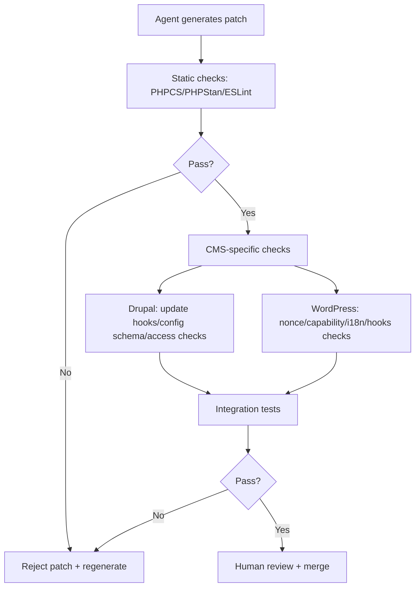

import Tabs from '@theme/Tabs';
import TabItem from '@theme/TabItem';
import TOCInline from '@theme/TOCInline';

The most useful learning item was not a shiny launch. It was a blunt reminder: code quality drops if teams treat AI output as done. For Drupal modules and WordPress plugins, that means stricter review gates, not faster merge buttons.

<!-- truncate -->

<TOCInline toc={toc} minHeadingLevel={2} maxHeadingLevel={2} />

## What made the cut for Drupal/WordPress teams

| Item | CMS relevance | Practical impact |
|---|---|---|
| Agentic Engineering Patterns | Direct | Set quality gates for plugin/module code generated by agents |
| Matt Glaman on Drupal OAuth scopes | Direct (Drupal) | Redesign auth boundaries for API consumers |
| WordPress `theme.json` pseudo-state support | Direct (WordPress) | Reduce custom CSS debt for block interaction states |
| WP SAML Auth 2.3.1 | Direct (WordPress) | Identity-provider compatibility and auth hardening upgrades |
| CISA KEV catalog additions | Operationally relevant | Patch SLAs for hosting/control-plane dependencies around CMS estates |
| Node.js release schedule changes | Conditional but real | Decoupled Drupal/WordPress build/runtime compatibility planning |
| Drupal AI Initiative webinar (responsible AI) + Symfony-in-Drupal AI workflow discussion | Direct (Drupal, plus WP parallel) | Governance for AI-generated content/code in CMS workflows |

## AI coding in CMS repos: quality gates or chaos

> "If adopting coding agents demonstrably reduces the quality of the code and features you are producing, you should address that problem directly."
>
> — Simon Willison, [Agentic Engineering Patterns](https://simonwillison.net/guides/agentic-engineering-patterns/)

For Drupal/WordPress work, this is the correct frame. Speed alone is useless if PRs regress permissions, cache behavior, or upgrade safety. AI-generated code is ~~faster therefore acceptable~~ a liability until CI proves otherwise.



:::warning[Set non-negotiable merge criteria]
Require automated checks for coding standards, security linting, and CMS-specific behavior before review. If an agent patch skips tests or broadens permissions, reject it.
:::

## Drupal OAuth scopes are exposing old assumptions

Matt Glaman’s point lands hard: Drupal permissions were built for session-centric workflows; OAuth adds edges that super-permissions can punch through.

<Tabs>
  <TabItem value="drupal" label="Drupal Actions" default>
- Audit every OAuth client and map scopes to narrowly scoped roles.
- Remove or isolate roles with `bypass node access` and similar super-permissions from token-bearing flows.
- Add API tests that validate denied access for over-scoped tokens.
- Treat scope design as architecture, not just config.
  </TabItem>
  <TabItem value="wordpress" label="WordPress Parallel">
- For SSO/OAuth plugins, map IdP claims to least-privilege WP roles.
- Block automatic role escalation on login callbacks.
- Add integration tests for role-mapping drift after plugin updates.
- Review admin-capability inheritance in multisite.
  </TabItem>
</Tabs>

## WordPress block interaction states moved into theme.json

The WordPress item about pseudo-class selectors on blocks/variations matters because it removes “throw CSS at it later” as the default.

```diff
-/* Old pattern: custom CSS for button hover/focus */
-.wp-block-button__link:hover { background: #111; }
-.wp-block-button__link:focus-visible { outline: 2px solid #111; }

+// theme.json-managed interactive states (WordPress 7.0+)
+{
+  "styles": {
+    "blocks": {
+      "core/button": {
+        ":hover": { "color": { "background": "#111111" } },
+        ":focus-visible": { "outline": "2px solid #111111" }
+      }
+    }
+  }
+}
```

This improves portability across themes and keeps style intent near block config instead of scattering state logic in CSS overrides.

## WP SAML Auth 2.3.1 is a maintenance signal, not a checkbox

SSO plugins sit on the auth path. Updating late is operational debt with a timer.

:::caution[Run update verification against the real IdP]
Use staging with your production identity provider metadata before rollout. Validate login, logout, role mapping, and fail-closed behavior when assertions are malformed.
:::

```bash
wp plugin list --status=active
wp plugin update wp-saml-auth --dry-run
wp plugin update wp-saml-auth
wp cache flush
```

## KEV catalog additions: CMS teams are still in the blast radius

The CISA KEV update did not name Drupal/WordPress CVEs directly, and that is irrelevant. Agencies and platform teams run CMS sites on infrastructure that depends on adjacent systems. If exposed management tools or enterprise middleware are exploited, your CMS estate gets dragged into incident response anyway.

Use KEV as an input to hosting patch SLA and network segmentation policy, not as “someone else’s list.”

## Node.js release cadence changes affect decoupled stacks

“Evolving the Node.js release schedule” is directly relevant where Drupal/WordPress frontends use Node-based build chains (Next.js/Gatsby/Astro/Vite pipelines, CI asset builds, SSR layers).

If runtime and build images drift across Node majors, expect broken builds or subtle hydration/runtime issues.

<details>
<summary>Operational command set used in CMS platform pipelines</summary>

```bash
node -v
npm -v
npm ci
npm audit --omit=dev
npm run build
composer audit
drush status
wp core version
```

</details>

## Responsible AI in Drupal workflows is governance work

The Drupal AI Initiative webinar topic and the Symfony-in-Drupal AI workflow conversation both point to one thing: production AI usage in CMS is a policy problem before it is a tooling problem.

For Drupal and WordPress teams:
- Define where AI can write code and where it can only propose.
- Require provenance notes in PRs for generated patches.
- Keep content-generation flows reviewable and reversible.
- Track hallucination-prone areas (permissions, migrations, schema changes, payment flows).

What to do now:
1. Add AI-specific quality gates to module/plugin CI.
2. Re-audit OAuth/SAML role and scope mappings.
3. Move WordPress block state styling into `theme.json` where possible.
4. Tie KEV updates to concrete hosting patch deadlines.

***
*Looking for an Architect who doesn't just write code, but builds the AI systems that multiply your team's output? View my enterprise CMS case studies at [victorjimenezdev.github.io](https://victorjimenezdev.github.io) or connect with me on LinkedIn.*
