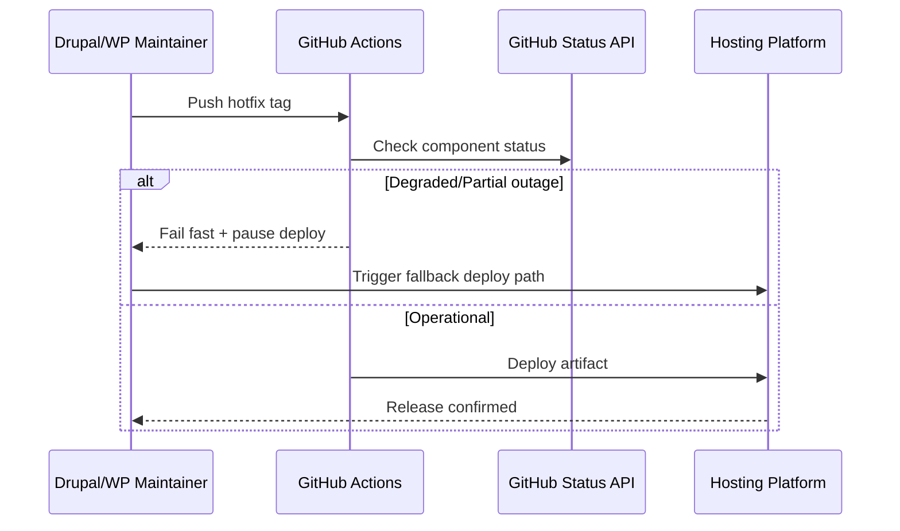

import Tabs from '@theme/Tabs';
import TabItem from '@theme/TabItem';
import TOCInline from '@theme/TOCInline';

GitHub availability incidents are not abstract infra drama for Drupal and WordPress teams; they break deploy pipelines, delay security releases, and create messy rollback windows. The useful signal here is simple: tighten release resilience and stop pretending the forge is always available. ~~GitHub is always up~~ is not an engineering strategy.

<!-- truncate -->

<TOCInline toc={toc} minHeadingLevel={2} maxHeadingLevel={2} />

## Selected items with clear Drupal/WordPress impact

| Item | Keep/Discard | Drupal/WordPress relevance |
|---|---|---|
| GitHub availability issues | Keep | Direct impact on CI/CD, release timing, hotfix delivery, and dependency updates for modules/plugins |
| Rakuten fixes issues faster with Codex | Keep | Practical pattern for reducing MTTR in CMS repos (triage, PR checks, safer patches) |
| Chat SDK WhatsApp adapter support | Keep | Relevant for Drupal/WordPress sites that need support/chat automations and outbound notification flows |
| Running Super Bowl Squares with AI (Tag1) | Keep | Real agency-style automation pattern: internal tooling around CMS teams, not production plugin logic |
| AI for rural heart health in Australia | Discard | Important work, but no direct Drupal/WordPress engineering implication in the item itself |
| Sorting algorithm animations | Discard | Educational, but no concrete CMS operational or product impact from this specific update |
| Introducing The Anthropic Institute | Discard | Institutional announcement without direct CMS implementation consequences |

## GitHub availability incidents change CMS release design

> "GitHub recently experienced several availability incidents."
>
> — GitHub Blog, Addressing GitHub's recent availability issues

If deployment for a Drupal module or WordPress plugin depends on `git fetch`, release tags, Actions runners, or package pulls from GitHub, outages become release blockers. That includes emergency security patches when timing matters most.



:::warning[Harden release path before the next outage]
Add a status gate and a fallback path in every Drupal/WordPress production pipeline. If GitHub is degraded, block auto-deploy and switch to a prebuilt artifact route or host-native deploy command.
:::

```bash title="release-precheck.sh"
curl -fsSL https://www.githubstatus.com/api/v2/status.json | jq -r '.status.indicator,.status.description'
```

## Codex MTTR claims are useful only when wired to CMS reality

> "reducing MTTR 50%, automating CI/CD reviews, and delivering full-stack builds in weeks."
>
> — Rakuten fixes issues twice as fast with Codex

The claim is marketing until it is mapped to Drupal/WordPress failure modes: broken updates, plugin/module regressions, failed migrations, and flaky integration tests. The high-value move is to use coding agents for constrained remediation loops, not autonomous repo chaos.

```yaml title=".github/workflows/cms-hotfix-triage.yml" showLineNumbers
name: CMS Hotfix Triage
on:
  issues:
    types: [opened]
jobs:
  classify:
    runs-on: ubuntu-latest
    steps:
      - uses: actions/checkout@v4
      - name: Label security hotfix
        if: contains(github.event.issue.title, '[security]')
        run: gh issue edit ${{ github.event.issue.number }} --add-label security
      # highlight-next-line
      - name: Escalate production blocker
        if: contains(github.event.issue.body, 'production down')
        run: gh issue edit ${{ github.event.issue.number }} --add-label p1
```

<details>
<summary>Where this pays off in Drupal/WordPress repos</summary>

1. Auto-triage plugin/module bug reports into `p1`, `security`, `needs-repro`.
2. Generate first-pass patch proposals for failing PHPUnit/PHPCS jobs.
3. Enforce changelog/version consistency before tag creation.
4. Shorten incident handoff with machine-written rollback notes tied to commit SHAs.

</details>

## WhatsApp adapter support is relevant for CMS integrations, with limits

> "Chat SDK now supports WhatsApp... with the new WhatsApp adapter."
>
> — Chat SDK announcement

Drupal and WordPress teams regularly build support workflows, lead capture, appointment confirmations, and transactional messaging around site events. WhatsApp adapter support matters because it lowers integration overhead, but the announced limits (no retrieval/edit/delete) affect moderation, auditability, and compliance design.

<Tabs>
<TabItem value="drupal" label="Drupal" default>

Use a queue worker for outbound WhatsApp events from form submissions and commerce state changes. Keep message payloads idempotent and log delivery metadata in a custom entity for audit trails.

</TabItem>
<TabItem value="wordpress" label="WordPress">

Hook outbound events to `wp_insert_post`, order status transitions, or form plugin actions. Persist request/response metadata in custom tables or post meta, and build admin retries for failed sends.

</TabItem>
</Tabs>

:::tip[Design for adapter constraints]
Because retrieval/edit/delete is unsupported, treat WhatsApp sends as append-only events. Add redaction rules before send, and keep a local immutable log keyed by external message ID.
:::

## Tag1's AI + Sheets story is a valid pattern for CMS teams

The Super Bowl Squares automation post is not a Drupal feature release, but it is operationally relevant for agencies and site teams: AI-accelerated internal tools can remove repetitive coordination work around CMS delivery. Internal automations belong outside production plugin/module code unless they are hardened, tested, and supportable.

A practical reading for Drupal/WordPress shops: automate internal operations aggressively, keep production extensions conservative, and enforce the boundary in repos and deployment policies.

## What to change in Drupal/WordPress repos now

1. Add GitHub status prechecks to deploy workflows and block releases during degraded platform states.
2. Use coding agents for triage and patch prep in bounded scopes (tests, lint, issue labeling), not full autonomous merges.
3. Build WhatsApp integrations as append-only outbound systems with retry queues and local audit logs.
4. Keep agency/internal AI automations separate from production CMS plugin/module code until reliability and ownership are clear.

***
*Looking for an Architect who doesn't just write code, but builds the AI systems that multiply your team's output? View my enterprise CMS case studies at [victorjimenezdev.github.io](https://victorjimenezdev.github.io) or connect with me on LinkedIn.*
