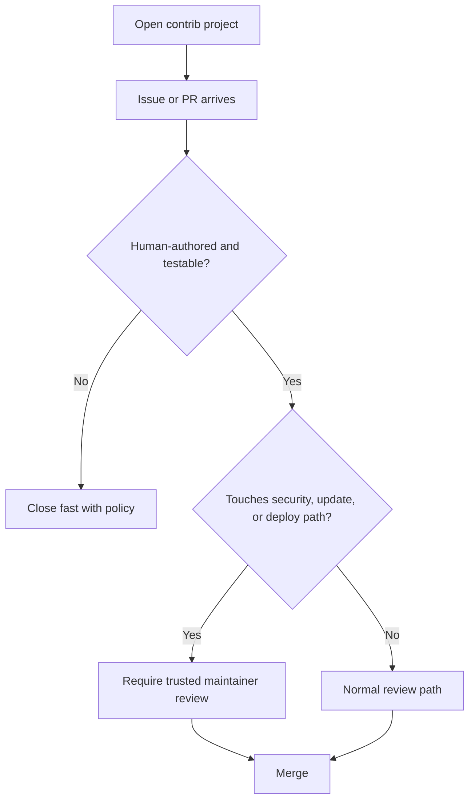

import Tabs from '@theme/Tabs';
import TabItem from '@theme/TabItem';
import TOCInline from '@theme/TOCInline';

Open membership worked when the main risk was a sloppy merge. It breaks down fast when maintainers are filtering machine-made junk at scale. That matters well beyond Python: Drupal contrib and WordPress plugin ecosystems run on the same fragile human attention.

<!-- truncate -->

<TOCInline toc={toc} minHeadingLevel={2} maxHeadingLevel={2} />

## AI spam is now a governance problem for contrib maintainers

> "GitHub's slopocalypse ... has made Jazzband's model of open membership and shared push access untenable."
>
> — Jannis Leidel, [Jazzband](https://jazzband.co/news/2026/03/14/sunsetting-jazzband)

This is not a Python-only story. The **Drupal contrib** and **WordPress plugin** worlds also depend on trust-heavy maintenance models, volunteer review, and issue queues that are already noisy enough without synthetic sludge poured on top.

For Drupal, the impact is obvious in module queues, merge-request triage, and co-maintainer trust. For WordPress, it shows up in plugin support forums, patch submissions, and GitHub mirrors around plugin code. Open collaboration still matters; blind openness around write access and review intake does not.



:::warning[Contrib maintainers need stricter intake rules]
If a Drupal module or WordPress plugin accepts drive-by patches, require reproducible bug reports, test coverage, and a clear user-facing impact statement before review starts. The old assumption that every incoming patch deserves equal attention is dead. Triage is now part of supply-chain defense.
:::

A shared lesson for both CMS ecosystems:

| Problem in open-source maintenance | Drupal impact | WordPress impact | Practical response |
| --- | --- | --- | --- |
| AI-generated spam issues | Noise in contrib queues | Noise in plugin support/GitHub mirrors | Add stricter issue templates and close low-signal reports fast |
| AI-generated PRs | Review fatigue on modules/themes | Review fatigue on plugins/blocks | Require tests, screenshots, reproduction steps, and changelog intent |
| Shared push access | Higher risk around release branches | Higher risk around plugin update paths | Limit release authority to a smaller trusted set |
| Maintainer burnout | Slower security and compatibility fixes | Slower plugin maintenance and support | Prefer fewer maintainers with explicit roles over vague openness |

## 1M-context models are useful for Drupal and WordPress audits, not magic

> "Standard pricing now applies across the full 1M window for both models, with no long-context premium."
>
> — Anthropic, [1M context is now generally available for Opus 4.6 and Sonnet 4.6](https://claude.com/blog/1m-context-ga)

The interesting part is not the vanity number. The useful part is being able to load a **large Drupal distribution**, a **WordPress plugin with years of compatibility baggage**, or a theme plus deployment glue without immediately playing context-window Tetris.

That has real use in both ecosystems:

- Reviewing custom Drupal modules before a core upgrade.
- Mapping WordPress plugin hooks, options, cron jobs, and REST routes in one pass.
- Auditing mixed PHP, YAML, JS, Twig, and config exports for security or upgrade risk.
- Comparing old and new implementations during plugin or module rewrites.

<Tabs>
<TabItem value="drupal" label="Drupal" default>

A 1M-context model is good at following relationships across `composer.json`, custom modules, service definitions, routing, permissions, config exports, and Twig overrides. That makes it useful for pre-upgrade reviews where the real problem is not syntax, but hidden coupling.

</TabItem>
<TabItem value="wordpress" label="WordPress">

It helps when a plugin sprawls across bootstrap code, admin pages, block registration, REST endpoints, cron hooks, and upgrade routines. The value is seeing the whole surface area at once, especially before a major PHP or WordPress core bump.

</TabItem>
</Tabs>

This does not change one important fact: ~~more context means better judgment~~. It means the model can see more files. Someone still has to verify whether the conclusion is sane.

```bash title="audit-commands.sh"
composer audit
drush pm:security --format=list
wp plugin list --update=available
wp theme list --update=available
wp core verify-checksums
```

:::info[Use long context for review, not for authority]
Point 1M-context models at upgrade analysis, dependency mapping, and security review prep. Do not let them invent release decisions. In Drupal and WordPress work, the expensive mistakes still happen in schema updates, cache invalidation, permissions, hook timing, and backward-compatibility assumptions.
:::

<details>
<summary>Where long-context review pays off in real CMS work</summary>

- Drupal: tracing deprecated API usage across custom modules before a core major upgrade.
- Drupal: checking whether config exports depend on modules that are being removed or replaced.
- WordPress: finding option names, cron hooks, and REST routes that a plugin registered over several years.
- WordPress: auditing whether a plugin update routine can run twice safely during failed deployments.
- Both: building an inventory of third-party dependencies before security remediation work.
</details>

## Browser KEVs matter because Drupal and WordPress admin panels live in browsers

CISA added two actively exploited items to the KEV catalog:

- `CVE-2026-3909` Google Skia out-of-bounds write
- `CVE-2026-3910` Google Chromium V8 unspecified vulnerability

This is not a CMS vulnerability story. It still matters to **Drupal site admins**, **WordPress editors**, and managed-hosting teams because the attack surface includes the browser used to access `/wp-admin`, `/user`, `/admin`, hosting dashboards, SSO flows, and cloud control panels.

A compromised browser session around a CMS is bad news even when core is fully patched. Admin cookies, privileged dashboard actions, and copy-pasted secrets do not care whether the initial bug lived in PHP or Chromium.

```bash title="security-triage.sh"
google-chrome --version
wp core version
wp plugin list --update=available
drush status --fields=drupal-version,php-version
```

The operational takeaway is boring and therefore important:

- Patch browsers on admin workstations fast.
- Separate casual browsing from privileged CMS administration.
- Recheck CMS admin sessions after workstation/browser updates.
- Treat browser patch cadence as part of CMS operations, not some other department's problem.

:::caution[Admin workstation hygiene is part of CMS security]
If someone can administer Drupal or WordPress, their browser patch level belongs on the same checklist as plugin updates, module updates, MFA, and backup verification. A pristine production server does not save a compromised admin session.
:::

## MALUS is satire, but the licensing warning applies directly to GPL ecosystems

> "Our proprietary AI robots independently recreate any open source project from scratch. The result? Legally distinct code with corporate-friendly licensing."
>
> — MALUS, [malus.sh](https://malus.sh/)

The joke lands because plenty of people want it to be true. That matters for **WordPress plugins** and **Drupal modules** because both ecosystems sit in GPL territory, and both rely on a culture where derivative work, redistribution, and attribution expectations are not optional decoration.

If a vendor starts pitching AI-assisted "clean room" rewrites of a plugin or module to dodge GPL obligations, the smell is obvious. In WordPress especially, this collides with directory policy, community trust, and the practical reality that copied behavior, copied structure, and copied compatibility targets tend to leave fingerprints. The machine-generated fig leaf does not make the licensing question disappear.

For Drupal teams and WordPress shops, the useful lens is procurement and compliance:

- Ask where the code came from.
- Ask what training or source material informed it.
- Ask whether third-party assets, libraries, or copied behavior introduce obligations.
- Reject hand-wavy claims that the model "made it new."

This is one of those areas where the hype merchants keep trying to sell amnesia as a legal strategy. Bad plan.

## PostgreSQL-backed chat state has a narrow but real use in headless CMS builds

The new PostgreSQL adapter for Chat SDK is not a mainstream Drupal or WordPress story. It still has a clear fit in **headless** or **composable** builds where a Drupal or WordPress site fronts a product or content experience and an adjacent AI assistant needs persistent chat state.

The practical relevance is infrastructure simplification. If the project already runs PostgreSQL, a chat feature can persist locks, subscriptions, and ephemeral state without adding Redis just to satisfy one sidecar feature.

That is useful in a narrow slice of CMS work:

- Drupal with decoupled front ends and product-support assistants.
- WordPress as a content backend for headless apps with embedded chat.
- Hosting environments where reducing moving parts matters more than theoretical purity.

It is not a reason to bolt chat onto every site. Most brochure sites and editorial installs do not need a conversational widget pretending to be strategy.

## What to do with this

Drupal and WordPress teams should treat these four items as operational guidance, not trivia. Tighten contrib intake rules, use long-context models for audits instead of authority, patch admin browsers like they are part of CMS security, and push back on AI licensing fairy tales when buying code or services.

The common thread is maintenance reality. Human review time is scarce, admin sessions are fragile, upgrade surfaces are large, and legal obligations do not vanish because someone added "AI" to the sales pitch.

***
*Looking for an Architect who doesn't just write code, but builds the AI systems that multiply your team's output? View my enterprise CMS case studies at [victorjimenezdev.github.io](https://victorjimenezdev.github.io) or connect with me on LinkedIn.*
