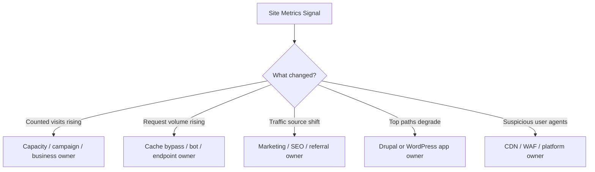

Pantheon has been expanding Site Metrics and dashboard visibility through a series of updates published on **February 4, 2026**, **February 23, 2026**, and earlier dashboard modernization work from **May 5, 2025**. The feature set is genuinely useful, but only if teams stop treating "traffic" as one bucket.

For Drupal and WordPress operators, Pantheon Site Metrics changes one thing more than anything else: it makes it easier to separate **performance problems**, **ownership problems**, and **noise problems** before they become incident calls.

<!-- truncate -->

## What Pantheon Actually Added

Pantheon has been moving the site dashboard toward a more operational view instead of a basic hosting summary:

- On **May 5, 2025**, Pantheon described the broader dashboard modernization effort.
- On **February 4, 2026**, Pantheon added page-view and visitor trend visibility plus top traffic patterns and traffic sources in site dashboards.
- On **February 23, 2026**, Pantheon added request count to Site Metrics.
- In parallel, Pantheon has been publishing more guidance around malicious and bot traffic visibility.

That combination matters because visits alone do not explain what is happening on a Drupal or WordPress property. A team can have flat visitor counts and still see request explosions from cache misses, crawlers, preview workflows, headless consumers, or plugin/module behavior.

## The Useful Mental Model: Three Different Metrics, Three Different Owners

Pantheon Site Metrics is most valuable when teams map each signal to a different question.

| Signal | What it is good for | Wrong conclusion to avoid | Primary owner |
|---|---|---|---|
| Visitors / page-view trends | Detecting audience shifts, campaign impact, seasonal spikes | "The site is slow because traffic is up" | Product, marketing, platform |
| Request count | Spotting cache bypass, bot pressure, chatty integrations, endpoint abuse | "Higher requests means more real users" | Platform, performance, security |
| Top traffic patterns / sources | Identifying which paths and channels deserve attention first | "Homepage metrics explain the whole app" | Product, SEO, app teams |

If your Drupal or WordPress team assigns all three to one generic "DevOps" queue, you will still get slow triage. The dashboard is only faster if the ownership model is faster.

## What This Changes for Drupal Teams

Drupal sites have several request patterns that distort naive traffic reading:

- Authenticated editors and preview flows bypass the easy cache narrative.
- BigPipe, personalized blocks, JSON:API, GraphQL, and search endpoints can multiply backend work without obvious visit growth.
- Cron, queue workers, and contrib integrations can create load that a visit chart barely explains.

That means a Drupal team should use Site Metrics like this:

1. Start with top paths and request count, not just visitor trends.
2. Compare spikes against known cache-sensitive routes such as search, preview, authenticated dashboards, and API endpoints.
3. Check whether the issue belongs to Drupal application behavior, CDN policy, or traffic quality.

A practical Drupal triage pattern:

- If **visitors and page views rise together**, verify cache hit behavior on landing pages and campaign destinations.
- If **requests rise without similar visitor growth**, inspect JSON:API, GraphQL, search, preview, and editor-heavy workflows first.
- If **traffic sources change sharply**, involve content and SEO owners before tuning infrastructure blindly.

## What This Changes for WordPress Teams

WordPress teams have a similar problem, just with different hotspots:

- `wp-admin` and logged-in editorial activity distort page-view assumptions.
- `admin-ajax.php`, REST API routes, search, WooCommerce cart/checkout, and preview flows can produce request-heavy load.
- Plugins often add external beacons, scheduled actions, and API chatter that look like "traffic growth" until you split request count from actual audience.

For WordPress, the operational win is simple: Site Metrics gives teams a cleaner way to prove that a slowdown is often about **uncacheable behavior** or **automation noise**, not a sudden success event.

That is important for agency and in-house teams alike, because it changes how quickly you escalate:

- Marketing spike: route to campaign and cache-readiness owners.
- WooCommerce/API/request spike: route to plugin/theme/performance owners.
- Suspicious bot or scraper pattern: route to CDN/WAF/security owners.

## The Best Actionable Workflow: Split Triage Into Four Lanes

Most teams need fewer dashboards and better routing. Pantheon Site Metrics supports a simple four-lane workflow.

### 1. Performance lane

Use top paths, request count, and trend changes to answer:

- Which pages or endpoints are now expensive?
- Is the load cache-friendly or cache-hostile?
- Did the slowdown come from real demand or backend amplification?

For Drupal, that usually means checking cache tags, authenticated traffic, API routes, and render-heavy pages. For WordPress, it usually means checking `admin-ajax.php`, REST traffic, checkout/search, and plugin-added endpoints.

### 2. Ownership lane

Use traffic sources and top patterns to decide who should act first:

- SEO/content team when referral/search mix changes.
- Platform team when request count rises disproportionately.
- Application team when one path family degrades.
- Security/CDN owner when suspicious agents or scraping patterns dominate.

The operational improvement here is political as much as technical: fewer meetings start with the wrong team.

### 3. Cost and capacity lane

Pantheon's newer visibility helps teams separate audience growth from noisy request growth. That matters for planning, billing conversations, and platform tuning.

The wrong move is to interpret every increase as "good traffic." Request-heavy noise from bots, broken integrations, or cache bypass can raise urgency without creating business value.

For Drupal and WordPress teams managing budgets, request count is the metric that forces more honest conversations.

### 4. Security and bot lane

Pantheon's bot-traffic guidance makes Site Metrics more useful as a first-pass noise detector. It is not a replacement for WAF, rate limiting, or deeper logs, but it helps teams spot when the real problem is not PHP, MySQL, or Redis at all.

A good operational rule:

- If request count climbs while meaningful visitor and conversion signals stay flat, assume noise until disproven.

That pushes teams toward the right next actions faster: robots rules, user-agent blocking, CDN controls, rate limiting, challenge policies, or application endpoint hardening.

## The Operational Playbook I Would Use

For Drupal and WordPress teams on Pantheon, this is the workflow worth standardizing:

1. Review Site Metrics daily for trend shifts, not just during incidents.
2. Create explicit owners for visitor trends, request count, and suspicious traffic patterns.
3. Define a threshold where request growth without audience growth triggers endpoint-level investigation.
4. Maintain a short list of cache-hostile Drupal routes and WordPress endpoints so triage starts with known risk areas.
5. Pair dashboard review with CDN/WAF action paths, not just application debugging.

If you use Terminus in operational workflows, add metrics pulls to recurring checks and incident templates so the data is not trapped in one person's dashboard habit.

## Where Teams Will Still Get This Wrong

Pantheon Site Metrics is helpful, but it does not remove several common failure modes:

- Teams still confuse request growth with business growth.
- Teams still over-focus on homepage numbers when the problem is one API or search route.
- Teams still escalate to developers before checking for scraper pressure or cache bypass.
- Teams still lack clear ownership between marketing, SEO, application, and platform roles.

So the main change is not the widget itself. The main change is that Pantheon now gives teams less excuse for ambiguous triage.

## Bottom Line

Pantheon Site Metrics is a real improvement for Drupal and WordPress operations, but its value is not "more observability" in the abstract.

Its value is that it helps teams answer four questions faster:

- Is this real audience growth or request noise?
- Which paths or sources changed first?
- Which owner should act first?
- Is this a performance problem, a platform problem, or a bot problem?

If your team formalizes those workflows, Site Metrics will shorten triage and improve accountability. If not, it becomes another dashboard that everyone checks after the incident already started.

## Sources

- [Pantheon Blog (May 5, 2025): Modernizing Pantheon's Site Dashboard](https://pantheon.io/blog/modernizing-pantheons-site-dashboard)
- [Pantheon Product Page: All your websites managed from a single dashboard](https://pantheon.io/single-dashboard)
- [Pantheon Blog (July 2, 2025): Navigating the Noise: A Look at Bot Traffic on Pantheon](https://pantheon.io/blog/tracking-bot-traffic-on-pantheon)
- [Pantheon Docs search results used for verification of February 2026 Site Metrics additions](https://docs.pantheon.io/search?query=site%20metrics)
