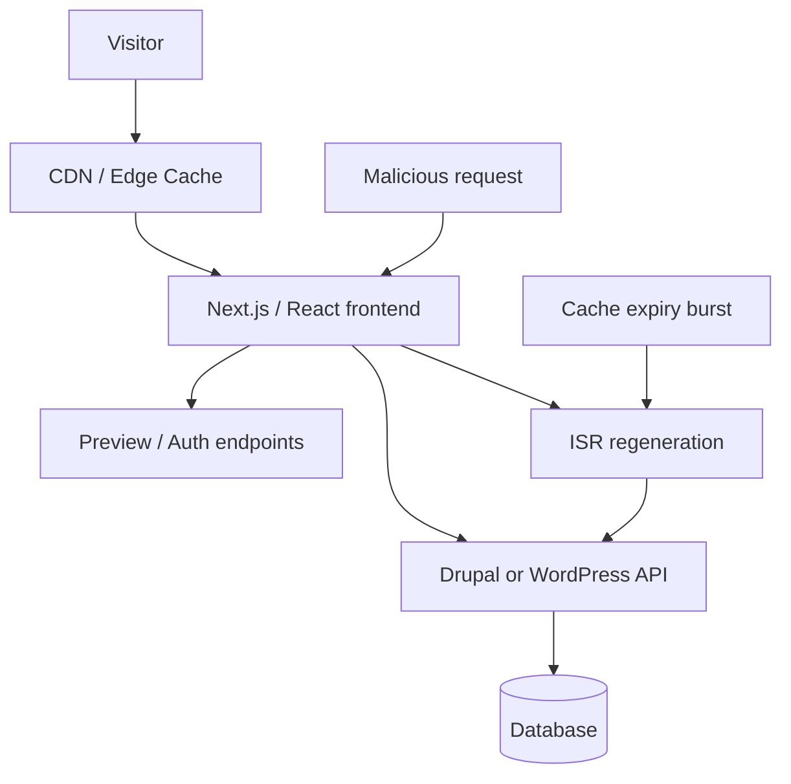

import Tabs from '@theme/Tabs';
import TabItem from '@theme/TabItem';
import TOCInline from '@theme/TOCInline';

Most of the list was marketing lacquer with a pulse. The useful part was narrower: a few items change how Drupal and WordPress teams should handle headless frontends, build pipelines, compliance boundaries, and AI-assisted maintenance. Those are the ones worth keeping.
<!-- truncate -->

<TOCInline toc={toc} minHeadingLevel={2} maxHeadingLevel={2} />

| Topic | Drupal / WordPress consequence | Immediate action |
| --- | --- | --- |
| Custom Regions | Regulated sites need tighter control over where content, logs, AI features, and backups are processed | Map every data processor, not just the primary host |
| Four Kitchens on dashboards | Editorial dashboards shape behavior in Drupal admin and WordPress wp-admin | Audit dashboard widgets against actual publishing KPIs |
| React2Shell bulletin | Headless Drupal/WordPress frontends running React/Next.js have a direct patching obligation | Inventory React-based frontends and patch on urgency, not on comfort |
| npm supply-chain attack response | Gutenberg builds, block plugins, and decoupled frontends inherit npm risk | Freeze, audit, and verify JS dependencies in release pipelines |
| Request collapsing in CDN/ISR | Headless sites using ISR can stampede Drupal/WordPress origins during cache expiry | Add regeneration controls and protect origin endpoints |
| AGENTS.md + filesystem/bash patterns + sandboxed code execution | AI maintenance for CMS repos works better with repo-local instructions and isolated execution | Put upgrade, QA, and deployment rules in the repo, not in tribal memory |

## Custom regions are a CMS architecture decision, not a cloud footnote

"Custom Regions" sounds like one more control-plane checkbox until a client asks where editorial drafts, user uploads, search indexes, AI summaries, logs, backups, and CDN edge traces are processed. At that point it stops being branding and becomes a Drupal/WordPress architecture review.

For **Drupal** and **WordPress** shops dealing with government, health, finance, or cross-border publishing, region controls affect more than the database. A site can keep MySQL in one country and still leak compliance scope through object storage, image optimization, observability, search, translation, or AI add-ons running elsewhere. Headless builds make this worse because the CMS, frontend, cache layer, and background jobs often live in different places.

:::info[Data residency review]
If a hosting vendor adds finer regional controls, use that moment to redraw the data map for the whole stack: `db`, `files`, `logs`, `search`, `email`, `analytics`, `CDN`, `preview`, and any AI service touching content. For Drupal and WordPress, the compliance failure usually hides in the add-ons, not in the core CMS runtime.
:::

A boring but necessary consequence: procurement and migration docs need to name every processor that handles CMS content. "Hosted in region X" is incomplete unless it covers previews, backups, and observability.

## Editorial dashboards still decide what gets published

The Four Kitchens piece is squarely in Drupal territory, but the point lands just as hard in WordPress: dashboards are governance. If the platform team picks widgets based on what is easy to measure instead of what editorial teams need, the admin UI starts training people badly.

> "A dashboard isn't just a summary page. It's a statement of priorities."
>
> — Four Kitchens, "When the people who run the platform aren't the people who run the content"

That matters for **Drupal** because custom admin dashboards, content moderation queues, and editorial workspaces often drift toward operational vanity metrics. It matters for **WordPress** because `wp-admin` dashboards and plugin-added widgets love to turn the first screen into clutter, upsells, and meaningless counts.

The practical rule is simple: if a dashboard widget does not change a publishing decision, it is decoration. Replace "number of nodes/posts created" with things editors can act on: unpublished scheduled items, broken preview links, stale landing pages, pending moderation, failed webhooks, translation backlog, expiring campaign content.

<Tabs>
<TabItem value="wordpress" label="WordPress" default>

```bash title="Editorial dashboard triage for WordPress"
wp plugin list --status=active
wp option get blog_public
wp cron event list
wp post list --post_status=future --fields=ID,post_title,post_date
```

</TabItem>
<TabItem value="drupal" label="Drupal">

```bash title="Editorial dashboard triage for Drupal"
drush pm:list --status=enabled --type=module
drush state:get system.cron_last
drush sqlq "SELECT nid, title, status, changed FROM node_field_data ORDER BY changed DESC LIMIT 20;"
drush config:get workflows.workflow.editorial
```

</TabItem>
</Tabs>

Those commands are not a dashboard solution. They are a fast way to see whether the admin layer reflects real editorial work or just whatever the platform team happened to expose.

## React2Shell is a headless CMS incident, not someone else's frontend problem

If a **Drupal** or **WordPress** build uses React through **Next.js** or another headless frontend, the React2Shell bulletin is your problem. No escape hatch there.

> "CVE-2025-55182 is a critical vulnerability in React that requires immediate action. Next.js and other frameworks that React are affected."
>
> — Vercel, [React2Shell Security Bulletin](https://vercel.com/)

A lot of CMS teams still talk about the frontend as if it were a separate concern maintained by another squad. Fine, until the exploit path runs through the frontend and lands on pages sourced from Drupal or WordPress. Then the CMS team inherits the incident anyway because content, preview flows, authenticated editors, and cache invalidation are tied to that stack.



The diagram is the point: in headless CMS setups, React is not sitting off to the side. It is in the request path, preview path, and regeneration path.

:::danger[Headless patching rule]
Treat any critical React or Next.js bulletin as production work for the Drupal/WordPress estate if that frontend serves CMS content. Do not wait for the next sprint, the next platform meeting, or the next round of "who owns this." Patch, test preview/auth flows, and verify cache regeneration behavior.
:::

<Tabs>
<TabItem value="wordpress-headless" label="WordPress" default>

```bash title="WordPress headless dependency check"
npm ls react react-dom next
composer audit
wp plugin list --status=active
```

</TabItem>
<TabItem value="drupal-headless" label="Drupal">

```bash title="Drupal headless dependency check"
npm ls react react-dom next
composer audit
drush pm:list --status=enabled --type=module
```

</TabItem>
</Tabs>

The WordPress or Drupal command at the end is there for one reason: patching the frontend without checking the CMS-side preview/auth modules is how teams create a second outage while fixing the first one.

## npm supply-chain attacks hit Gutenberg plugins and decoupled builds first

The npm incident belongs in a Drupal/WordPress devlog because the JS toolchain is no longer optional. Gutenberg blocks, modern admin interfaces, decoupled frontends, and theme build steps all pull from npm. A compromised maintainer account upstream is enough to turn "build asset update" into malware delivery.

The old fiction was that PHP CMS teams could ignore the JavaScript ecosystem and still be serious about security. ~~That fiction is dead.~~ A plugin with a `package.json` has a second supply chain whether the team likes it or not.

:::warning[Release pipelines need dependency verification]
For WordPress plugins with block assets and Drupal projects with frontend build steps, CI should fail on unexpected lockfile changes, known advisories, or unreviewed package bumps. If a release can be cut from a dirty `node_modules` state, the pipeline is not trustworthy.
:::

Useful consequences for CMS work:

- **WordPress plugin authors** need stricter review on `@wordpress/*`, build tooling, and transitive dependencies used to compile blocks.
- **Drupal teams** using Vite, Webpack, Storybook, or decoupled admin/frontend components need the same discipline they already apply to `composer.lock`.
- **Agencies** should assume a client handoff without lockfile policy becomes an eventual incident.

```bash title="Dependency audit commands for CMS projects"
composer audit
npm audit --omit=dev
npm ci
git diff --exit-code package-lock.json composer.lock
```

That last line is the release gate too many teams skip because "the build passed." Malware also passes builds.

<details>
  <summary>Where this lands in real CMS repos</summary>

For WordPress, check every plugin or theme that ships compiled assets and verify whether built files are committed, rebuilt in CI, or generated ad hoc on laptops. For Drupal, check custom themes, component libraries, Storybook setups, and any decoupled frontend repo tied to the site. The risk is highest where lockfiles drift or where deploy artifacts are built outside CI.

</details>

## Request collapsing matters when cache expiry hammers the CMS origin

The Vercel CDN write-up on request collapsing maps cleanly to **headless Drupal** and **headless WordPress** because ISR-style regeneration can punish the CMS origin exactly when traffic spikes.

If multiple requests hit the same expired page at once and each one triggers regeneration work, the frontend burns compute while Drupal or WordPress gets hammered for the same content repeatedly. That is not a theoretical optimization problem. It is how a marketing launch turns into an origin meltdown.

This is the operational consequence:

- A high-traffic campaign page expires.
- The frontend tries to regenerate it many times in parallel.
- Drupal or WordPress gets a thundering herd of API requests.
- Editors complain that preview is broken while ops wonders why the cache layer is making things worse.

For **Drupal**, this shows up around JSON:API or GraphQL endpoints under bursty traffic. For **WordPress**, the same pattern hits REST API or WPGraphQL origins.

A CMS team using ISR, on-demand revalidation, or edge caching should make three decisions explicit:

1. Which routes are safe for regeneration under load.
2. Which origin endpoints must be shielded or rate-limited.
3. Which pages should be pre-rendered instead of lazily regenerated.

This is one of those areas where "fast frontend" can quietly become "fragile origin" if nobody models expiry behavior.

## Repo-local instructions beat abstract agent lore for CMS maintenance

Two items belong together here: the AGENTS.md evaluation result and the "filesystem + bash" approach. The interesting part is not agent hype. The useful part is that **repo-local instructions** appear to work better than detached skill catalogs when an agent has to maintain real code.

> "A compressed 8KB docs index embedded directly in AGENTS.md achieved a 100% pass rate, while skills maxed out at 79%..."
>
> — "AGENTS.md outperforms skills in our agent evals"

That has a very direct consequence for **Drupal** and **WordPress** repositories. Upgrade rules, coding standards, release policies, cache-clearing steps, and deployment constraints should live in the repo where the agent and the human maintainer can both see them. Not in a wiki nobody opens. Not in Slack archaeology. Not in the senior dev's memory.

The related item about running agents with filesystem and bash is useful for the same reason: CMS maintenance is mostly file inspection, command execution, and diff review. That maps well to `composer`, `drush`, `wp`, `phpunit`, PHPCS, static analysis, and lockfile checks. Fancy tools are optional; clear local instructions are not.

The Vercel Sandbox item also matters here, but only as infrastructure. If teams are going to let agents inspect plugins, run tests, or try fixes, isolated execution for untrusted code is sane. That is relevant for agencies reviewing third-party WordPress plugins, evaluating Drupal contrib patches, or testing client repositories without giving everything broad host access.

A practical repo rule for CMS teams:

- Put upgrade constraints in `AGENTS.md`.
- Include the exact QA commands.
- Spell out what must never be auto-fixed.
- Note deployment-sensitive files like `composer.lock`, `package-lock.json`, exported config, and built assets.

If a maintenance agent cannot discover the project's rules from the repository itself, it will invent them. That usually ends badly, and in a CMS repo "badly" often means a broken deploy with stale config or regenerated assets nobody intended to ship.

## What goes into the next Drupal/WordPress maintenance pass

The useful items were the ones with a concrete engineering consequence. For Drupal and WordPress teams, that means four things: review data residency beyond the database, fix admin dashboards that train editors badly, treat React/npm issues as first-class CMS risk in headless builds, and move maintenance rules into the repo so humans and agents stop guessing.

Anything outside that list was mostly noise, executive theater, or product-page fog. The web has enough of that already.

***
*Looking for an Architect who doesn't just write code, but builds the AI systems that multiply your team's output? View my enterprise CMS case studies at [victorjimenezdev.github.io](https://victorjimenezdev.github.io) or connect with me on LinkedIn.*
