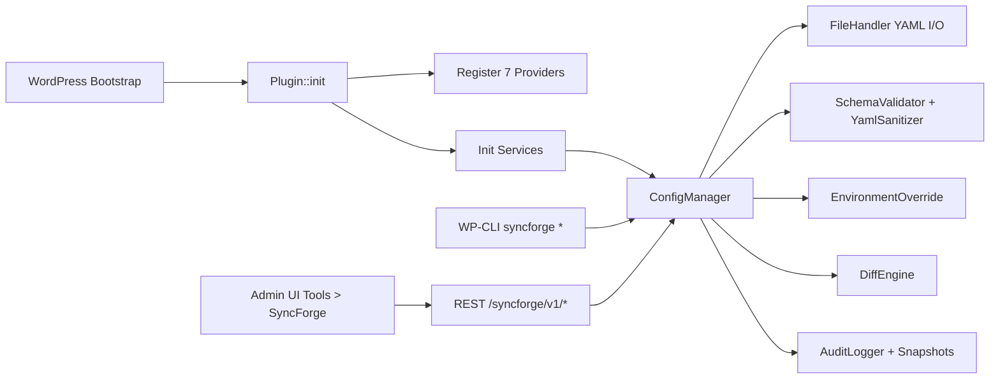

import Tabs from '@theme/Tabs';
import TabItem from '@theme/TabItem';

**SyncForge Config Manager** treats WordPress configuration like code instead of tribal memory in `wp-admin`: export to YAML, diff it, import it with guardrails, and roll it back when a release goes sideways. The useful part is not the YAML. It is having one deterministic workflow across admin UI, REST, and WP-CLI instead of three half-different behaviors.  
<!-- truncate -->

## The Problem

~~A DB dump is config management~~. It is mostly a panic button.

What breaks teams is **configuration drift**: options changed in wp-admin, theme mods changed in one environment, widget trees drifting silently, rewrite config different after one plugin update. Normal release pipelines do not track any of that cleanly.

> "Export, import, and sync WordPress site configuration as YAML files across environments."
>
> - SyncForge Config Manager README, [GitHub](https://github.com/victorstack-ai/config-sync/blob/main/README.md)

## Why build a plugin instead of installing one

The obvious question is whether WordPress already has a maintained plugin that handles this cleanly. I did not find one that combines all of the pieces that matter in real delivery work:

- provider-based exports instead of one giant opaque blob,
- diff + dry-run + rollback in the same workflow,
- support for roles, menus, widgets, theme mods, rewrite rules, and block patterns,
- the same orchestration path exposed in admin, REST, and WP-CLI.

That gap is why building the plugin made sense. If a maintained plugin already covered those boundaries, writing another one would have been waste.

## How It Works

The plugin boots a container, registers providers, then uses `ConfigManager` as the orchestration layer for export/import/diff/rollback. Providers define how each config domain maps between DB state and YAML files.



<Tabs>

<TabItem value="cli" label="WP-CLI Path" default>

```bash title="real commands from src/CLI/*.php"
wp syncforge export
wp syncforge diff --format=json
wp syncforge import --dry-run
wp syncforge import --yes
wp syncforge status
wp syncforge discover --track-all
```

</TabItem>

<TabItem value="rest" label="REST/Admin Path">

```bash title="real routes from src/Rest/*.php"
/wp-json/syncforge/v1/export
/wp-json/syncforge/v1/import
/wp-json/syncforge/v1/diff
/wp-json/syncforge/v1/snapshots
/wp-json/syncforge/v1/rollback/{id}
/wp-json/syncforge/v1/discover
```

</TabItem>

</Tabs>

## Implementation

`ConfigManager` does the heavy lifting: lock acquisition, provider ordering (topological sort), YAML read, env override merge, schema validation, sanitization, then dry-run or import.

```php title="syncforge-config-manager/src/ConfigManager.php" showLineNumbers
private function do_import_provider( Provider\ProviderInterface $provider, bool $dry_run ): array {
	$config = $this->read_provider_config( $provider );

	// highlight-next-line
	$config = $this->container->get_environment_override()->apply_overrides( $provider->get_id(), $config );

	$validation = $this->container->get_schema_validator()->validate( $provider->get_id(), $config );

	if ( is_wp_error( $validation ) ) {
		throw new \RuntimeException(
			sprintf(
				esc_html__( 'Validation failed for provider %1$s: %2$s', 'syncforge-config-manager' ),
				esc_html( $provider->get_id() ),
				esc_html( $validation->get_error_message() )
			)
		);
	}

	// highlight-next-line
	$config = $this->container->get_yaml_sanitizer()->sanitize( $config, $provider->get_id() );

	if ( $dry_run ) {
		return $provider->dry_run( $config );
	}

	return $provider->import( $config );
}
```

Option discovery avoids hardcoded plugin lists. It classifies by patterns and groups discovered keys by plugin slug (or `misc` when ownership is ambiguous).

```php title="syncforge-config-manager/src/Admin/OptionDiscovery.php" showLineNumbers
private const RUNTIME_KEYWORDS = array(
	'_version',
	'_db_version',
	'_migration',
	'_nonce',
	'_session',
	'_token_',
	'_count',
	'_dismissed',
	'_telemetry',
	'_last_run',
	'_children',
	'_site_health',
);

private const RUNTIME_SUFFIXES = array(
	'_state',
	'_rat',
	'_pubkey',
	'_auth',
	'_install',
);
```

| Provider ID | Dependency | File strategy |
|---|---|---|
| `options` | none | fixed files (`options/general.yml`, etc.) + dynamic extra groups |
| `roles` | none | dynamic directory (`roles/{role}.yml`) |
| `menus` | `options` | directory (`menus/`) |
| `widgets` | `options` | directory (`widgets/`) |
| `theme-mods` | `options` | single file (`theme-mods.yml`) |
| `rewrite` | `options` | single file (`rewrite.yml`) |
| `block-patterns` | none | directory (`block-patterns/`) |

A real project change that matters: the rename from generic `config-sync` branding to `syncforge-config-manager`, reflected in plugin header and docs.

```diff
-=== Config Sync ===
+=== SyncForge Config Manager ===
-Contributors: victorstack-ai
+Contributors: victorjimenezdev
-Text Domain: config-sync
+Text Domain: syncforge-config-manager
-Plugin Name: Config Sync
+Plugin Name: SyncForge Config Manager
```

<details>
<summary>Supplementary: security controls implemented in code</summary>

- `FileHandler::resolve_safe_path()` rejects traversal before file access.
- ZIP import rejects entries containing `..` and only extracts `.yml`.
- `YamlSanitizer` rejects serialized object payload patterns.
- `AuditLogger` redacts secret-looking keys before storing snapshots/diffs.
- Config directory gets `.htaccess`, `index.php`, and `web.config` deny files.

</details>

## What I Learned

- Provider contracts beat one giant "sync everything" routine. Dependencies are explicit and sortable.
- The lock model (`config_sync_lock` in `wp_options`) is simple and good enough for admin/CLI concurrency.
- The same orchestration layer serving REST, CLI, and admin reduces edge-case drift in behavior.
- Default path choices matter more than people admit; the code defaults to `wp-content/syncforge-config-manager`, while docs still mention `wp-content/config-sync/`.

:::tip[Use Dry-Run as a Release Gate]
Make `wp syncforge diff` and `wp syncforge import --dry-run` mandatory in staging before any production import. The plugin already has the primitives; the missing part is process discipline.
:::

:::caution[Capability Model Is Split]
REST checks `manage_config_sync`, while parts of admin/ZIP handling check `manage_options`. If this runs in a delegated ops model, unify capability checks to avoid "works in one interface, blocked in another" support drama.
:::

For Drupal teams, the analogy is config export/import discipline rather than feature parity with Drupal core config sync. WordPress has more mutable state hiding in runtime options, so the plugin has to be stricter about classification, sanitization, and rollback if it wants to be useful outside demos.

## References

- [View Code](https://github.com/victorstack-ai/config-sync)
- [Project README](https://github.com/victorstack-ai/config-sync/blob/main/README.md)
- [Main Plugin Bootstrap](https://github.com/victorstack-ai/config-sync/blob/main/syncforge-config-manager/syncforge-config-manager.php)

***
*Looking for an Architect who does not just write code, but builds the AI systems that multiply your team's output? View my enterprise CMS case studies at [victorjimenezdev.github.io](https://victorjimenezdev.github.io) or connect with me on LinkedIn.*
