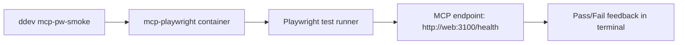

I built a DDEV add-on that runs Playwright checks against local MCP endpoints using internal DDEV DNS names like `web`. This solves flaky localhost-based testing and gives one command for repeatable MCP smoke tests.
<!-- truncate -->

## The Problem

Teams testing MCP servers locally usually mix host networking, ad-hoc scripts, and one-off commands. That breaks quickly when ports change or when tests run from a different container context.

| Pain point | Typical failure |
| --- | --- |
| Host-only URLs (`localhost`) | Fails inside containers where service DNS is required |
| Manual Playwright setup per project | Inconsistent versions and missing browser deps |
| No MCP-specific smoke command | Health-check regressions are discovered too late |

Related context: [Build: MCP Web Setup](/build-mcp-web-setup/), [Build: Drupal MCP Toolkit](/build-drupal-mcp-toolkit/), [Drupal Context MCP Integration](/drupal-context-mcp-integration/).

## The Solution

The add-on installs:
- A dedicated `mcp-playwright` service via Docker Compose.
- DDEV commands: `ddev mcp-pw-smoke` and `ddev mcp-pw-test`.
- A Playwright smoke test for `GET /health` with configurable `MCP_BASE_URL`.



Code from the project:

```yaml
# docker-compose.mcp-playwright.yaml
services:
  mcp-playwright:
    image: mcr.microsoft.com/playwright:v1.56.1-noble
    working_dir: /var/www/html/.ddev/mcp-playwright
```

```bash
# commands/host/mcp-pw-smoke
ddev exec -s mcp-playwright "cd /var/www/html/.ddev/mcp-playwright && npm ci --silent && MCP_BASE_URL=\${MCP_BASE_URL:-http://web:3100} npx playwright test tests/mcp-health.spec.js --reporter=line"
```

```js
// mcp-playwright/tests/mcp-health.spec.js
const response = await request.get(`${baseUrl}/health`);
expect(response.ok()).toBeTruthy();
```

## What I Learned

- `web` DNS names inside DDEV are safer than `localhost` for cross-container test reliability.
- A tiny helper (`resolveMcpBaseUrl`) plus tests prevents subtle URL-format bugs.
- Dedicated smoke commands are worth adding early when MCP endpoints are a release gate.

## References

- [View Code](https://github.com/victorstack-ai/ddev-mcp-playwright-addon)
- https://ddev.readthedocs.io/en/stable/users/extend/additional-services/
- https://playwright.dev/docs/test-intro
