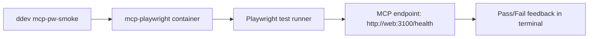

import Tabs from '@theme/Tabs';
import TabItem from '@theme/TabItem';

I built a DDEV add-on that runs Playwright checks against local MCP endpoints using internal DDEV DNS names like `web`. This solves flaky localhost-based testing and gives one command for repeatable MCP smoke tests.

<!-- truncate -->

## The Problem

Teams testing MCP servers locally usually mix host networking, ad-hoc scripts, and one-off commands. That breaks quickly when ports change or when tests run from a different container context.

| Pain point | Typical failure |
| --- | --- |
| Host-only URLs (`localhost`) | Fails inside containers where service DNS is required |
| Manual Playwright setup per project | Inconsistent versions and missing browser deps |
| No MCP-specific smoke command | Health-check regressions are discovered too late |

Related context: [Build: MCP Web Setup](/build-mcp-web-setup/), [Build: Drupal MCP Toolkit](/build-drupal-mcp-toolkit/), [Drupal Context MCP Integration](/drupal-context-mcp-integration/).

## The Solution

The add-on installs:
- A dedicated `mcp-playwright` service via Docker Compose.
- DDEV commands: `ddev mcp-pw-smoke` and `ddev mcp-pw-test`.
- A Playwright smoke test for `GET /health` with configurable `MCP_BASE_URL`.


```mermaid
flowchart LR
  A[ddev mcp-pw-smoke] --> B[mcp-playwright container]
  B --> C[Playwright test runner]
  C --> D[MCP endpoint: http://web:3100/health]
  D --> E[Pass/Fail feedback in terminal]
```

## Tech Stack

| Component | Technology | Why |
|---|---|---|
| Container platform | DDEV / Docker Compose | Standard local dev for CMS projects |
| Test runner | Playwright v1.56.1 | Reliable browser automation with built-in assertions |
| Base image | `mcr.microsoft.com/playwright:v1.56.1-noble` | All browser deps pre-installed |
| Service DNS | DDEV internal networking | `web` resolves to the app container without port hacks |

## Implementation

<Tabs>
<TabItem value="compose" label="Docker Compose" default>

```yaml title=".ddev/docker-compose.mcp-playwright.yaml"
services:
  mcp-playwright:
image: mcr.microsoft.com/playwright:v1.56.1-noble
working_dir: /var/www/html/.ddev/mcp-playwright
```

</TabItem>
<TabItem value="command" label="DDEV Command">

```bash title=".ddev/commands/host/mcp-pw-smoke"
# highlight-next-line
ddev exec -s mcp-playwright "cd /var/www/html/.ddev/mcp-playwright && npm ci --silent && MCP_BASE_URL=${MCP_BASE_URL:-http://web:3100} npx playwright test tests/mcp-health.spec.js --reporter=line"
```

</TabItem>
<TabItem value="test" label="Smoke Test">

```javascript title=".ddev/mcp-playwright/tests/mcp-health.spec.js"
// highlight-next-line
const response = await request.get(`${baseUrl}/health`);
expect(response.ok()).toBeTruthy();
```

</TabItem>
</Tabs>

:::tip[Use DDEV DNS Names, Not localhost]
`web` DNS names inside DDEV are safer than `localhost` for cross-container test reliability. When your test runner lives in a sidecar container, `localhost` points to the sidecar itself, not your app.
:::

:::caution[URL Format Bugs Are Silent]
A tiny helper (`resolveMcpBaseUrl`) plus tests prevents subtle URL-format bugs. Trailing slashes, missing ports, and protocol mismatches fail silently and waste hours of debugging.
:::

<details>
<summary>Full add-on file structure</summary>

```text showLineNumbers
.ddev/
  docker-compose.mcp-playwright.yaml
  commands/
    host/
      mcp-pw-smoke
      mcp-pw-test
  mcp-playwright/
    package.json
    playwright.config.js
    tests/
      mcp-health.spec.js
```

</details>

## Why this matters for Drupal and WordPress

DDEV is the standard local development environment for Drupal projects and increasingly adopted by WordPress teams. Any Drupal or WordPress site integrating MCP-based AI tools -- content analyzers, module generators, migration assistants -- needs reliable endpoint testing before deployment. This add-on gives CMS teams a single command to verify MCP server health inside the same container stack they already use for local development, eliminating the gap between "it works on my machine" and CI-reproducible smoke tests.

## What I Learned

- `web` DNS names inside DDEV are safer than `localhost` for cross-container test reliability.
- A tiny helper (`resolveMcpBaseUrl`) plus tests prevents subtle URL-format bugs.
- Dedicated smoke commands are worth adding early when MCP endpoints are a release gate.

## References

- [View Code](https://github.com/victorstack-ai/ddev-mcp-playwright-addon)
- https://ddev.readthedocs.io/en/stable/users/extend/additional-services/
- https://playwright.dev/docs/test-intro


***
*Looking for an Architect who doesn't just write code, but builds the AI systems that multiply your team's output? View my enterprise CMS case studies at [victorjimenezdev.github.io](https://victorjimenezdev.github.io) or connect with me on LinkedIn.*
